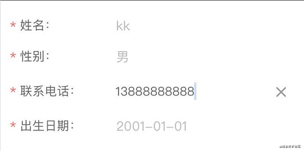
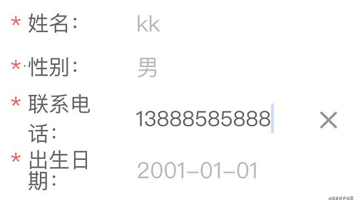

# 前端页面适配

## Flexible方案(lib-flexible)

### 1.1 核心思想

#### 1.1.1 使用rem模拟vw特性适配多种屏幕尺寸

rem是相对于html元素的font-size来做计算的计算属性值。

通过设置documentElement的fontSize属性值就可以统一整个页面的布局标准。

```js
// set 1rem = viewWidth / 10
function setRemUnit () {
    var rem = docEl.clientWidth / 10
    // docEl为document.documentElement，即html元素
    docEl.style.fontSize = rem + 'px'
}
setRemUnit();
```

#### 1.1.2 控制viewport的width和scale值适配高倍屏显示

设置viewport的width为device-width，改变浏览器viewport（布局视口和视觉视口）的默认宽度为理想视口宽度，从而使得用户可以在理想视口内看到完整的布局视口的内容。

等比设置viewport的initial-scale、maximum-scale、minimum-scale的值，从而实现1物理像素=1css像素，以适配高倍屏的显示效果（就是在这个地方规避了大家熟知的“1px问题”）

```js
var metaEL= doc.querySelector('meta[name="viewport"]');
var dpr = window.devicePixelRatio;
var scale = 1 / dpr
metaEl.setAttribute('content', 'width=device-width, initial-scale=' + scale + ', maximum-scale=' + scale + ', minimum-scale=' + scale + ', user-scalable=no'); 
```


### 1.2. Flexible配合的周边工具

#### 1.2.1 PostCSS-px2rem

Flexible使用了rem作为统一页面布局标准的布局单位，且把页面宽度等分为了10份，那么我们在书写css代码时就需要去计算当前的px单位在当前设计稿上对应的rem值应该是多少。

以iPhone6为例：布局视口为375px，则1rem = 37.5px，这时设计稿上给定一个元素的宽为75px（设备独立像素），我们只需要将它设置为75 / 37.5 = 2rem即可。

当然，以上的工作方式显然是低效且不可接受的，我们可以借助PostCSS的pxtorem插件来帮我们完成这个计算过程:

```js
plugins: {
    ...,
    'postcss-pxtorem': {
        // 750设计标准
        rootValue: 75,
        // 转换成的rem后，保留小数点后几位
        unitPrecision: 5,
        /**
        * 将会被转换的css属性列表，
        * 设置为*表示全部，['*','*position*','!letter-spacing','!font*']
        * *position* 表示所有包含 position 的属性
        * !letter-spacing 表示非 letter-spacing 属性
        * !font* 表示非font-size font-weight ... 等的属性
        * */
        propList: ['*', '!letter-spacing'],
        // 不会被转换的class选择器名，支持正则
        selectorBlackList: ['.rem-'],
        replace: true,
        // 允许在媒体查询中转换`px`
        mediaQuery: false,
        // 小于1px的将不会被转换
        minPixelValue: 1
    }
}
```

以上代码是基于Vue Cli3.x的Webpack项目，只需要配置在当前项目根目录的postcss.config.js中即可，除了Webpack配置之外，还可以使用其他的配置方式。

### 1.3. Flexible的缺陷

#### 1.3.1 对iframe的使用不兼容。

即iframe中展示的内容依然使用的是css像素，在高倍屏下会出问题，如我们在使用iframe引用一个腾讯视频的视频播放资源时，该视频播放器的播放按钮在不同dpr的设备上展示差异很大：

播放按钮在dpr = 2的设备上展示的大小要比在dpr = 3的设备上要大很多，如果你去仔细测量的话，会发现刚好是其1.5倍

#### 1.3.2 对高倍屏的安卓手机没做处理

如果你去研究过lib-flexible的源码，那你一定知道lib-flexible对安卓手机的特殊处理，即：一律按dpr = 1处理。

```js
if (isIPhone) {
  // iOS下，对于2和3的屏，用2倍的方案，其余的用1倍方案
  if (devicePixelRatio >= 3 && (!dpr || dpr >= 3)) {                
    dpr = 3;
  } else if (devicePixelRatio >= 2 && (!dpr || dpr >= 2)){
    dpr = 2;
  } else {
    dpr = 1;
  }
} else {
  // 其他设备下，仍旧使用1倍的方案
  dpr = 1;
}
```

#### 1.3.3 不兼容响应式布局

响应式布局，其实质性做法就是结合css3的媒体查询@media对一些不同尺寸阈值做特定的布局设计，如对768px以下屏幕的使用紧凑型布局，对769px到992px的屏幕做图文混排型布局，对大于992px的屏幕做富元素、多元素布局等。

```js
.main-content {
    max-width: 70em
}
@media screen and (min-width: 0) {
    .main-content {
        margin:0 6.4935064935%
    }
}
@media screen and (min-width: 45em) {
    .main-content {
        margin:0 5.1282051282%
    }
}
@media screen and (min-width: 70em) {
    .main-content {
        margin:0 5.1282051282%
    }
}
```
其中，@media语法中涉及到的尺寸查询语句，查询的尺寸依据是当前设备的物理像素，和Flexible的布局理论（即针对不同dpr设备等比缩放视口的scale值，从而同时改变布局视口和视觉视口大小）相悖，因此响应式布局在“等比缩放视口大小”的情境下是无法正常工作的。

#### 1.3.4 无法正确响应系统字体大小

根据Flexible的实现理论，我们都知道它是通过设置的html元素的font-size大小，从而确保页面内所有元素在使用rem为单位进行样式设置时都是相对于html元素的font-size值。

然而，在微信环境（或其他可设置字体大小的Web浏览器中，如Safari）下，设置微信的字体大小（调大）后再打开使用Flexible技术适配的Web页面，你会发现页面布局错乱了，所有使用rem设置大小的元素都变大了，此时html的font-size还是原来的大小，但是元素就是变大了，这是为什么呢？




事实上，虽然Flexible帮我们使用<meta/>标签设置了width=device-width和user-scalable=no以及对应的scale缩放值以保证我们的元素大小在高倍屏下（dpr >= 2 ）正常展示，但是在调整Web浏览器的字体大小后，我们的"视口"也响应的等比缩小了，即视觉视口(window.innerWidth)，豁然开朗，并不是我们的元素变大了，而是我们的视觉视口变小了！

```
<!-- 在 chrome Devtool 的console窗口输入 -->
innerwidth
```

## Viewport方案

Viewport方案中主要使用的是css3中CSS Values and Units Module Level 3（候选推荐）新增的 length单位vw、vh、vmax和vmin。定义中，它们都是相对单位，其相对的参考系都是"视觉视口":

unit | relative to（参考单位）
---|--- 
'vw' | 1% of viewport's width（视觉视口宽度的1%）
'vh' | 1% of viewport's height（视觉视口高度的1%）
'vmax' | 1% of viewport's larger dimension（vw和vh中的较大值）
'vmin' | 1% of viewport's smaller dimension（vw和vh中的较大值）

### Viewport方案的核心思想

#### 1. 使用vw作为元素的布局单位

vw作为布局单位，从底层根本上解决了不同尺寸屏幕的适配问题，因为每个屏幕的百分比是固定的、可预测、可控制的。

从我们的实际开发工作出发，我们现在都是统一使用的iPhone6的视觉设计稿（即宽度为750px），那么100vw=750px，即1vw = 7.5px。那么如果设计稿上某一元素的宽度为value像素，那么其对应的vw值则可以通过vw = value / 7.5来计算得到。

需要注意的是，虽然vw无痛解决了我们之前遇到的很多问题，但是它并不是万能的，通过查找资料、博客和测试实践，以下场景我们可以放心使用vw来适配我们的页面：

• 容器适配，可以使用vw
• 文本适配，可以使用vw
• 大于1px的边框、圆角、阴影都可以使用vw
• 内边距和外边距都可以使用vw

#### 2. 降级处理不兼容

在我们已知的大部分主流浏览器中，都是天然支持vw单位的，但不排除有某些浏览器的某些版本存在不兼容的情况，如果业务需要，我们可以通过如下两种方式做降级处理：

• CSS Houdini：通过CSS Houdini针对vw做处理，调用CSS Typed DOM Level1提供的CSSUnitValue API；

• CSS Polifill：通过相应的Polyfill做响应的处理，目前针对vw单位的Polyfill主要有：vminpoly、Viewport Units Buggyfill、vunits.js和Modernizr。大漠老师比较推荐的是Viewport Units Buggyfill

### Viewport方案配合的周边工具

#### 1. postcss-px-to-viewport

postcss-px-to-viewport插件的作用和postcss-pxtorem的作用类似，主要用来把px单位转换为vw、vh、vmin或者vmax这样的视窗单位（推荐转换为vw，其他单位多多少少都有一些兼容性问题），也是viewport适配方案的核心插件之一。

结合webpack项目进行配置时，只需要将其配置在项目根目录下的postcss.config.js中即可，其基本配置项如下：

```js
plugins: {
'postcss-px-to-viewport': {
    unitToConvert: 'px',   // 需要转换的单位
    viewportWidth: 750,    // 视口宽度，等同于设计稿宽度
    unitPrecision: 5,      // 精确到小数点后几位
    /**
    * 将会被转换的css属性列表，
    * 设置为 * 表示全部，如：['*']
    * 在属性的前面或后面设置*，如：['*position*']，*position* 表示所有包含 position 的属性，如 background-position-y
    * 设置为 !xx 表示不匹配xx的那些属性，如：['!letter-spacing'] 表示除了letter-spacing 属性之外的其他属性
    * 还可以同时使用 ! 和 * ，如['!font*'] 表示除了font-size、 font-weight ...这些之外属性之外的其他属性名头部是‘font’的属性
    * */
    propList: ['*'],
    viewportUnit: 'vw',    // 需要转换成为的单位
    fontViewportUnit: 'vw',// 需要转换称为的字体单位
    /**
    * 需要忽略的选择器，即这些选择器对应的属性值不做单位转换
    * 设置为字符串，转换器在做转换时会忽略那些选择器中包含该字符串的选择器，如：['body']会匹配到 .body-class，也就意味着.body-class对应的样式设置不会被转换
    * 设置为正则表达式，在做转换前会先校验选择器是否匹配该正则，如果匹配，则不进行转换，如[/^body$/]会匹配到 body 但是不会匹配到 .body
    */
    selectorBlackList: [],
    minPixelValue: 1,      // 最小的像素单位值
    mediaQuery: false,     // 是否转换媒体查询中设置的属性值
    replace: true,                 // 替换包含vw的规则，而不是添加回退
    /**
    * 忽略一些文件，如'node_modules'
    * 设置为正则表达式，将会忽略匹配该正则的所有文件
    * 如果设置为数组，那么该数组内的元素都必须是正则表达式
    */
    exclude: [],
    landscape: false,      // 是否自动加入 @media (orientation: landscape)，其中的属性值是通过横屏宽度来转换的
    landscapeUnit: 'vw',   // 横屏单位
    landscapeWidth: 1334   // 横屏宽度
}
```

目前出视觉设计稿，我们都是使用750px宽度的，那么100vw = 750px，即1vw = 7.5px。那么我们可以根据设计图上的px值直接转换成对应的vw值。在实际撸码过程，不需要进行任何的计算，直接在代码中写px即可，postcss-px-to-viewport会自动帮我们把px计算转换为对应的vw值。

当然，postcss-px-to-viewport的功能不止于此，它还可以在selectorBlackList选项中设置一些关键词或正则，来避免对这些指定的选择器做转换，如selectorBlackList：['.ignore', '.hairlines']：

```css
<div class="box ignore"></div>
写CSS的时候： 
.ignore {
    margin: 10px;
    background-color: red;
}
.box {
    width: 180px;
    height: 300px;
}
.hairlines {
    border-bottom: 0.5px solid red;
}
```
转换之后：
```css
.box {
    width: 24vw;
    height: 40vw;
}
.ignore {
    margin: 10px; /*.box元素中带有.ignore类名，在这个类名写的`px`不会被转换*/
    background-color: red;
}
.hairlines {
    border-bottom: 0.5px solid red;
}
```


## 1.动态适配Rem

```html
<body>
    <script>
    (function() {
        var ua = window.navigator.userAgent;
        var docEl = document.documentElement;
        var html = document.querySelector('html');
        var isAndorid = /Android/i.test(ua);
        var dpr = window.devicePixelRatio || 1;
        var rem = docEl.clientWidth / 10;

        // 设置 rem 基准值
        html.style.fontSize = rem + 'px';

        // Nexus 5 上 rem 值不准，
        // 如：设置100px，getComputedStyle 中的值却为 85px，导致页面错乱
        // 这时需要检查设置的值和计算后的值是否一样，
        // 不一样的话重新设置正确的值
        var getCPTStyle = window.getComputedStyle;
        var fontSize = parseFloat(html.style.fontSize, 10);
        var computedFontSize = parseFloat(getCPTStyle(html)['font-size'], 10);
        if (getCPTStyle && Math.abs(fontSize - computedFontSize) >= 1) {
            html.style.fontSize = fontSize * (fontSize / computedFontSize) + 'px';
        }

        // 设置 data-dpr 属性，留作的 css hack 之用
        html.setAttribute('data-dpr', dpr);

        // 安卓平台额外加上标记类
        if (isAndorid) {
            html.setAttribute('data-platform', 'android');
        }
    })();
    </script>
    ...
</body>
```

```js
<!-- 设计图标准尺寸：750*1334 -->
<script>   
(function (doc, win) {
        var docEl = doc.documentElement,
            resizeEvt = 'orientationchange' in window ? 'orientationchange' : 'resize',
            recalc = function () {
                var clientWidth = docEl.clientWidth;
                if (!clientWidth) return;
                if(clientWidth>=750){
                    docEl.style.fontSize = '100px';
                }else{
                    docEl.style.fontSize = 100 * (clientWidth / 750) + 'px';
                }
            };

        if (!doc.addEventListener) return;
        win.addEventListener(resizeEvt, recalc, false);
        doc.addEventListener('DOMContentLoaded', recalc, false);
    })(document, window);
</script>

document.addEventListener('DOMContentLoaded', function(e) {
    document.getElementsByTagName('html')[0].style.fontSize = window.innerWidth / 10 + 'px';
}, false);

```

- 当初始的 HTML 文档被完全加载和解析完成之后，DOMContentLoaded 事件被触发，而无需等待样式表、图像和子框架的完成加载。


## 2.css设置

```css
//设计稿为640
@function rem($val) {
    @return $val/64 * 1rem;;
}

//设计稿为750
@function rem750($val) {
    @return $val/75 * 1rem;
}

//使用
.className {
    width: @rem(100);
}
```

```scss
// utils.scss
@function px2rem($px){
    $rem : 75px; // '750/10':分成10份
    @return ($px/$rem) + rem;
}

// foo.scss

.box1 {
 	width: px2rem(320px); // '(320/750) * 10 = 4.266rem'
 }

```

## 3. 像素比

### 物理像素

物理像素等同于设备像素（dp:device pixel），顾名思义，显示屏是由一个个物理像素点组成的，通过控制每个像素点的颜色使屏幕显示出不同的图像，屏幕从出厂那天起，它上面的物理像素点就固定不变了，单位pt

### 设备独立像素

我们必须用一种单位来同时告诉不同分辨率的手机，它们在界面上显示元素的大小是多少，这个单位就是设备独立像素(Device Independent Pixels)简称DIP或DP。上面我们说，列表的宽度为300个像素，实际上我们可以说：列表的宽度为300个设备独立像素。

设备像素比device pixel ratio简称dpr，即物理像素和设备独立像素的比值。
在web中，浏览器为我们提供了window.devicePixelRatio来帮助我们获取dpr。
在css中，可以使用媒体查询min-device-pixel-ratio，区分dpr：

```css
@media (-webkit-min-device-pixel-ratio: 2),(min-device-pixel-ratio: 2){ }
```

window对象有一个devicePixelRatio(设备像素比)属性，而它的官方的定义为：设备物理像素和设备独立像素的比例，从而我们可以得到一个公式： dpr = dp / dips。

1. dp(device pixels)：设备物理像素；

2. dips(device-independent pixels)：设备独立像素，dips = css像素 / scale（缩放比例）

- 设备花了200px的长宽来渲染CSS里面定义的100px的长宽，而设备pixels和样式pixels的比值，就是dpr，即Device Pixel Ratio

- 我们大家都知道Retina屏（视网膜屏），之所以看起来这么高清，就是因为苹果设备花两个像素来渲染一个像素的物体，那么看起来肯定更为精致。
所以，如果我们针对dpr=1的书写了rem2px(100px)，那么在dpr=2的设备看起来将会是被放大了2倍的元素。


```js
var dpr = window.devicePixelRatio;
meta.setAttribute('content', 'initial-scale=' + 1/dpr + ', maximum-scale=' + 1/dpr + ', minimum-scale=' + 1/dpr + ', user-scalable=no'); 
// 帮助理解 如果dpr=2，说明写的100px渲染成了200px，所以需要缩小至1/2，即1/dpr
```

## 4. 总结：

```js
<script>
  var dpr = window.devicePixelRatio;
  var meta = document.createElement('meta');

  // dpr
  meta.setAttribute('content', 'initial-scale=' + 1/dpr + ', maximum-scale=' + 1/dpr + ', minimum-scale=' + 1/dpr + ', user-scalable=no'); 
  document.getElementsByTagName('head')[0].appendChild(meta);

  // rem
  document.addEventListener('DOMContentLoaded', function (e) {
    document.getElementsByTagName('html')[0].style.fontSize = window.innerWidth / 10 + 'px';
  }, false);
</script>
```


## 5. 安全区域

在iPhoneX发布后，许多厂商相继推出了具有边缘屏幕的手机。

这些手机和普通手机在外观上无外乎做了三个改动：圆角（corners）、刘海（sensor housing）和小黑条（Home Indicator）。为了适配这些手机，安全区域这个概念变诞生了：安全区域就是一个不受上面三个效果的可视窗口范围。
为了保证页面的显示效果，我们必须把页面限制在安全范围内，但是不影响整体效果

### 5.1 viewport-fit

viewport-fit是专门为了适配iPhoneX而诞生的一个属性，它用于限制网页如何在安全区域内进行展示。

- contain：可视窗口完全包含网页内容

- cover：网页内容完全覆盖可视窗口

默认情况下或者设置为auto和contain效果相同。

### 5.2 env、constant

我们需要将顶部和底部合理的摆放在安全区域内，iOS11新增了两个CSS函数env、constant，用于设定安全区域与边界的距离。 函数内部可以是四个常量：

- safe-area-inset-left：安全区域距离左边边界距离

- safe-area-inset-right：安全区域距离右边边界距离

- safe-area-inset-top：安全区域距离顶部边界距离

- safe-area-inset-bottom：安全区域距离底部边界距离

注意：我们必须指定viweport-fit后才能使用这两个函数：

```html
<meta name="viewport" content="viewport-fit=cover">
```

constant在iOS < 11.2的版本中生效，env在iOS >= 11.2的版本中生效，这意味着我们往往要同时设置他们，将页面限制在安全区域内：

```css
body {
  padding-bottom: constant(safe-area-inset-bottom);
  padding-bottom: env(safe-area-inset-bottom);
}
```

## 6. 常见问题

### 6.1 1px问题

而在设备像素比大于1的屏幕上，我们写的1px实际上是被多个物理像素渲染，这就会出现1px在有些屏幕上看起来很粗的现象。

#### 解决方案：

1. 媒体查询利用设备像素比缩放，设置小数像素；

>优点：简单，好理解<br>缺点：兼容性差，目前之余IOS8+才支持，在IOS7及其以下、安卓系统都是显示0px。

```css
.border { border: 1px solid #999 }
@media screen and (-webkit-min-device-pixel-ratio: 2) {
    .border { border: 0.5px solid #999 }
}
@media screen and (-webkit-min-device-pixel-ratio: 3) {
    .border { border: 0.333333px solid #999 }
}
```

2. viewport + rem

> 通过设置缩放，让CSS像素等于真正的物理像素。<br>例如：当设备像素比为3时，我们将页面缩放1/3倍，这时1px等于一个真正的屏幕像素。

```js
const scale = 1 / window.devicePixelRatio;
    const viewport = document.querySelector('meta[name="viewport"]');
    if (!viewport) {
        viewport = document.createElement('meta');
        viewport.setAttribute('name', 'viewport');
        window.document.head.appendChild(viewport);
    }
    viewport.setAttribute('content', 'width=device-width,user-scalable=no,initial-scale=' + scale + ',maximum-scale=' + scale + ',minimum-scale=' + scale);
```

### 6.2 图片模糊问题

在dpr > 1的屏幕上，位图的一个像素可能由多个物理像素来渲染，然而这些物理像素点并不能被准确的分配上对应位图像素的颜色，只能取近似值，所以相同的图片在dpr > 1的屏幕上就会模糊:

#### 解决方案

为了保证图片质量，我们应该尽可能让一个屏幕像素来渲染一个图片像素，所以，针对不同DPR的屏幕，我们需要展示不同分辨率的图片。

如：在dpr=2的屏幕上展示两倍图(@2x)，在dpr=3的屏幕上展示三倍图(@3x)。

1. media查询

```css
.avatar{
    background-image: url(conardLi_1x.png);
}
@media only screen and (-webkit-min-device-pixel-ratio:2){
    .avatar{
        background-image: url(conardLi_2x.png);
    }
}
@media only screen and (-webkit-min-device-pixel-ratio:3){
    .avatar{
        background-image: url(conardLi_3x.png);
    }
}
```

> 只适用于背景图

2. image-set

```css
.avatar {
    background-image: -webkit-image-set( "conardLi_1x.png" 1x, "conardLi_2x.png" 2x );
}
```
> 只适用于背景图

3. srcset 使用img标签的srcset属性，浏览器会自动根据像素密度匹配最佳显示图片：

```HTML

```

4. 使用svg

SVG的全称是可缩放矢量图（Scalable Vector Graphics）。不同于位图的基于像素，SVG 则是属于对图像的形状描述，所以它本质上是文本文件，体积较小，且不管放大多少倍都不会失真。

```HTML


.avatar {
  background: url(conardLi.svg);
}
```


