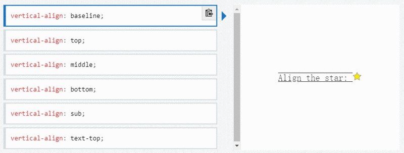
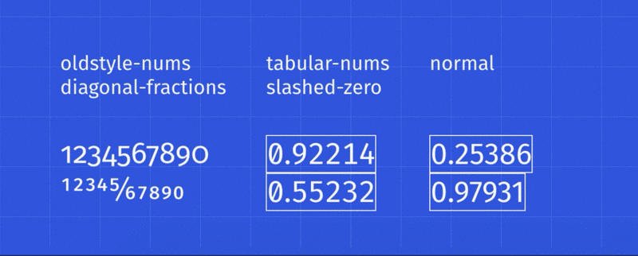
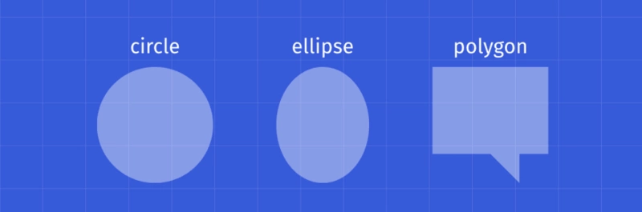
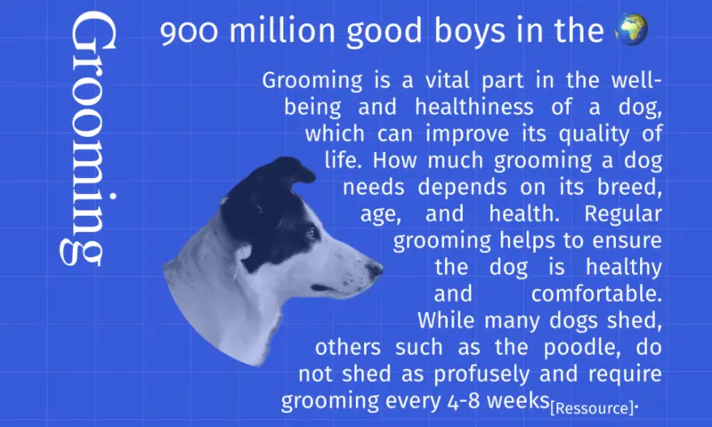

# CSS3属性与变量

## 1.border-radius
- 语法：border-radius: [左上] [右上] [右下] [左下]
- 语法：border-radius:x半径/y半径


## 2. ::after
- eg:放大镜

```css
div {
    width: 50px;
    height: 50px;
    border-radius: 50%;
    border: 5px solid #333;
    position: relative;
}
div::after {
    content: '';
    display: block;    
    width: 8px;    
    height: 60px;    
    border-radius: 5px;    
    background: #333;    
    position: absolute;    
    right: -22px;    
    top: 38px;    
    transform: rotate(-45deg);
}
```

## 3.attr和content:

- css3提供的attr：能够在css中获取到元素的某个属性值，然后插入到伪元素的content中去。

- html代码：

```html
<div data-title=“Hello World!”>hello</div>
```

- 我们来看看实现这个插件的css代码：
```css
div {
    position: relative;
}
div:hover::after {
    content: attr(data-title);    //取到data-title属性的值
    display: inline-block;
    padding: 10px 14px;
    border: 1px solid #ddd;
    border-radius: 5px;
    position: absolute;
    top: -50px;
    left: -30px;
}
```

- 当hover的时候，在元素尾部添加一个内容为data-title属性值的元素，所以就实现了hover显示的效果，如下图所示：

## 4.box-sizing
- 在标准盒子模型中，元素的总宽＝content + padding + border + margin。
box-sizing属性就是用来重定义这个计算方式的，它有三个取值，分别是：content-box（默认）、border-box、padding-box
一般来说，假如我们需要有一个占宽200px、padding10px、border5px的div，经过计算，要这么定义样式。

```css
div {
    width: 170px;   //这里的宽度要使用200-10*2-5*2 = 170得到。
    height: 50px;
    padding: 10px;
    border: 5px solid red;
}
```

- 然后我们来使用一下box-sizing属性。

```css
div {
    box-sizing: border-box;
    width: 200px;  //这里的宽度就是元素所占总宽度，不需要计算  
    height: 50px;
    padding: 10px;
    border: 5px solid red;
}
```

## 5.position属性

<font color=FF0000>absolute</font> 绝对定位，相对于 static 定位以外的第一个父元素进行定位。

<font color=FF0000>relative</font> 相对定位，相对于其自身正常位置进行定位。

<font color=FF0000>fixed</font> 固定定位，相对于浏览器窗口进行定位。

<font color=FF0000>static</font> 默认值。没有定位，元素出现在正常的流中。

<font color=FF0000>inherit</font> 规定应该从父元素继承 position 属性的值。


## 6. vertical-align

CSS 的属性 <font color=FF0000>vertical-align</font> 用来指定行内元素（<font color=FF0000>inline</font>）或表格单元格（<font color=FF0000>table-cell</font>）元素的垂直对齐方式。

vertical-align取其中一个值:<font color=FF0000>super | top | middle | bottom | baseline (default) | sub | text-top | text-bottom，</font>或从基线开始的长度(<font color=FF0000>px，%， em, rem</font>等等)。

- **sub：**使元素的基线与父元素的下标基线对齐。

- **super：**使元素的基线与父元素的上标基线对齐。

- **text-top：**使元素的基线与父元素的上标基线对齐。

- **text-bottom：**使元素的底部与父元素的字体底部对齐。

- **middle：**使元素的中部与父元素的基线加上父元素x-height（译注：x高度）的一半对齐。



> 注意 vertical-align 只对行内元素、表格单元格元素生效：不能用它垂直对齐块级元素。

## 7. writing-mode

<font color=FF0000>writing-mode</font> 属性定义了文本水平或垂直排布以及在块级元素中文本的行进方向。为整个文档设置书时，应在根元素上设置它（对于 HTML 文档应该在 html 元素上设置）。 它采用以下值之一<font color=FF0000>horizontal-tb (default) | vertical-rl | vertical-lr</font>。

- **horizontal-tb：**对于左对齐(ltr)脚本，内容从左到右水平流动。对于右对齐(rtr)脚本，内容从右到左水平流动。下一水平行位于上一行下方。

- **vertical-rl：**对于左对齐(ltr)脚本，内容从上到下垂直流动，下一垂直行位于上一行左侧。对于右对齐(rtr)脚本，内容从下到上垂直流动，下一垂直行位于上一行右侧。

- **vertical-lr：**对于左对齐(ltr)脚本，内容从上到下垂直流动，下一垂直行位于上一行右侧。对于右对齐(rtr)脚本，内容从下到上垂直流动，下一垂直行位于上一行左侧。

## 8. font-variant-numeric

<font color=FF0000>font-variant-numeric</font> CSS属性控制数字，分数和序号标记的替代字形的使用。

它采用以下这些值之一： <font color=FF0000>normal | ordinal | slashed-zero | lining-nums | oldstyle-nums | proportional-nums | tabular-nums | diagonal-fractions | stacked-fractions</font>。

此属性对于设置数字样式很有用。 根据情况，你可能希望显示老式的数字或带有斜杠的零，对于这些情况，font-feature-settings很有用。



>>> 请注意，font-variant-numeric是font-feature-settings组属性的一部分。 诸如font-variant-caps或font-variant-ligatures之类的属性也属于该组。还要注意，像所有font-feature-settings属性一样，你的字体需要实现上述功能才能正常工作。 我使用的字体是Fira Sans。

## 9. user-select

每当我们有不想让用户选择的文本，或者相反，如果发生了双击或上下文单击，希望选择所有文本时，<font color=FF0000>user-select</font>属性将非常有用。

此属性采用以下值之一：<font color=FF0000>none | auto | text | all</font>。


- **none：**元素及其子元素的文本不可选中。 请注意这个Selection 对象可以包含这些元素。 从Firefox 21开始， none 表现的像 -moz-none，因此可以使用 -moz-user-select: text 在子元素上重新启用选择。

- **auto：**auto 的具体取值取决于一系列条件，具体如下：
    
    - 在 ::before 和 ::after 伪元素上，采用的属性值是 none
    
    - 如果元素是可编辑元素，则采用的属性值是 contain
    
    - 否则，如果此元素的父元素的 user-select 采用的属性值为 all，则该元素采用的属性值也为 all
    
    - 否则，如果此元素的父元素的 user-select 采用的属性值为none，则该元素采用的属性值也为 none
    
    - 否则，采用的属性值为text

- **text：**用户可以选择文本。

- **all：**在一个HTML编辑器中，当双击子元素或者上下文时，那么包含该子元素的最顶层元素也会被选中。


## 10. clip-path

<font color=FF0000>clip-path</font> CSS 属性可以创建一个只有元素的部分区域可以显示的剪切区域。区域内的部分显示，区域外的隐藏。剪切区域是被引用内嵌的URL定义的路径或者外部svg的路径，或者作为一个形状例如<font color=FF0000>circle</font>()。<font color=FF0000>clip-path</font>属性代替了现在已经弃用的剪切 <font color=FF0000>clip</font>属性。

此属性采用以下值之一:<font color=FF0000>circle() | ellipse() | polygon() | path() | url()</font>。

我使用最多的两个值是<font color=FF0000>circle</font>和<font color=FF0000>polygon</font>。

- circle(radius at pair)值有两个参数，第一个参数是圆的半径，第二个参数是表示圆心的点。

- polygon(pair, pair, pair ...)值取3个或更多的点，表示一个三角形、一个矩形等等。



## 11. shape-outside

<font color=FF0000>shape-outside</font>的CSS 属性定义了一个可以是非矩形的形状，相邻的内联内容应围绕该形状进行包装。 默认情况下，内联内容包围其边距框; <font color=FF0000>shape-outside</font>提供了一种自定义此包装的方法，可以将文本包装在复杂对象周围而不是简单的框中。它采用与<font color=FF0000>clip-path</font>相同的值。

<font color=FF0000>clip-path</font>定义用户如何查看元素，<font color=FF0000>shape-outside</font>定义其他HTML元素如何查看元素。



## 12. background-clip

<font color=FF0000>backgroundclip</font> CSS属性设置元素的背景是否扩展到其<font color=FF0000>border</font> 、<font color=FF0000>padding</font> 或<font color=FF0000>content</font> 框之下。

此属性采用以下值之一：<font color=FF0000>border-box (default) | padding-box | content-box | text</font>


