# CSS混合模式

CSS 混合模式，就是三个被现代浏览器所广泛支持的 CSS 属性

1. <font color=FF0000> background-blend-mode </font>：用于混合元素背景图案、渐变和颜色

2. <font color=FF0000> mix-blend-mode </font>：用于元素与元素之间的混合

3. <font color=FF0000> isolation </font>：用户阻止某些元素在mix-blend-mode 使用时被混合


## CSS 渐变和 background-blend-mode 组合

我们使用<font color=FF0000>background</font>属性来设置 CSS 渐变，常用的值如 <font color=FF0000>linear-gradient()</font>, <font color=FF0000>radial-gradient()</font>, <font color=FF0000>repeating-linear-gradient()</font> 以及 <font color=FF0000>repeating-radial-gradient()</font>，而且<font color=FF0000>background</font>属性还能支持多个渐变参数，通过逗号来分隔。

### 1. 光谱背景

我们通过覆盖三层渐变来创造一个近乎全波段光谱的图像，展示再大家面前。 

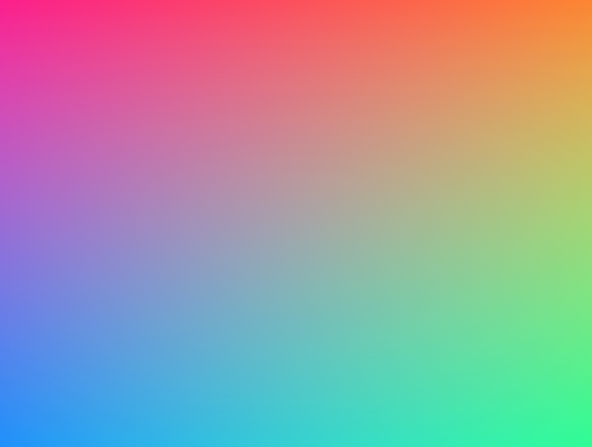

```css
.spectrum-background {
    background:
        linear-gradient(red, transparent),
        linear-gradient(to top left, lime, transparent),
        linear-gradient(to top right, blue, transparent);
    background-blend-mode: screen;
}
```

### 2. 条纹网格背景

同样的，通过这个属性我们可以实现出一些有趣的条纹网格背景来： 

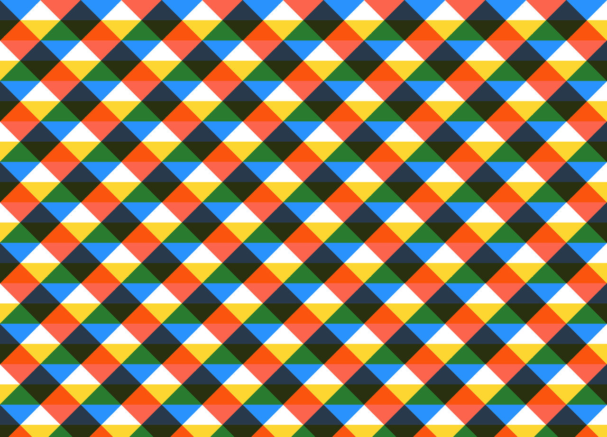

```css
.plaid-background {
    background:
        repeating-linear-gradient(
            -45deg,
            transparent 0,
            transparent 25%,
            dodgerblue 0,
            dodgerblue 50%
       ),
       repeating-linear-gradient(
            45deg,
            transparent 0,
            transparent 25%,
            tomato 0,
            tomato 50%
        ),
        repeating-linear-gradient(
            transparent 0,
            transparent 25%,
            gold 0,
            gold 50%
        ), white;
    background-blend-mode: multiply;
    background-size: 100px 100px;
}
```

### 3. 圆圈环绕背景

通过径向渐变来实现圆圈环绕背景： 

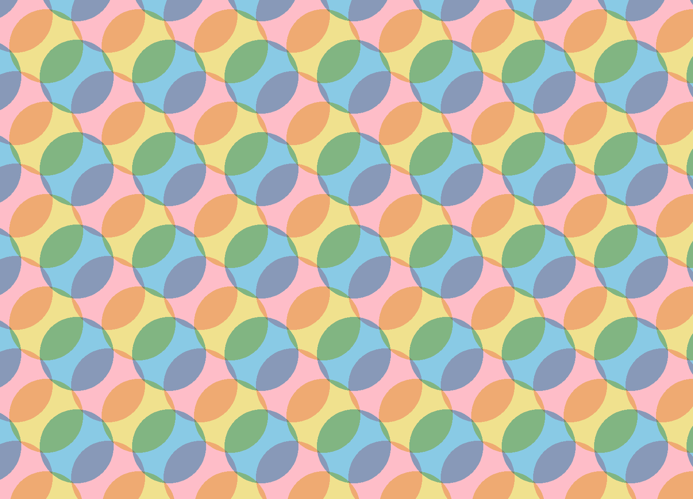

```css
.circles-background {
    background:
        radial-gradient(
            khaki 40px,
            transparent 0,
            transparent 100%
        ),
        radial-gradient(
            skyblue 40px,
            transparent 0,
            transparent 100%
        ),
        radial-gradient(
            pink 40px,
            transparent 0,
            transparent 100%
        ), snow;
    background-blend-mode: multiply;
    background-size: 100px 100px;
    background-position: 0 0, 33px 33px, -33px -33px;
}
```


## 图片效果和 background-blend-mode 组合

因为 background-image 允许我们在一个元素中添加多个渐变，同理我们也可以设置多张背景图片在同一元素中。当多张图片融合了 <font color=FF0000>background-blend-mode</font> 和 <font color=FF0000>filter</font>属性，图片的效果更加有趣：

### 1. 素描效果

我们可以通过 CSS 让左图的图片看起来像素描一样。不需要 Photoshop、HTML canvas、WebGL 或者 JavaScript 库，5 个 CSS 属性就足够了。

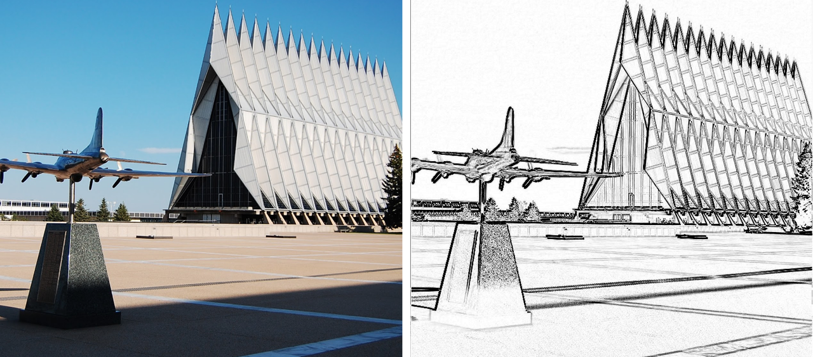

```html
<div class=”pencil-effect”></div>
```
- 添加两张图片

```css
.pencil-effect {
    background:
        url(chapel.jpg),
        url(chapel.jpg);
    background-size: cover;
}
```

- 下图左一就是我们的第一步的效果：

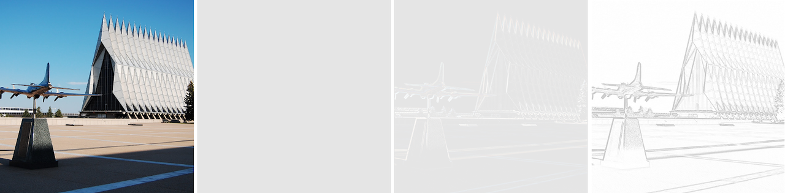

- 现在我们为它添加一个混合模式，效果如图二：**background-blend-mode: difference;**

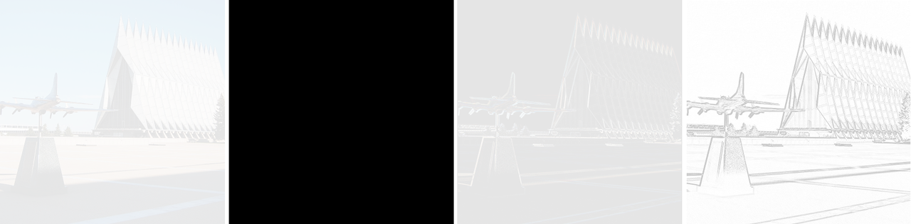

你会发现图二一片漆黑，difference 这种混合模式会将两张图片中每个像素点之间深色的像素去掉。假如你依旧疑惑，我们不妨通过 <font color=FF0000>background-position</font> 和 <font color=FF0000>calc()</font> 来实现一些位置上的偏差。

```css
background-position:
    calc(50% - 1px) calc(50% - 1px),
    calc(50% + 1px) calc(50% + 1px);
```

- 设置好两张背景图片的位置偏移后，现在我们可以看到图片中景物的边框了，如图三所示：


- 最后，通过添加 filter 属性，我们对图片进行反相和透明度和明度调整：

```css
filter: brightness(3) invert(1) grayscale(1);
```

- 完整的代码片段：

```css
.pencil-effect {
    background:
        url(photo.jpg),
        url(photo.jpg);
    background-size: cover;
    background-blend-mode: difference;
    background-position:
        calc(50% — 1px) calc(50% — 1px),
        calc(50% + 1px) calc(50% + 1px);
    filter: brightness(3) invert(1) grayscale(1);
}
```

- 最终效果如下图四所示:

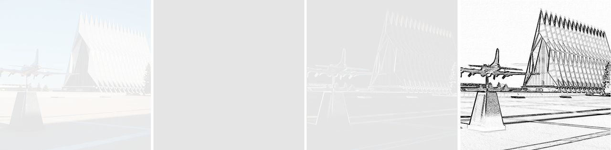

### 2. 黑板效果

基于上面的素描效果，我们通过调整一个 CSS 属性即可实现上图二的黑板报效果，把 filter 属性直接设置为 <font color=FF0000>invert(1)</font> 即可。


### 3. 夜视效果

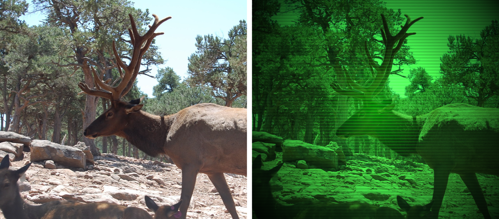

- 接下来通过 CSS 混合模式让图片看起来像通过夜视仪观察到的效果。首先设置好背景图片和相关样式（图一所示）：

```css
background: url(moose.jpg);
background-size: cover;
background-position: center;
```

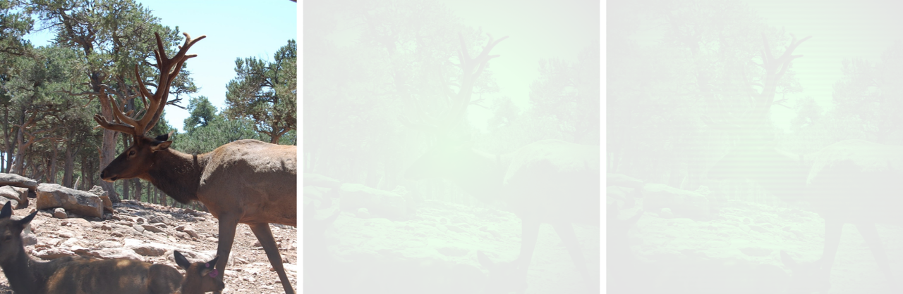

- 现在我们假如渐变和混合模式，这里加入的是一个具有一定透明度的黑色径向渐变：

```css
background:
    url(moose.jpg),
    radial-gradient(
        rgba(0,255,0,.8),
        black
    );
background-blend-mode: overlay;
```
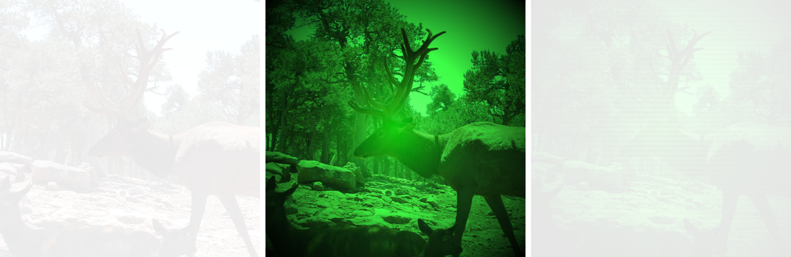

- 还不错，但可以继续优化。我有一些办法可以让图片看起来更加可信，通过加入一些扫描线到图片上并重复平铺（如图三）：

```css
background:
    url(moose.jpg),
    radial-gradient(
        rgba(0,255,0,.8),
        black
    ),
    repeating-linear-gradient(
        transparent 0,
        rgba(0,0,0,.2) 3px,
        transparent 6px
    );
```

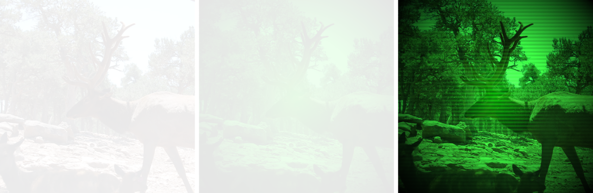

- 完整代码

```css
.night-vision-effect {
    background:
        url(moose.jpg),
        radial-gradient(
            rgba(0,255,0,.8),
            black
        ),
        repeating-linear-gradient(
            transparent 0,
            rgba(0,0,0,.2) 3px,
            transparent 6px
        );
    background-blend-mode: overlay;
    background-size: cover;
 }
```

## 四、浏览器兼容和优雅降级

好消息是 <font color=FF0000>background-blend-mode</font> 在 Firefox、Chrome 和 Opera 上兼容性良好。同时 Safari 中同样支持上述我们所列举的所有效果，目前 Safari 不支持的混合模式有： <font color=FF0000>saturation</font>, <font color=FF0000>hue</font>, <font color=FF0000>color</font>以及 <font color=FF0000>luminosity</font>。而 IE 浏览器则全部不支持。

- 这意味着我们需要考虑不支持混合模式的浏览器，通过 CSS 的 @supports 可以让这件事更加简单。第一个案例我们可以通过 @supports 检测混合模式支持度，并在不支持的时候做一个降级：

```css
.spectrum-background {
    background: gray;
@supports (background-blend-mode: screen) {
background:
linear-gradient(red, transparent),
linear-gradient(to top left, lime, transparent),
linear-gradient(to top right, blue, transparent);
background-blend-mode: screen;
}
}
```

- 我们也可以检测多个 CSS 属性，如下：

```css
.pencil-effect {
    background-image: url(photo.jpg);
    background-size: cover;
@supports (background-blend-mode: difference) and (filter: invert(1)) {
background-image:
url(photo.jpg),
url(photo.jpg);
background-blend-mode: difference;
background-position:
calc(50% — 1px) calc(50% — 1px),
calc(50% + 1px) calc(50% + 1px);
filter: brightness(3) invert(1) grayscale(1);
}
}
```