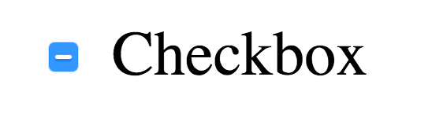
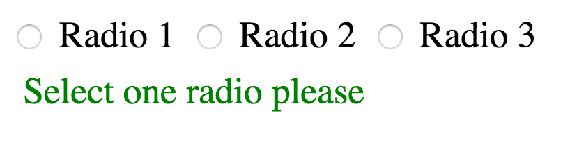
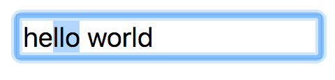

# 常用标签

## 1. a标签
 * 链接一个页面,点击则会跳转这个链接页面
 * 使用锚点滚动到设定的位置
 * 只有拥有name属性的a标签才能锚点,还有一种方式是通过ID标识唯一元素，也可以跳转(不仅仅是a标签)

```html
<a href=""></a>
<!--a标签中的href控制点击的时候跳转到哪里如果没写表示刷新当前页面-->

<a href="#"></a>
<!--跳转到当前页面(回归到页面顶部)-->

<a href="javascript:void(0);"></a>
<!--死链接，不会跳转，一般用于js特效-->

<a href="#name">锚点到一个标签上所对应的ID名字，点击则跳到那个标签位置</a>

<a href="//baidu.com">跳转到百度</a>
<!--跳转到百度 需要注意的是 http 协议不能少-->
```

## 2. 文本章节类HTML标签

###  article / section

- 都是表示文档中的一个独立区域（独立单元），其中还可以从结构上拆分成 header / footer 等部分。

- article比section要大一级：

    1.  article 中可以包含 section ，举个例子：一篇博客文章的下方或侧方一般会有“相关文章”的列表，那么，这一整块HTML就可以用 article 给包起来，而“相关文章”的那一小块HTML则可以用section来表示；再举个例子，比如说文章的“版权信息”，也可以用section来表示。
    2. article 中可包含 article ，比如说：一篇文章以及这篇文章的用户评论，整块HTML可以用 article 来包起来，而用户评论从逻辑分析起来也是从属于这篇文章的，因此也可以用 article 包起来并归到文章的 article 之下。
    3. section 之下不能再放 section 了，这从侧面表示这是最小一级的独立单元标签。
    
    4.  article 一般用于“详细内容”，因此一般一个页面只含有一个顶级的 article 。而相反， section 的用途更广泛一些，除却“详细内容”外都可以用 section 来进行包裹，比如说：网站首页上，可以利用 section 来展示不同分类/栏目的文章列表。

### pre: 预定义格式文本

- HTML pre 元素表示预定义格式文本。在该元素中的文本通常按照原文件中的编排，以等宽字体的形式展现出来，文本中的空白符（比如空格和换行符）都会显示出来。

```html
<pre>
    < Hello World >                          我      就是   想
      ---------------------------                    乱    七   
            \   ^__^                            八       遭
              \  (oo)\_______
                (__)\       )\/\        的                     定位  写
                    ||----w |
                    ||     ||                      出来 ~
</pre>
```

### figure 与 figcaption

- HTML figure 元素代表一段独立的内容, 经常与说明（caption）figcaption配合使用, 并且作为一个独立的引用单元。当它属于主内容流（main flow）时，它的位置独立于主体。这个标签经常是在主文中引用的图片，插图，表格，代码段等等.

```html
<figure>
    
    <figcaption>这是的我微信公众号，快来扫码认识我吧~</figcaption>
</figure>
```

### em 标签 与 strong 标签

- HTML 着重元素 (em) 标记出需要用户着重阅读的内容， em 元素是可以嵌套的，嵌套层次越深，则其包含的内容被认定为越需要着重阅读,一般显示为 " 倾斜字体 "。

- Strong 元素 (strong)表示文本十分重要，一般用粗体显示。

### 定义水平线：hr

## 3. 对话框

### dialog(只有Chrome和Safari支持)

- 基础用法：open属性控制dialog是否显示

```html
<dialog open>我是一个对话框</dialog>
```

- 简单用法：用JS来控制元素的显示跟隐藏。

    1. show: 显示dialog元素（跟open属性控制一样）

    2. showModal: 显示dialog元素，并且全屏居中，并带有黑色透明遮罩
    
    3. close: 隐藏dialog元素

```html
<dialog>
  <p>我是一个对话框</p>
  <button onclick="hideDialog()">隐藏对话框</button>
</dialog>

<button onclick="showDialog()">显示对话框</button>

<script>
  let dialog = document.querySelector("dialog");
  
  // 显示对话框
  function showDialog() {
    dialog.show();
  }
  
  // 隐藏对话框
  function hideDialog() {
    dialog.close();
  }
</script>
```

- 修改背景色: 直接覆盖掉样式
```css
/* ::backdrop伪元素（透明遮罩） */
dialog::backdrop {
  background: linear-gradient(45deg, black, transparent);
}
```

## 4. 表单元素

### 4.1 input标签

#### **defaultValue**: 
> 返回 / 设置在创建此对象的 HTML 中最初指定的默认值。

```html
<input type="text" value="Hello world">
```

```js
const input = document.querySelector('input');

console.log(input.value);        // 'Hello world'

input.value = 'New value';

console.log(input.value);        // 'New value'
console.log(input.defaultValue); // 'Hello world'
```

属性 <font color=FF0000>value</font> 中定义的值最初反映在元素属性 <font color=FF0000>value</font> 中，这没什么特别，但当你改变 <font color=FF0000>value</font> 时，仍然可以使用 <font color=FF0000>defaultValue</font> 访问“初始值”（<font color=FF0000>defaultChecked</font> 在复选框也可用）

#### indeterminate

> 表示复选框或单选按钮没有值且处于不确定的状态。复选框的外观会变成第三个状态，但这不影响 checked 属性的值，单击复选框会将值设置为 false。

<font color=FF0000>indeterminate</font> 属性是一个迷人的属性。你可曾知道复选框具有已选和未选之外的其他可视状态？<font color=FF0000>indeterminate</font> 是一个 property（没有对应的 attribute），你有时候可能会看到带着一个小破折号的复选框，使用这个属性便能做到。

```js
const input = document.querySelector('input');
input.indeterminate = true;
```


- indeterminate 不仅适用于复选框，还可以用于单选按钮和进度元素。假设有一组单选按钮，没有一个按钮被选择。在你未作出选择前，它们都没有被选中同时也都没有不被选中，这时它们就处于 indeterminate 状态。

- 还有一种玩法，你可以对被选定元素使用 CSS 伪类 :indeterminate，这样可以在单选按钮组未被选择时方便展示一些特殊的 UI 组件。

```css
.msg {
  display: none;
}

input:indeterminate ~ .msg {
  display: block;
}
```


- 有关 indeterminate 属性的有趣之处在于你可以将它设置为 true 或 false，这将影响复选框的伪类，但不会影响单选按钮。对于单选按钮，按钮组的实际选择状态始终是正确的。


#### selectionStart、selectionEnd 和 selectionDirection

这三个属性可以确定用户选择的内容，并且使用起来非常简单。如果用户在输入字段中选择文本，则可以使用这三个属性计算所选内容。



```js
const input = document.querySelector('input');

setInterval( _ => {
  console.log(
    input.selectionStart,
    input.selectionEnd,
    input.selectionDirection;
  ); // e.g. 2, 5, "forward"
}, 1000)
```

- 这段测试代码的作用是每秒记录一次选择值。<font color=FF0000>selectionStart</font> 和 <font color=FF0000>selectionEnd</font> 返回描述我选择位置的索引，但是当你使用鼠标或触控板选择时 <font color=FF0000>selectionDirection</font> 返回的是 none，而使用 SHIFT 和箭头选择文本时会返回 <font color=FF0000>forward</font> 或 <font color=FF0000>backward</font>。

