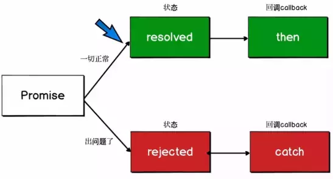

# 异步编程方案

> javascript语言的执行环境是"单线程"(single thread)，就是指一次只能完成一件任务。如果有多个任务，就必须排队，等前面一个任务完成，再执行后面一个任务，以此类推。

> 这种模式的好处是实现起来比较简单，执行环境相对单纯；坏处是只要有一个任务耗时很长，后面的任务都必须排队等着，会拖延整个程序的执行

## 同步

- 指在 主线程上排队执行的任务，只有前一个任务执行完毕，才能继续执行下一个任务。

- 也就是调用一旦开始，必须这个调用 **返回结果** 才能继续往后执行。程序的执行顺序和任务排列顺序是一致的。

## 异步

- 异步任务是指不进入主线程，而进入 **任务队列**的任务，只有任务队列通知主线程，某个异步任务可以执行了，该任务才会进入主线程。

- 每一个任务有一个或多个 **回调函数**。前一个任务结束后，不是执行后一个任务,而是执行回调函数，后一个任务则是不等前一个任务结束就执行。

- 程序的执行顺序和任务的排列顺序是不一致的，异步的。

- 我们常用的setTimeout和setInterval函数，Ajax都是异步操作。

## 如何实现异步编程

### 1、回调函数（Callback）

回调函数是异步操作最基本的方法。以下代码就是一个回调函数的例子：

```js
ajax(url, () => {
    // 处理逻辑
})
```

- 弱点：就是容易写出回调地狱（Callback hell）。假设多个请求存在依赖性，你可能就会写出如下代码：

```js
ajax(url, () => {
    // 处理逻辑
    ajax(url1, () => {
        // 处理逻辑
        ajax(url2, () => {
            // 处理逻辑
        })
    })
})
```

- 优点是简单、容易理解和实现，缺点是不利于代码的阅读和维护，各个部分之间高度耦合，使得程序结构混乱、流程难以追踪（尤其是多个回调函数嵌套的情况），而且每个任务只能指定一个回调函数。

### 2. 事件监听

在这种方式下：异步任务的执行不取决于代码的顺序，而取决于某个事件是否发生。

- 这种方法的优点是比较容易理解，可以绑定多个事件，每个事件可以指定多个回调函数，而且可以"去耦合"，有利于实现模块化。

- 缺点是整个程序都要变成事件驱动型，运行流程会变得很不清晰。阅读代码的时候，很难看出主流程。

### 3. 发布订阅

我们假定，存在一个"信号中心"，某个任务执行完成，就向信号中心"发布"（publish）一个信号，其他任务可以向信号中心"订阅"（subscribe）这个信号，从而知道什么时候自己可以开始执行。这就叫做 **"发布/订阅模式"**（publish-subscribe pattern），又称"观察者模式"（observer pattern）。

```js
// <!--首先，f2向信号中心jQuery订阅done信号。-->
jQuery.subscribe('done', f2);
// <!--然后，f1进行如下改写：-->
function f1() {
  setTimeout(function () {
    // ...
    jQuery.publish('done');
  }, 1000);
}
// <!--上面代码中，jQuery.publish('done')的意思是，f1执行完成后，向信号中心jQuery发布done信号，从而引发f2的执行。 f2完成执行后，可以取消订阅（unsubscribe）-->
jQuery.unsubscribe('done', f2);
```

### 4. Promise/A+

> MDN对Promise定义：Promise对象用于表示一个异步操作的最终状态（完成或失败），以及其返回的值。

Promise本意为**承诺**，我们可以理解为程序承诺过一段时间后会给你一个结果。 Promise是一个对象，可以保存三个状态 每一时刻必须有一个状态。

#### 1. Promise的三种状态

- Pending(处理中) ---- Promise对象实例创建时候的初始状态

- Fulfilled(完成) ---- 成功的操作，为表述方便，fulfilled 使用 resolved 代替

- Rejected(失败) ---- 可以理解为失败的状态



- pending可以转化为fulfilled或rejected并且只能转化一次，也就是说如果pending转化到fulfilled状态，那么就不能再转化到rejected。并且fulfilled和rejected状态只能由pending转化而来，两者之间不能互相转换。

#### 2. promise的链式调用

- 每次调用返回的都是一个新的Promise实例(这就是then可用链式调用的原因)

  1. then — 运行 promise 函数完成时传递给它的回调
  
  2. catch — 运行 promise 函数错误时传递给它的回调

- 如果then中返回的是一个结果的话会把这个结果传递下一次then中的成功回调

- 如果then中出现异常,会走下一个then的失败回调

- 在 then中使用了return，那么 return 的值会被Promise.resolve() 包装(见例1)

- then中可以不传递参数，如果不传递会透到下一个then中(见例2)

- catch 会捕获到没有捕获的异常

example:

```js
// 例1
Promise.resolve(1)
.then(res => {
console.log(res)
return 2 //包装成 Promise.resolve(2)
})
.catch(err => 3)
.then(res => console.log(res))

// result:
1
2
Promise:{<resolved>: undefined}
```

```js
// 例2
let fs = require('fs')
function read(url) {
  return new Promise((resolve, reject) => {
    fs.readFile(url, 'utf8', (err, data) => {
      if (err) reject(err)
      resolve(data)
    })
  })
}
read('./name.txt')
  .then(function(data) {
    throw new Error() //then中出现异常,会走下一个then的失败回调
  }) //由于下一个then没有失败回调，就会继续往下找，如果都没有，就会被catch捕获到
  .then(function(data) {
    console.log('data')
  })
  .then()
  .then(null, function(err) {
    console.log('then', err)// then error
  })
  .catch(function(err) {
    console.log('error')
  })
```

#### 3. promise 的优势

1. 链式调用
    - Promise 使用 then 方法后还会返回一个新的 Promise 对象，便于我们传递状态数据，同时链式写法接近于同步写法，更符合线性思维。

2. 错误捕捉
    - 相比回调函数的错误无法在外部捕捉的问题，Promise 能够为一连串的异步调用提供错误处理。

3. 控制反转再反转
    - 由于第三方提供的异步函数，无法保证回调函数如何被执行，但是 Promise 的特点，能够保证异步函数只能被 resolve 一次，以及始终以异步的形式执行代码。

4. 可以利用 Promise.all 和 Promise.race 来解决 Promise 始终未决议和并行 Promise 嵌套的问题

#### 4. Promise 的不足

1. 每个 .then() 都是一个独立的作用域
    - 加入有很多个 .then() 方法，就会创建很多个独立的作用域，那么将只能通过外面包裹一层函数作用域的闭包来共享状态数据

2. 无法取消单个 .then()
    - 当 Promise 链中任意一个 .then() 方法中有语句执行错误后，尽管经过 catch 方法的错误处理，还是并不会中断整个 Promise 链的执行。

3. 无法得知进度
    - 由于 Promise 只能从 pending 到 fullfilled 或 rejected 状态，无法得知 pending 阶段的进度。


### 5. 生成器Generators/ yield

Generator 函数是 ES6 提供的一种异步编程解决方案，语法行为与传统函数完全不同，Generator 最大的特点就是可以控制函数的执行。

- 语法上，首先可以把它理解成，Generator 函数是一个状态机，封装了多个内部状态。

- Generator 函数除了状态机，还是一个遍历器对象生成函数。

- 可暂停函数, yield可暂停，next方法可启动，每次返回的是yield后的表达式结果。

- yield表达式本身没有返回值，或者说总是返回undefined。next方法可以带一个参数，该参数就会被当作上一个yield表达式的返回值。

example:

```js
function *foo(x) {
  let y = 2 * (yield (x + 1))
  let z = yield (y / 3)
  return (x + y + z)
}
let it = foo(5)
console.log(it.next())   // => {value: 6, done: false}
console.log(it.next(12)) // => {value: 8, done: false}
console.log(it.next(13)) // => {value: 42, done: true}

// 首先 Generator 函数调用和普通函数不同，它会返回一个迭代器
// 当执行第一次 next 时，传参会被忽略，并且函数暂停在 yield (x + 1) 处，所以返回 5 + 1 = 6
// 当执行第二次 next 时，传入的参数12就会被当作上一个yield表达式的返回值，如果你不传参，yield 永远返回 undefined。此时 let y = 2 * 12，所以第二个 yield 等于 2 * 12 / 3 = 8
// 当执行第三次 next 时，传入的参数13就会被当作上一个yield表达式的返回值，所以 z = 13, x = 5, y = 24，相加等于 42
```

从上例中我们看出手动迭代Generator 函数很麻烦，实现逻辑有点绕，而实际开发一般会配合 co 库去使用。co是一个为Node.js和浏览器打造的基于生成器的流程控制工具，借助于Promise，你可以使用更加优雅的方式编写非阻塞代码。

```js
// npm install co
function* r() {
  let r1 = yield read('./1.txt')
  let r2 = yield read(r1)
  let r3 = yield read(r2)
  console.log(r1)
  console.log(r2)
  console.log(r3)
}
let co = require('co')
co(r()).then(function(data) {
  console.log(data)
})
// 2.txt=>3.txt=>结束=>undefined
```

### 6. async/await

Async/Await简介:
  
- async/await是基于Promise实现的，它不能用于普通的回调函数。

- async/await与Promise一样，是非阻塞的。

- async/await使得异步代码看起来像同步代码，这正是它的魔力所在。

Async 函数是通过在函数声明之前加上单词 async 来创建的: 一个函数如果加上 async ，那么该函数就会返回一个 Promise

- async必须在函数声明前


```js
async function async1() {
  return "1"
}
console.log(async1()) // -> Promise {<resolved>: "1"}
```

Async/Await并发请求: Async 函数可以使用 await 暂停，该关键字只能在 Async 函数中使用。 Await 返回 async 函数完成时返回的任何内容。

- await 接一个 promise，那么后面的代码就会等待，等promise resolve了才会执行。

```js
let fs = require('fs')
function read(file) {
  return new Promise(function(resolve, reject) {
    fs.readFile(file, 'utf8', function(err, data) {
      if (err) reject(err)
      resolve(data)
    })
  })
}
function readAll() {
  read1()
  read2()//这个函数同步执行
}
async function read1() {
  let r = await read('1.txt','utf8')
  console.log(r)
}
async function read2() {
  let r = await read('2.txt','utf8')
  console.log(r)
}
readAll() // 1.txt 2.txt
```

> 这是 promise 和 Async/Await 之间的区别

```js
// Async / Await
const asyncGreeting = async () => 'Greetings';

// Promise
const promiseGreeting = () => new Promise(((resolve) => {
  resolve('Greetings');
}));
asyncGreeting().then(result => console.log(result));
promiseGreeting().then(result => console.log(result));
```


