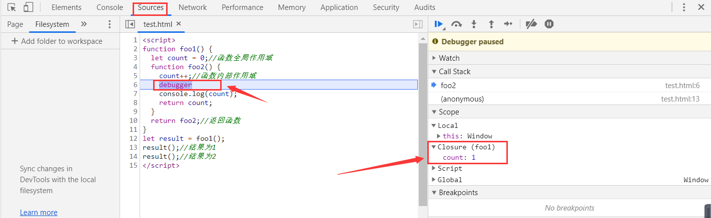

# 闭包

## 一个小 demo

```js
let count=500 //全局作用域
function foo1() {
  let count = 0;//函数全局作用域
  function foo2() {
    count++;//函数内部作用域
    console.log(count);
    return count;
  }
  return foo2;//返回函数
}
let result = foo1();
result();//结果为1
result();//结果为2
```

首先foo1()返回的是一个foo2()函数,当我们调用result()的时候就会返回foo2()执行的函数,foo2()里面有什么呢? 首先我们看到如下有一个count变量,但是没有定义.我们根据JavaScript的作用域链的定义可知,当函数内部的变量没有定义的时候,就会采用冒泡的方式,向上一级寻找.上一级没有接着上一级找,直到最顶层window. 如果都没有,就会报underfined的错误.这里我们在foo2()中找到了count,于是count+1,第一次输出的是1,没有什么问题.

```js
 function foo2() {
    count++;
    console.log(count);
    return count;
  }
```

但是第二次我们再执行result()的时候就出现了问题,为什么会是2呢?按照流程,首先再foo2()函数内部寻找count,没有然后到外层寻找,找到了count=0,这时候count+1应该为1才对.这里就涉及到闭包的问题了.



首先我们在原来的代码中加一个debugger,然后到谷歌浏览器右键检查,点击resources就可以看到右边有一个Closure,浏览器的可视化已经证实了这的确是一个闭包.并且count=1已经存储在了Closure之中.也就说明count=1没有被销毁,等下次在调用result()的时候count=2.


## 作用域

要学习Clusure必须了解JavaScript的作用域相关知识 作用域包括：

1. 全局作用域

2. 函数作用域

3. 块级作用域(es6 新出,解决 var 问题, 新增 let, const)

```js
  var count = 100; //全局作用域
  function foo1() {
    var count = 0; //函数全局作用域
    return count; //返回函数
  }
  if (count == 1) {
    //块级作用域
    console.log(count);
  }
```

上面代码简单可以看出作用域分类,需要注意是,一个函数(function)也是块级作用域,简单来说,一般有 {}都可以算做是一个块级作用域.

## 作用域链

作用域里面嵌套作用域,就形成了作用域链. 外部作用域无法访问内部的作用域,看如下例子

```js
function foo(){
var n=1
function foo2(){
  var m=1
  console.log(n) //1
}
foo2()
}
foo()
console.log(n) //err: n is not defined
```

上述代码中在全局中无法访问内部的n,但是在嵌套的内部foo2()可以访问外部的函数,这就是作用域产生的特殊效果.

明白了作用域链,我们再来看个例子(很有迷惑性,仔细看看哦):

```js
 var name = 'Mike'; //第一次定义name
  function showName() {
    console.log(name);  //输出 Mike 还是 Jay ？     
  }

  function changeName() {
    var name = 'Jay'; //重新定义name
    showName(); //调用showName()
  }
  changeName();
```

上面的例子你觉得输出的是什么呢?答案是Mike.在这里我们引出了一个新的概念,<font color=FF0000>词法作用域</font> 作用域有两种模型:

- 词法作用域（静态）：js查找是按照代码书写时候的位置来决定的，而不是按照调用时候位置

- 动态作用域：目前还有使用的有Perl，Bash (可以自行了解)

通过词法作用域的的规则我们可以再来分析一下

1. 调用changeName()时,找到这个函数

2. 定义var name = "Jay"

3. 调用showName()

4. 在changeName()里面查找是否有showName()这个方法,发现没有,向外层查找,找到了

5. 调用console.log(name),在函数内部查找有没有name,没有,向外查找,找到了,name="Mike"

6. 输出Mike


## 闭包

闭包在两本书上的官方解释:

1. 小"黄"书(你不知道的JavaScript): 当函数可以记住并访问所在的词法作用域时,就产生了闭包,即使函数是在当前词法作用域之外执行.

2. 红宝书(JavaScript高级程序设计): 闭包是指有权访问另一个 函数作用域中的变量的函数

> 理解：当一个变量(就像上面的name)既不是该函数内部的局部变量,也不是该函数的参数,相对于作用域来说,就是一个自由变量(引用了外部变量),这样就会形成一个闭包.==> 嵌套函数中调用了外部变量就会形成闭包

```js
let count = 500; //全局作用域
function foo1() {
  let count = 0; //函数全局作用域
  function foo2() {
    let count2 = 1; //随便新增一个变量
    // count++;  注释
    debugger;
    //console.log(count); 注释
    //return count;  注释
  }
  return foo2; //返回函数
}
let result = foo1();
result(); //结果为1
result(); //结果为2
```

这时Closure已经消失了,这也就证实我说的,如果函数内部不调用外部的变量,就不会形成闭包.但是如果调用了外部变量,那么就会形成闭包. 这也就是说不是所有的函数嵌套函数都能形成闭包

### 循环闭包的实例

```js
for (var i = 1; i <= 5; i++) {
  setTimeout(function timer() {
    debugger;
    console.log(i); // 输出什么?   
  }, 1000);
}
```

答案 6 6 6 6 6 .因为setTimeout里面的回调函数是一个异步的过程(异步代表可以不用等待我这个代码先执行完,可以先往后执行),而for循环是同步的(代码只能从上往下的执行),立即执行,异步的setTimeout必须等待一秒才能执行,这时i早已经循环结束了.
解决办法有三个:

1. 将for循环中的var 改成let

```js
for (let i = 1; i <= 5; i++) {
  setTimeout(function timer() {
    debugger;
    console.log(i); // 1 2 3 4 5 
  }, 1000);
}
```

这样就没有问题了, 因为let是有块级的功能,每一层循环都是独立的,互不影响,所以才能正常输出.

2. 把setTimeout()套上一个function

```js
for (var i = 1; i <= 5; i++) {
  log(i); // 1 2 3 4 5
}
function log(i) {
  setTimeout(function timer() {
    debugger;
    console.log(i);
  }, 1000);
}
```

这样同样能够实现这个功能,原理和第一个方法一样,每一个log()都是独立的,互不影响,这样才能有正确的结果,var就是因为没有块级的功能,才会出问题 

3. 包装成匿名函数

```js
for (var i = 1; i <= 5; i++) {
  (function (i) {
    setTimeout(function timer() {
      debugger;
      console.log(i);
    }, 1000);
  })(i)
}
```
前面一个(func..)定义函数,后面一个(i)调用,这再JavaScript叫做立即执行函数,其实与第二种方式是一样的,只是写法不一样.

