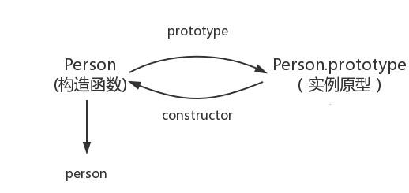
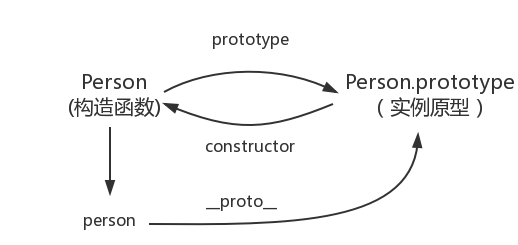
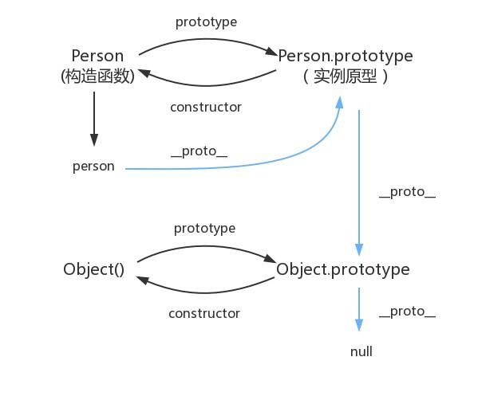

# JS 原型及原型链

## 实例和构造函数

当我们用构造函数创建一个实例时，我们会这么写：

```JS
// 构造函数
function Person () {}
// 实例
var person = new Person();
var student = new Person();
```

其中，我们称**Person**为构造函数，**person和student**为构造函数Person的实例。

JS中的每种数据类型基本都有构造函数，如：

- obj的构造函数是function Object()

- array的构造函数是function Array()

- boolean的构造函数是function Boolean()

- string的构造函数是function String()

- number的构造函数是function Number()

- regExp的构造函数是function RegExp()

- date的构造函数是function Date()

## 原型 prototype

每个函数(包含自定义的函数)创建的时候都会自带一个prototype属性，这个属性指向另外一个对象，这个对象就是我们所说的原型。

换句话说prototype是函数特有的属性。

原型的构造函数指向该构造函数，即：Person.prototype.constructor === Person。



就像我们生产一个商品一样，我们最开始的时候会设计该商品，然后将其制作出来，制作完成后我们会对其进行检验是否达标，如果不达标，我们会对其进行重新设计并制作，直至其达标，那么这件商品最终形态我们称之为原型，之后便可以按照该原型进行批量生产甚至改造成其他版本。

也就是说，所有的实例都会拥有原型的所有方法，还拿Person来讲解。

```js
// 构造函数
function Person () {}
// Person.prototype表示Person的原型
Person.prototype.say = function () { console.log('hello') }
// 实例
var person = new Person();
var student = new Person();

person.say(); // 输出`hello`
student.say(); // 输出`hello`
```

当我们给原型添加一个say方法时，原型的所有实例都会同时拥有该方法，我们可以理解为原型就是实例的公共库，同一原型的所有实例都可以调用该公共库。

就像我们定义一个数组一样var arr = []，arr的构造函数就是function Array()，其原型为Array.prototype，我们没有给arr定义任何方法和属性，但是我们仍然可以用push，pop等方法，因为这是Array.prototype中定义的，它就是arr的公共库，可以调用它的所有方法和属性，我们称这种关系为**原型链**

## 原型链 __proto__

在JavaScript中并没有类的概念，类的继承和多态是通过原型链来实现的。

我们在原型中所说的实例可以调用原型中的所有方法和属性就是继承的实现，同时其也可以实现多态，即可以对原型上的方法和属性进行重写。

```js
// 构造函数
function Person () {}
// Person.prototype表示Person的原型
Person.prototype.say = function () { console.log('hello') }
// 实例
var person = new Person();
var student = new Person();

// 重写原型上的方法
person.say = function () { console.log('我是实例person上的say方法') }

person.say(); // 输出`我是实例person上的say方法`
student.say(); // 输出`hello`
```

这里并不是覆盖，只是重写而已，我们可以看到Person.prototype.say()还是可以照样输出的。

那么它的寻找顺序是怎样的呢？

1. 在实例上寻找，如果有该方法或属性，则直接调用

2. 如果实例上没有，则在实例的原型上寻找，有则直接调用

3. 如果原型上没有，则继续在原型的原型上寻找，有则直接调用

4. 循环第三步，直至null为止

prototype是函数特有的属性，但是person和student是一个对象类型，没有该属性；

JavaScript提供了__proto__来获取其原型，即person.__proto__ === Person.prototype。



## 万物皆对象

从上面看来，我们了解了原型，原型链的概念，也知道怎么获取原型，那么就思考一个问题：原型的原型是什么。

```js
// Person.prototype是原型
// __proto__是原型的原型，即我们可以通过__proto__不停的向上寻找
console.log(Person.prototype.__proto__);

/* 输出结果
  {constructor: ƒ Object(), __defineGetter__: ƒ, __defineSetter__: ƒ, hasOwnProperty: ƒ, __lookupGetter__: ƒ, …}
*/
```

我们看到，它指向的是Object，即Person.prototype.__proto__ === Object.prototype。



我们常说，万物皆对象，那么是不是其他的类型也是指向了Object.prototype呢？

```js
// 字符类型的原型
var str = '前端橘子君';
str.__proto__.__proto__ === Object.prototype;

// 数字类型的原型
var num = 100;
num.__proto__.__proto__ === Object.prototype;

// 正则类型的原型
var reg = /[1-9]*/;
reg.__proto__.__proto__ === Object.prototype;

// 日期类型的原型
var date = new Date();
date.__proto__.__proto__ === Object.prototype;

// 布尔类型的原型
var boolean = true;
boolean.__proto__.__proto__ === Object.prototype;

// 数组类型的原型
var arr = [];
arr.__proto__.__proto__ === Object.prototype;

// Symbol类型的原型
var symbol = Symbol('前端橘子君');
symbol.__proto__.__proto__ === Object.prototype;

// 对象类型的原型
var obj = {};
obj.__proto__ === Object.prototype;
```

由此可见，所有变量和方法的最终原型是Object，也就是当我们调用一个方法时，如果到了Object.prototype仍然没有找到，就会提示没有该方法，否则就调用最近的方法。

