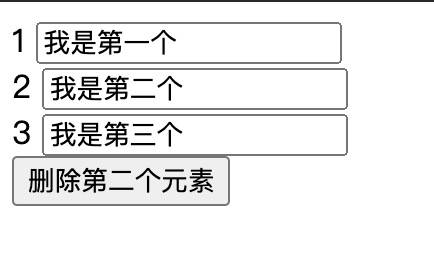
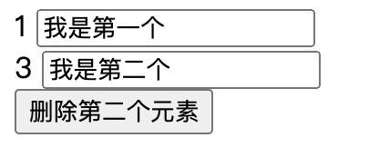

# vue常用开发技巧

## 1.路由参数解耦

一般在组件内使用路由参数，大多数人会这样做：

```js
export default {
    methods: {
        getParamsId() {
            return this.$route.params.id
        }
    }
}
```

- 在组件中使用 $route 会使之与其对应路由形成高度耦合，从而使组件只能在某些特定的 URL 上使用，限制了其灵活性。

- 正确的做法是通过 props 解耦

```js
const router = new VueRouter({
    routes: [{
        path: '/user/:id',
        component: User,
        props: true
    }]
})
```

- 将路由的 props 属性设置为 true 后，组件内可通过 props 接收到 params 参数

```js
export default {
    props: ['id'],
    methods: {
        getParamsId() {
            return this.id
        }
    }
}
```

- 另外你还可以通过函数模式来返回 props

```js
const router = new VueRouter({
    routes: [{
        path: '/user/:id',
        component: User,
        props: (route) => ({
            id: route.query.id
        })
    }]
})
```

## 2.函数式组件

函数式组件是无状态，它无法实例化，没有任何的生命周期和方法。创建函数式组件也很简单，只需要在模板添加 functional 声明即可。一般适合只依赖于外部数据的变化而变化的组件，因其轻量，渲染性能也会有所提高。

组件需要的一切都是通过 context 参数传递。它是一个上下文对象，具体属性查看文档。这里 props 是一个包含所有绑定属性的对象。

- 函数式组件

```html
<template functional>
    <div class="list">
        <div class="item" v-for="item in props.list" :key="item.id" @click="props.itemClick(item)">
            <p>{{item.title}}</p>
            <p>{{item.content}}</p>
        </div>
    </div>
</template>
```

- 父组件使用

```html
<template>
    <div>
        <List :list="list" :itemClick="item => (currentItem = item)" />
    </div>
</template>
```

```js
import List from '@/components/List.vue'
export default {
    components: {
        List
    },
    data() {
        return {
            list: [{
                title: 'title',
                content: 'content'
            }],
            currentItem: ''
        }
    }
}
```

## 3.样式穿透

在开发中修改第三方组件样式是很常见，但由于 scoped 属性的样式隔离，可能需要去除 scoped 或是另起一个 style 。这些做法都会带来副作用（组件样式污染、不够优雅），样式穿透在css预处理器中使用才生效。

- 我们可以使用 >>> 或 /deep/ 解决这一问题:

```js
// >>>
<style scoped>
外层 >>> .el-checkbox {
  display: block;
  font-size: 26px;

  .el-checkbox__label {
    font-size: 16px;
  }
}
</style>

// /deep/
<style scoped>
/deep/ .el-checkbox {
  display: block;
  font-size: 26px;

  .el-checkbox__label {
    font-size: 16px;
  }
}
</style>
```

## 4.watch高阶使用

### 立即执行

- watch 是在监听属性改变时才会触发，有些时候，我们希望在组件创建后 watch 能够立即执行

- 可能想到的的方法就是在 create 生命周期中调用一次，但这样的写法不优雅，或许我们可以使用这样的方法

```js
export default {
    data() {
        return {
            name: 'Joe'
        }
    },
    watch: {
        name: {
            handler: 'sayName',
            immediate: true
        }
    },
    methods: {
        sayName() {
            console.log(this.name)
        }
    }
}
```

### 深度监听

- 在监听对象时，对象内部的属性被改变时无法触发 watch ，我们可以为其设置深度监听

```js
export default {
    data: {
        studen: {
            name: 'Joe',
            skill: {
                run: {
                    speed: 'fast'
                }
            }
        }
    },
    watch: {
        studen: {
            handler: 'sayName',
            deep: true
        }
    },
    methods: {
        sayName() {
            console.log(this.studen)
        }
    }
}
```

### 触发监听执行多个方法

使用数组可以设置多项，形式包括字符串、函数、对象

```js
export default {
    data: {
        name: 'Joe'
    },
    watch: {
        name: [
            'sayName1',
            function(newVal, oldVal) {
                this.sayName2()
            },
            {
                handler: 'sayName3',
                immaediate: true
            }
        ]
    },
    methods: {
        sayName1() {
            console.log('sayName1==>', this.name)
        },
        sayName2() {
            console.log('sayName2==>', this.name)
        },
        sayName3() {
            console.log('sayName3==>', this.name)
        }
    }
}
```

## 5.watch监听多个变量

- watch本身无法监听多个变量。但我们可以将需要监听的多个变量通过计算属性返回对象，再监听这个对象来实现“监听多个变量”

```js
export default {
    data() {
        return {
            msg1: 'apple',
            msg2: 'banana'
        }
    },
    compouted: {
        msgObj() {
            const { msg1, msg2 } = this
            return {
                msg1,
                msg2
            }
        }
    },
    watch: {
        msgObj: {
            handler(newVal, oldVal) {
                if (newVal.msg1 != oldVal.msg1) {
                    console.log('msg1 is change')
                }
                if (newVal.msg2 != oldVal.msg2) {
                    console.log('msg2 is change')
                }
            },
            deep: true
        }
    }
}
```

## 6.事件参数$event

$event 是事件对象的特殊变量，在一些场景能给我们实现复杂功能提供更多可用的参数

### 原生事件

- 在原生事件中表现和默认的事件对象相同

```html
<template>
    <div>
        <input type="text" @input="inputHandler('hello', $event)" />
    </div>
</template>
```

```js
export default {
    methods: {
        inputHandler(msg, e) {
            console.log(e.target.value)
        }
    }
}
```

### 自定义事件

- 在自定义事件中表现为捕获从子组件抛出的值

- my-item.vue :

```js
export default {
    methods: {
        customEvent() {
            this.$emit('custom-event', 'some value')
        }
    }
}
```

- App.vue

```html
<template>
    <div>
        <my-item v-for="(item, index) in list" @custom-event="customEvent(index, $event)">
            </my-list>
    </div>
</template>
```
```js
export default {
    methods: {
        customEvent(index, e) {
            console.log(e) // 'some value'
        }
    }
}
```

## 7.自定义组件双向绑定

- 组件 model 选项:

::: tip
允许一个自定义组件在使用 v-model 时定制 prop 和 event。默认情况下，一个组件上的 v-model 会把 value 用作 prop 且把 input 用作 event，但是一些输入类型比如单选框和复选框按钮可能想使用 value prop 来达到不同的目的。使用 model 选项可以回避这些情况产生的冲突。
:::

- input 默认作为双向绑定的更新事件，通过 $emit 可以更新绑定的值

```html
<my-switch v-model="val"></my-switch>
```

```js
export default {
    props: {
        value: {
            type: Boolean,
            default: false
        }
    },
    methods: {
        switchChange(val) {
            this.$emit('input', val)
        }
    }
}
```

- 修改组件的 model 选项，自定义绑定的变量和事件

```html
<my-switch v-model="num" value="some value"></my-switch>
```

```js
export default {
    model: {
        prop: 'num',
        event: 'update'
    },
    props: {
        value: {
            type: String,
            default: ''
        },
        num: {
            type: Number,
            default: 0
        }
    },
    methods: {
        numChange() {
            this.$emit('update', this.num++)
        }
    }
}
```

## 8.监听组件生命周期

- 通常我们监听组件生命周期会使用 $emit ，父组件接收事件来进行通知

子组件

```js
export default {
    mounted() {
        this.$emit('listenMounted')
    }
}
```

父组件

```html
<template>
    <div>
        <List @listenMounted="listenMounted" />
    </div>
</template>
```

- 其实还有一种简洁的方法，使用 @hook 即可监听组件生命周期，组件内无需做任何改变。同样的， created 、 updated 等也可以使用此方法。

```html
<template>
    <List @hook:mounted="listenMounted" />
</template>
```

## 9.程序化的事件侦听器

比如，在页面挂载时定义计时器，需要在页面销毁时清除定时器。这看起来没什么问题。但仔细一看 this.timer 唯一的作用只是为了能够在 beforeDestroy 内取到计时器序号，除此之外没有任何用处。

```js
export default {
    mounted() {
        this.timer = setInterval(() => {
            console.log(Date.now())
        }, 1000)
    },
    beforeDestroy() {
        clearInterval(this.timer)
    }
}
```

如果可以的话最好只有生命周期钩子可以访问到它。这并不算严重的问题，但是它可以被视为杂物。

- 我们可以通过 $on 或 $once 监听页面生命周期销毁来解决这个问题：

```js
export default {
    mounted() {
        this.creatInterval('hello')
        this.creatInterval('world')
    },
    creatInterval(msg) {
        let timer = setInterval(() => {
            console.log(msg)
        }, 1000)
        this.$once('hook:beforeDestroy', function() {
            clearInterval(timer)
        })
    }
}
```
- 使用这个方法后，即使我们同时创建多个计时器，也不影响效果。因为它们会在页面销毁后程序化的自主清除。

## 10.删除事件监听器

删除事件监听器是一种常见的最佳实践，因为它有助于避免内存泄露并防止事件冲突。

- 如果你想在 created 或 mounted 的钩子中定义自定义事件监听器或第三方插件，并且需要在 beforeDestroy 钩子中删除它以避免引起任何内存泄漏，那么这是一个很好的特性。下面是一个典型的设置：
```js
mounted () {
    window.addEventListener('resize', this.resizeHandler);
},
beforeDestroy () {
    window.removeEventListener('resize', this.resizeHandler);
}
```

- 使用 $on('hook:')方法，你可以仅使用一种生命周期方法（而不是两种）来定义/删除事件。

```js
mounted () {
  window.addEventListener('resize', this.resizeHandler);
  this.$on("hook:beforeDestroy", () => {
    window.removeEventListener('resize', this.resizeHandler);
  })
}
```

## 11.手动挂载组件

在一些需求中，手动挂载组件能够让我们实现起来更加优雅。比如一个弹窗组件，最理想的用法是通过命令式调用，就像 elementUI 的 this.$message 。而不是在模板中通过状态切换，这种实现真的很糟糕。

```js
import Vue from 'vue'
import Message from './Message.vue'

// 构造子类
let MessageConstructor = Vue.extend(Message)
// 实例化组件
let messageInstance = new MessageConstructor()
// $mount可以传入选择器字符串，表示挂载到该选择器
// 如果不传入选择器，将渲染为文档之外的的元素，你可以想象成 document.createElement()在内存中生成dom
messageInstance.$mount()
// messageInstance.$el获取的是dom元素
document.body.appendChild(messageInstance.$el)
```

- 下面实现一个简易的 message 弹窗组件: Message/index.vue

```html
<template>
    <div class="wrap">
        <div class="message" :class="item.type" v-for="item in notices" :key="item._name">
            <div class="content">{{item.content}}</div>
        </div>
    </div>
</template>
```

```js
// 默认选项
const DefaultOptions = {
    duration: 1500,
    type: 'info',
    content: '这是一条提示信息！',
}
let mid = 0
export default {
    data() {
        return {
            notices: []
        }
    },
    methods: {
        add(notice = {}) {
            // name标识 用于移除弹窗
            let _name = this.getName()
            // 合并选项
            notice = Object.assign({
                _name
            }, DefaultOptions, notice)

            this.notices.push(notice)

            setTimeout(() => {
                this.removeNotice(_name)
            }, notice.duration)
        },
        getName() {
            return 'msg_' + (mid++)
        },
        removeNotice(_name) {
            let index = this.notices.findIndex(item => item._name === _name)
            this.notices.splice(index, 1)
        }
    }
}
```
```css
.wrap {
    position: fixed;
    top: 50px;
    left: 50%;
    display: flex;
    flex-direction: column;
    align-items: center;
    transform: translateX(-50%);
}

.message {
    --borderWidth: 3px;
    min-width: 240px;
    max-width: 500px;
    margin-bottom: 10px;
    border-radius: 3px;
    box-shadow: 0 0 8px #ddd;
    overflow: hidden;
}

.content {
    padding: 8px;
    line-height: 1.3;
}

.message.info {
    border-left: var(--borderWidth) solid #909399;
    background: #F4F4F5;
}

.message.success {
    border-left: var(--borderWidth) solid #67C23A;
    background: #F0F9EB;
}

.message.error {
    border-left: var(--borderWidth) solid #F56C6C;
    background: #FEF0F0;
}

.message.warning {
    border-left: var(--borderWidth) solid #E6A23C;
    background: #FDF6EC;
}
```

- Message/index.js

```js
import Vue from 'vue'
import Index from './index.vue'

let messageInstance = null
let MessageConstructor = Vue.extend(Index)

let init = () => {
    messageInstance = new MessageConstructor()
    messageInstance.$mount()
    document.body.appendChild(messageInstance.$el)
}

let caller = (options) => {
    if (!messageInstance) {
        init(options)
    }
    messageInstance.add(options)
}

export default {
    // 返回 install 函数 用于 Vue.use 注册
    install(vue) {
        vue.prototype.$message = caller
    }
}
```

- main.js

```js
import Message from '@/components/Message/index.js'

Vue.use(Message)
```
- 使用
```js
this.$messaga({
    type: 'success',
    content: '成功信息提示',
    duration: 3000
})
```

## 12.动态指令参数

Vue 2.6的最酷功能之一是可以将指令参数动态传递给组件。假设你有一个按钮组件，并且在某些情况下想监听单击事件，而在其他情况下想监听双击事件。这就是这些指令派上用场的地方：

```html
<template>
	...
	<aButton @[someEvent]="handleSomeEvent()" />...
</template>
<script>
  ...
  data(){
    return{
      ...
      someEvent: someCondition ? "click" : "dbclick"
    }
  },
  methods: {
    handleSomeEvent(){
      // handle some event
    }
  }  
</script>
```

## 13.重用相同路由的组件

开发人员经常遇到的情况是，多个路由解析为同一个Vue组件。问题是，Vue出于性能原因，默认情况下共享组件将不会重新渲染，如果你尝试在使用相同组件的路由之间进行切换，则不会发生任何变化。

```js
const routes = [
  {
    path: "/a",
    component: MyComponent
  },
  {
    path: "/b",
    component: MyComponent
  },
];
```

如果你仍然希望重新渲染这些组件，则可以通过在 router-view 组件中提供 :key 属性来实现。

```html
<template>
	<router-view :key="$route.path"></router-view>
</template>
```

## 14.把所有Props传到子组件很容易

这是一个非常酷的功能，可让你将所有 props 从父组件传递到子组件。如果你有另一个组件的包装组件，这将特别方便。所以，与其把所有的 props 一个一个传下去，你可以利用这个，把所有的 props 一次传下去：

```html
<template>
  <childComponent v-bind="$props" />
</template>
```
代替：

```html
<template>
  <childComponent :prop1="prop1" :prop2="prop2" :prop="prop3" :prop4="prop4" ... />
</template>
```

## 15.把所有事件监听传到子组件很容易

如果子组件不在父组件的根目录下，则可以将所有事件侦听器从父组件传递到子组件，如下所示：

```html
<template>
	<div>
    ...
		<childComponent v-on="$listeners" />...	
  <div>
</template>
```

如果子组件位于其父组件的根目录，则默认情况下它将获得这些组件，因此不需要使用这个小技巧。


## 16.v-for设置键值

为什么要给v-for设置键值？



```html
<!--模板部分-->
<div id="app">
    <div v-for="item in arr">
        {{item}}
        <input/>
    </div>

    <button @click="deleteData">删除第二个元素</button>
</div>
```

```js
// js 部分
new Vue({
    el: '#app',
    data() {
        return {
            arr: [1,2,3]
        }
    },
    methods:{
        deleteData() {
            this.arr.splice(1,1)
        }
    }
})
```

现在需要删除第二个元素。下面我们分别在渲染列表是 不使用key,使用索引作为key, 使用唯一值id作为key,看三种场景删除第二个元素之后的效果:

1. v-for 不使用key



2. v-for 使用索引作为key


3. v-for 使用唯一值id作为key


- 为什么v-for需要设置key，原因很简单。 对比数组 [1,2,3]和[1,3]，我们很容易发现删掉了2，但是计算机不是这样的逻辑:

    1. 计算机对比新旧数组，发现1===1，保持不变

    2. 然后再对比2，发现2变成了3，那么就把2修改为3，原来第二行的元素都可以复用，只把数字改一下就可以了

    3. 然后在对比3与undefined，发现3被删了，索引把第三行的元素删掉

- 那么为什么不能用索引作为key呢？ 当删掉[1,2,3]中的2之后，数组的长度由3变成了2，那么原来数字3的索引就变成了数字2的索引了。

- 而对于使用id作为key,那么每条数据都有了唯一的标识，当删掉[{id:'1',value: 1},{id: '2',value: 2}, {id: '3', value:3}]中的第二个，整个过程如下:

    
    1. 计算机取出新数据第一项的id，然后在原来数据里面寻找，发现存在相同id的数据，而且数据没有变化，所以保持不变
    
    2. 计算机继续取第二项的id，发现是3，然后从原来数据里面也找到了3，所以3保留
    
    3. 这时候旧数据里面剩了id为2的数据，而新的里面没有了，所以删掉。


## 17.模板中的复杂逻辑使用计算属性代替

vue在模板可以使用表达式是非常方便的，但表达式在设计之初是为了进行简单逻辑处理的，如果在模板中使用太多或太复杂的逻辑，会让模板的可读性和可维护性变得很差，整个模板显得很臃肿。

- Bad
```html
<!--v-if使用了一连串的条件判断,可读性比较差-->
 <button
    v-if="
      user.roles &&
        user.roles.includes('Workflowbeheer') &&
        data.userId === user.id &&
        data.status === 1
    "
  >
    删除
  </button>
```

- Good

```html
<template>
  <button v-if="deletable">
    删除
  </button>
</template>
<script>
export default {
  computed: {
    // 判断是否可以删除
    deletable() {
      const { data, user } = this
      // 如果当前用户不是流程管理员，则不能编辑
      if (user.roles && user.roles.includes('Workflowbeheer')) {
        // 如果当前用户为流程发起者且状态为未启动，则可以删除
        return data.userId === user.id && data.status === 1
      }
      return false
    }
  }
}
</script>
```

## 18.避免v-for与v-if混用

> 永远不要将v-for和v-if用在同一元素上

在开发vue项目中，大家可能会遇到这样的代码

```html
 <ul>
    <li v-for="item in list" v-if="item.visible" :key="item.id">
        {{ item.name }}
    </li>
 </ul>
```

在vue处理指令的时候,v-for比v-if会有更高的优先级，那么上述的代码用js可以模拟为

```js
list.map(item => {
    if(item.visible) {
        return item.name
    }
})
```

通过上述代码可以看到，即使大部分数据的visible都是false,也会将整个list全部遍历一次。如果每一次都需要遍历整个数组，将会影响速度，尤其是当之需要渲染很小一部分的时候。

对于上述的问题，可以使用计算属性来处理

```html
 <ul>
    <li v-for="item in getList" :key="item.id">
        {{ item.name }}
    </li>
 </ul>
 
 computed: {
    getList() {
      return this.list.filter(item => {
        return item.visible
      })
    }
  }
```

通过上述的代码，我们可以获得以下好处:

- 过滤后的列表只会在 list 数组发生相关变化时才被重新运算，过滤更高效。

- 使用 v-for="item in list" 之后，我们在渲染的时候只遍历需要显示的数据，渲染更高效。

- 解耦渲染层的逻辑,可维护性比较高。

## 19.尽量使用私有属性/方法

在开发vue组件的时候，我们可以通过组件的<font color=FF0000>ref</font>来调用组件对外提供的方法，但是一个组件内部有些方法是内部私有的，不应该被外部调用，但实际上js中并没有像其他语言一样有私有方法（比如java的private）,所以在js中一般约定使用<font color=FF0000>_</font>开头的属性或者方法表示私有的。

```js
 {
    // 公共的
    selectRows(rows) {},
    // 私有的 外部虽然可以调用到，但是因为是`_`开头，所以按照约定不应该去调用
    _select(rows){}
 }
```

在vue中定义私有属性/方法又与js常规约定有所不同。在Vue内部，已经使用了_开头去定义Vue原型上面的私有属性/方法，如果在组件内上面继续使用_开头去定义私有属性/方法可能会出现覆盖实例上面属性/方法的情况,比如下面这种情况:

```js
methods: {
    // 初始化组件的数据方法
  _init() {
    fetch().then(data => {
      
    })
  }
}
```

上面的代码看似没有问题，实际上运行的时候会报错，因为<font color=FF0000>_init</font>方法会覆盖<font color=FF0000>Vue.prototype</font>上面的同名方法,如下图为Vue原型链的方法，第一个便是<font color=FF0000>_init</font>

在Vue2.0风格指南中，建议使用<font color=FF0000>$_</font>来定义私有方法，可以确保不会和Vue自身发生冲突。

```js
methods: {
    // 初始化组件的数据方法
  $_init() {
    fetch().then(data => {
      
    })
  }
}
```

## 20.组件数据必须是一个函数，并返回一个对象

假设我们现在开发了一个组件，组件上面的data是一个普通的对象，那么当我们实例化多个组件的时候，所有的实例将共享引用同一个数据对象，任何一个实例对数据的修改都会影响到其他实例。而将组件上面的数据定义为一个函数之后，当实例化多个组件的时候，每个实例通过调用 data 函数，从而返回初始数据的一个全新副本数据对象，这时候就避免了对象引用。

## 21.为组件样式设置作用域

在Vue中，使用了通过给元素添加scoped attribute的方式为css添加作用域，具体代码如下

```html
<template>
  <button class="button">按钮</button>
</template>
<!--给style标签添加scoped属性-->
<style scoped>
.button {
  width: 50px;
  height: 40px;
}
</style>
```

编译之后的结果如下

```html
<!--html 添加了一个新属性 data-v-039c5b43，对于组件内的所有元素，都会添加同一个属性data-v-039c5b43,这样保证了同一个组件内所有元素都在同一个作用域内-->
<button data-v-039c5b43="" class="button">按钮</button>
```
```css
/*通过为样式添加属性选择器，去限制样式的作用域*/
.button[data-v-039c5b43] {
    width: 50px;
    height: 40px;
}
```

虽然我们建议为组件样式添加作用域，但是不一定必须使用vue提供的attribute scoped,对于组件库之类可能需要在外部覆盖样式，如果使用attribute scoped,因为属性名不确定，且样式权重较高，导致样式覆盖很困难.

这时候更建议使用类似BEM之类的命名规范来约束，这让覆写内部样式更容易，使用了常人可理解的 class 名称且没有太高的选择器优先级，而且不太会导致冲突。比如element ui 和 vant 均使用了BEM


## 22.将复杂页面拆分成多个多个组件文件

你有没有见过一个Vue文件里面有一大坨密密麻麻的模板代码，模板代码里面还加载了大量的v-if,v-for,v-show之类的指令，我不知道你看到之后感觉怎么样，对于小编来说，这无疑是地狱，各种逻辑耦合到一起，改bug比蜀道还要难
对于一个复杂的页面，我们建议将页面按照模块/功能进行拆分，然后写成多个小的，单一的组件，然后在主入口文件中引用。比如，对于一个复杂的页面，我们可以拆分成: <font color=FF0000>header.vue main.vue footer.vue</font>

三个文件，然后在三个文件内完成各自的逻辑，最后通过将三个组件都引入主入口文件，来实现页面的拼装。
这样做的好处包括

- 将复杂的逻辑进行解耦，代码结构更清晰，逻辑更简单，可读性更强

- 对功能进行组件化抽取抽象，组件复用变得更简单

- 便于多人协作开发，不同的人可以同时开发一个复杂的页面

## 23.prop应该尽量详细

```js
// 第一段
export default {
  props:['status','data']
}
// 第二段
export default {
  props:{
    status: {
      type: Boolean,
      default: true
    },
    data:{
      type: Array,
      required: true
    }
  }
}
```

通过第二段代码我们可以很清楚的知道组件需要什么属性，属性的类型是什么，默认值是什么，是否是必须的，这样做的好处包括：

- 详细的定义了属性的各方面信息，所以很容易看懂组件的用法；

- 在开发环境下，如果向一个组件提供格式不正确的 prop，Vue将会得到警告，可以更快的发现潜在的问题。

## 24.组件名应该由多个单词组成

因为这样做可以避免跟现有的以及未来的 HTML 元素相冲突。更关键的是，这样做不会被打，当然你也可以做，祝你好运，（手动调皮）。

## 25. 文本格式化，filter更简单

### 使用filter 简化逻辑

我想把时间戳显示成yyyy-MM-DD HH:mm:ss的格式怎么办？是需要在代码中先将日期格式化之后，再渲染到模板吗？就像下面这样

```js
<template>
  <div>
    {{ dateStr }}
    <ul>
      <li v-for="(item, index) in getList" :key="index">
        {{ item.date }}
      </li>
    </ul>
  </div>
</template>
<script>
import { format } from '@/utils/date'
export default {
  data() {
    return {
      date: Date.now(),
      list: [
        {
          date: Date.now()
        }
      ]
    }
  },
  computed: {
    dateStr() {
      return format(this.date, 'yyyy-MM-DD HH:mm:ss')
    },
    getList() {
      return this.list.map(item => {
        return {
          ...item,
          date: format(item.date, 'yyyy-MM-DD HH:mm:ss')
        }
      })
    }
  }
}
</script>
```

像上面的写法，针对每一个日期字段都需要调用format，然后通过计算属性进行转换？这时候可以考虑使用Vue提供的filter去简化

```js
<template>
  <div>
    <!--使用过滤器-->
    {{ dateStr | formatDate }}
    <ul>
      <li v-for="(item, index) in list" :key="index">
        <!--在v-for中使用过滤器-->
        {{ item.date | formatDate }}
      </li>
    </ul>
  </div>
</template>
<script>
import { format } from '@/utils/date'
export default {
  filters: {
    formatDate(value) {
      return format(value, 'yyyy-MM-DD HH:mm:ss')
    }
  },
  data() {
    return {
      date: Date.now(),
      list: [
        {
          date: Date.now()
        }
      ]
    }
  }
}
</script>
```

### 注册全局filter

有些过滤器使用的很频繁，比如上面提到的日期过滤器，在很多地方都要使用，这时候如果在每一个要用到的组件里面都去定义一遍，就显得有些多余了，这时候就可以考虑Vue.filter注册全局过滤器

对于全局过滤器，一般建议在项目里面添加filters目录，然后在filters目录里面添加

```js
// filters\index.js

import Vue from 'vue'
import { format } from '@/utils/date'

Vue.filter('formatDate', value => {
  return format(value, 'yyyy-MM-DD HH:mm:ss')
})
```

然后将filters里面的文件引入到main.js里面，这时候就可以在组件里面直接用了，比如将前面的代码可以修改为

```js
<template>
  <div>
    <!--使用过滤器-->
    {{ dateStr | formatDate }}
    <ul>
      <li v-for="(item, index) in list" :key="index">
        <!--在v-for中使用过滤器-->
        {{ item.date | formatDate }}
      </li>
    </ul>
  </div>
</template>
<script>
export default {
  data() {
    return {
      date: Date.now(),
      list: [
        {
          date: Date.now()
        }
      ]
    }
  }
}
</script>
```

## 释放组件资源

什么是资源? 每创建出一个事物都需要消耗资源，资源不是凭空产生的，是分配出来的。所以说，当组件销毁后，尽量把我们开辟出来的资源块给销毁掉，比如 setInterval , addEventListener等，如果你不去手动给释放掉，那么它们依旧会占用一部分资源。这就导致了没有必要的资源浪费。多来几次后，可以想象下资源占用率肯定是上升的。

- 添加的事件

```js
created() {
  addEventListener('click', Function, false)
},
beforeDestroy() {
  removeEventListener('click', Function false)
}
```

- 定时器

```js
created() {
  this.currentInterVal = setInterval(code,millisec,lang)
},
beforeDestroy() {
  clearInterval(this.currentInterVal)
}
```

## 长列表

项目当中，会涉及到非常多的长列表场景，区别于普通的分页来说，大部分的前端在做这种 无限列表 的时候，大部分新手前端都是通过一个 vFor 将数据遍历出来，想的多一点的就是做一个分页。滚动到底部的时候就继续请求 API 。其实这也是未思考妥当的。随着数据的加载，DOM会越来越多，这样就导致了性能开销的问题产生了，当页面上的DOM太多的时候，难免给我的客户端造成一定的压力，所以对于长列表渲染的时候，建议将DOM移除掉，类似于图片懒加载的模式，只有出现在视图上的DOM才是重要的DOM。网络上有一些很好的解决方案，如 vue-virtual-scroller 库等等，大家可以理性的选择。

## 图片合理的优化方式

图片应该都不陌生吧，在网页中，往往存在大量的图片资源，这些资源或大或小。当我们页面中DOM中存在大量的图片时，难免不会碰到一些加载缓慢的问题，导致图片出现加载失败的问题。网络上大部分都在使用 懒加载 的使用方式，只有当 存在图片的DOM 出现在页面上才会进行图片的加载，无形中起到了分流的作用，下面就说一套实践的方案吧

- 小图标使用 SVG 或者字体图标

- 通过 base64 和 webp  的方式加载小型图片

- 能通过cdn加速的大图尽量用cdn

- 大部分框架都带有懒加载的图片，不要嫌麻烦，多花点时间使用它

## 路由器按需加载

对于路由的懒加载，如果还不会的话，那么就真该好好的重新去学习一下了。路由懒加载的方式有两种，一种是require 另一种是 import 。当路由按需加载后，那么Vue服务在第一次加载时的压力就能够相应的小一些，不会出现 超长白屏P0问题 。下面是两种路由懒加载的写法：

```js
// require法
component: resolve=>(require(['@/components/HelloWorld'],resolve))

// import
component: () => import('@/components/HelloWorld')
```

## UI框架使用方式

确保在使用UI框架如， Element ， And Design 等UI框架的时候，都使用官方给暴露出来的按需加载组件。只有真正用到它的时候时候才会加载当前UI框架的组件，而不是一开始就将整个组件库给加载出来，我们都知道，一个UI框架其实很大，相对比其他的东西来说。因此，它在方便我们开发者的同时，也无形中产生了多余的开销。但是项目周期开发的时候，不得不依赖它。所以建议尽量的使用按需加载。合理的对项目进行止损，如果你不在意，非常嫌麻烦，那么可以进行全局引入。

```js
import { Button } from 'xxxx
```

## 首屏优化

众所周知，第一次打开Vue的时候，如果你的项目够大，那么首次加载资源时，会非常的久。由于资源没有加载完毕，界面的DOM也不会渲染，会造成白屏的问题。用户此时并不知道是加载的问题，所以会带来一个不好的体验。因此通常会在public下写一个加载动画，告诉用户，网页在加载中这个提示。当页面加载成功后，页面渲染出来的这一个体验比白屏等开机要好太多了。因此，推荐大家都设计一个自家公司的loading加载方式放入index.html中吧。

## 优雅更新props

更新 prop 在业务中是很常见的需求，但在子组件中不允许直接修改 prop，因为这种做法不符合单向数据流的原则，在开发模式下还会报出警告。因此大多数人会通过 $emit 触发自定义事件，在父组件中接收该事件的传值来更新 prop。

- child.vue

```js
export defalut {
    props: {
        title: String  
    },
    methods: {
        changeTitle(){
            this.$emit('change-title', 'hello')
        }
    }
}
``` 

- parent.vue

```html
<child :title="title" @change-title="changeTitle"></child>
```

```js
export default {
    data(){
        return {
            title: 'title'
        }  
    },
    methods: {
        changeTitle(title){
            this.title = title
        }
    }
}
```

这种做法没有问题，我也常用这种手段来更新 prop。但如果你只是想单纯的更新 prop，没有其他的操作。那么 sync 修饰符能够让这一切都变得特别简单。

```html
<child :title.sync="title"></child>
```

```js
export defalut {
    props: {
        title: String  
    },
    methods: {
        changeTitle(){
            this.$emit('update:title', 'hello')
        }
    }
}
```

只需要在绑定属性上添加 .sync，在子组件内部就可以触发 update:属性名 来更新 prop。可以看到这种手段确实简洁且优雅，这让父组件的代码中减少一个“没必要的函数”。

## provide/inject

这对选项需要一起使用，以允许一个祖先组件向其所有子孙后代注入一个依赖，不论组件层次有多深，并在其上下游关系成立的时间里始终生效。

简单来说，一个组件将自己的属性通过 provide 暴露出去，其下面的子孙组件 inject 即可接收到暴露的属性。

- App.vue 

```js
export default {
    provide() {
        return {
            app: this
        }
    } 
}
```

- child.vue:

```js
export default {
    inject: ['app'],
    created() {
        console.log(this.app) // App.vue实例
    }
}
```

- 在 2.5.0+ 版本可以通过设置默认值使其变成可选项:

```js
export default {
    inject: {
        app: {
            default: () => ({})
        }
    },
    created() {
        console.log(this.app) 
    }
}
```

- 如果你想为 inject 的属性变更名称，可以使用 from 来表示其来源：

```js
export default {
    inject: {
        myApp: {
            // from的值和provide的属性名保持一致
            from: 'app',
            default: () => ({})
        }
    },
    created() {
        console.log(this.myApp) 
    }
}
```

:::tips
需要注意的是 provide 和 inject 主要在开发高阶插件/组件库时使用。并不推荐用于普通应用程序代码中。但是某些时候，或许它能帮助到我们。
:::


