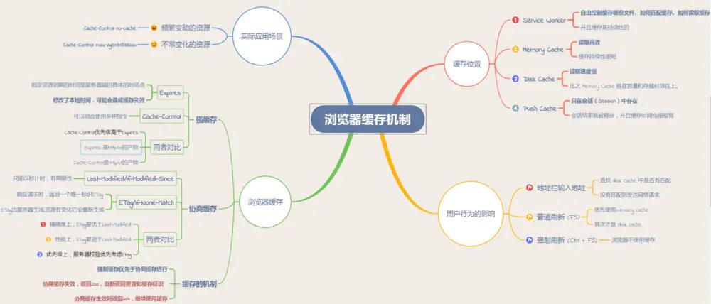
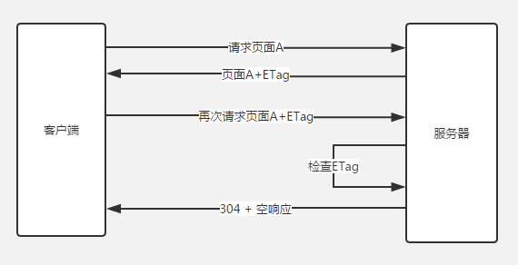
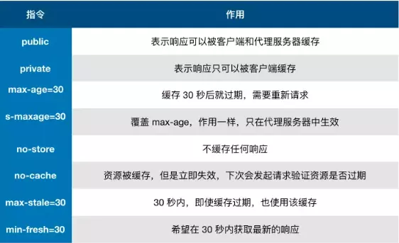
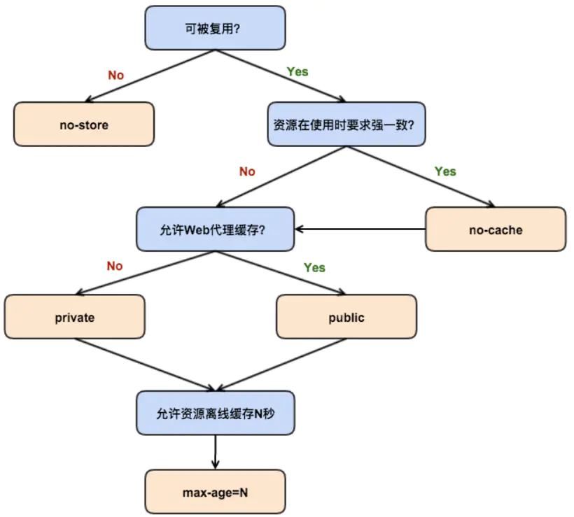
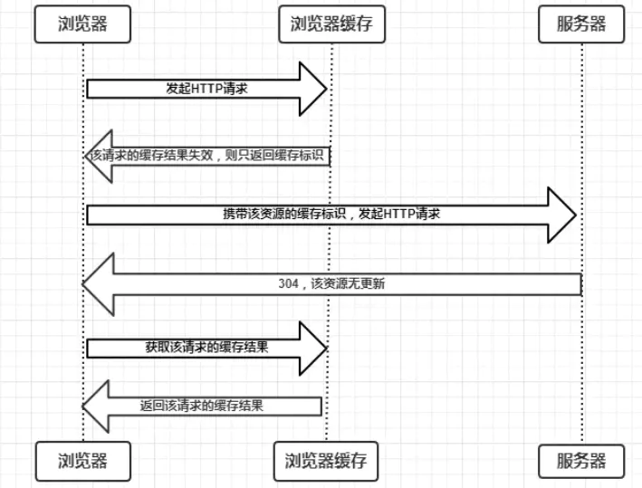
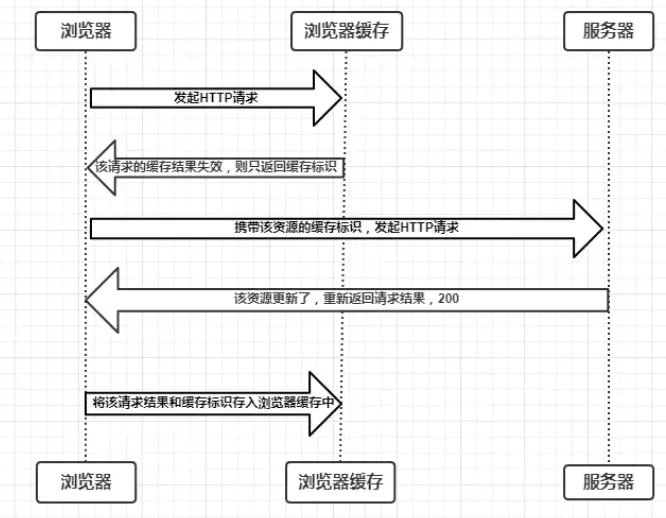
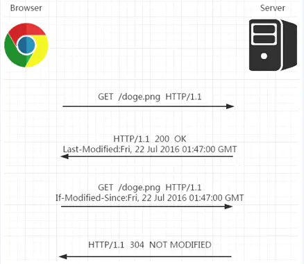
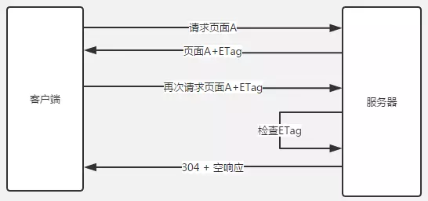
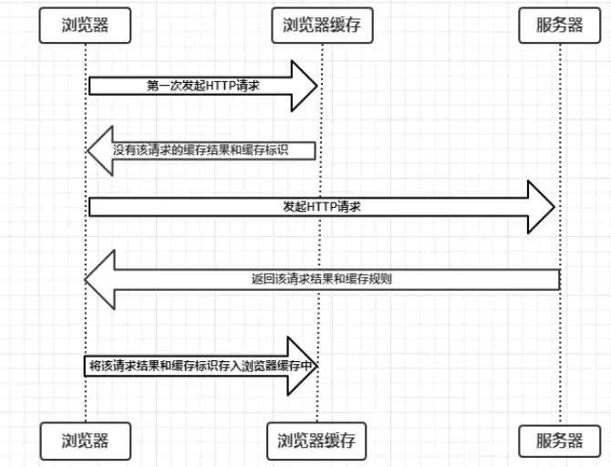
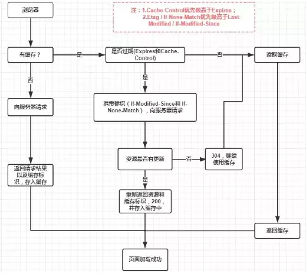

# 浏览器的缓存机制

-  提高网页反应速度，缓存可以说是性能优化中简单高效的一种优化方式了。

-  一个优秀的缓存策略可以缩短网页请求资源的距离，减少延迟，并且由于缓存文件可以重复利用，还可以减少带宽，降低网络负荷。



## 1. 介绍

**web缓存**是指一个web资源（如html页面，图片，js，数据等）存在于web服务器和客户端（浏览器）之间的副本。

- 缓存会根据进来的请求保存输出内容的副本；当下一个请求来到的时候，如果是相同的URL，缓存会根据缓存机制决定是直接使用副本响应访问请求，还是向源服务器再次发送请求。

- 比较常见的就是浏览器会缓存访问过网站的网页，当再次访问这个URL地址的时候，如果网页没有更新，就不会再次下载网页，而是直接使用本地缓存的网页。只有当网站明确标识资源已经更新，浏览器才会再次下载网页。

### 1.1 web缓存的作用

1. **减少网络带宽消耗**：无论对于网站运营者或者用户，带宽都代表着金钱，过多的带宽消耗，只会便宜了网络运营商。当Web缓存副本被使用时，只会产生极小的网络流量，可以有效的降低运营成本。

2. **降低服务器压力**：给网络资源设定有效期之后，用户可以重复使用本地的缓存，减少对源服务器的请求，间接降低服务器的压力。同时，搜索引擎的爬虫机器人也能根据过期机制降低爬取的频率，也能有效降低服务器的压力。

3. **减少网络延迟**，加快页面打开速度：带宽对于个人网站运营者来说是十分重要，而对于大型的互联网公司来说，可能有时因为钱多而真的不在乎。那Web缓存还有作用吗？答案是肯定的，对于最终用户，缓存的使用能够明显加快页面打开速度，达到更好的体验。

### 1.2 web缓存的类型

1. 数据库数据缓存

2. 服务器端缓存

3. 浏览器端缓存

4. web应用层缓存

- 浏览器通过代理服务器向源服务器发起请求的原理如下图：


- 浏览器缓存是将文件保存在客户端，在同一个会话过程中会检查缓存的副本是否足够新，在后退网页时，访问过的资源可以从浏览器缓存中拿出使用。通过减少服务器处理请求的数量，用户将获得更快的体验

## 2. web缓存的工作原理

所有的缓存都是基于一套规则来帮助他们决定什么时候使用缓存中的副本提供服务（假设有副本可用的情况下，未被销毁回收或者未被删除修改）。这些规则有的在协议中有定义（如HTTP协议1.0和1.1），有的则是由缓存的管理员设置（如DBA、浏览器的用户、代理服务器管理员或者应用开发者）。

### 2.1 浏览器端的缓存规则

对于浏览器端的缓存来讲，这些规则是在HTTP协议头和HTML页面的 Meta标签中定义的。他们分别从**新鲜度**和**校验值**两个维度来规定浏览器是直接使用缓存中的副本，还是需要去源服务器获取更新的版本。

1. **新鲜度**（过期机制）：也就是缓存副本有效期。一个缓存副本必须满足以下任一条件，浏览器会认为它是有效的，足够新的，而直接从缓存中获取副本并渲染：
    - 含有完整的过期时间控制头信息（HTTP协议报头），并且仍在有效期内
    - 浏览器已经使用过这个缓存副本，并且在一个会话中已经检查过新鲜度
2. **校验值**（验证机制）：服务器返回资源的时候有时在控制头信息带上这个资源的实体标签Etag（Entity Tag），它可以用来作为浏览器再次请求过程的校验标识。如过发现校验标识不匹配，说明资源已经被修改或过期，浏览器需求重新获取资源内容。

### 2.2 浏览器缓存的控制

#### 2.2.1 使用HTML的 Meta 标签

```html
<META HTTP-EQUIV="Pragma" CONTENT="no-cache">
```

上述代码的作用是告诉浏览器当前页面不被缓存，每次访问都需要去服务器拉取。使用上很简单，但只有部分浏览器可以支持，而且所有缓存代理服务器都不支持，因为代理不解析HTML内容本身。

#### 2.2.2 使用缓存有关的HTTP消息报头

一个URI的完整HTTP协议交互过程是由HTTP请求和HTTP响应组成的。有关HTTP详细内容可参考《Hypertext Transfer Protocol — HTTP/1.1》、《HTTP协议详解》等。

- 在HTTP请求和响应的消息报头中，常见的与缓存有关的消息报头有：


1. **Cache-Control**

    1. **max-age**（单位为s）指定设置缓存最大的有效时间，定义的是时间长短。当浏览器向服务器发送请求后，在max-age这段时间里浏览器就不会再向服务器发送请求了。我们来找个资源看下。比如QQ推广上的css资源，max-age=3600，也就是说缓存有效期为3600秒（也就是1h）。于是在1天内都会使用这个版本的资源，即使服务器上的资源发生了变化，浏览器也不会得到通知。max-age会覆盖掉Expires，后面会有讨论
    

    2. **s-maxage**（单位为s）同max-age，只用于共享缓存（比如CDN缓存）。比如，当s-maxage=60时，在这60秒中，即使更新了CDN的内容，浏览器也不会进行请求。也就是说max-age用于普通缓存，而s-maxage用于代理缓存。如果存在s-maxage，则会覆盖掉max-age和Expires header。

    3. **public** 指定响应会被缓存，并且在多用户间共享。也就是下图的意思。如果没有指定public还是private，则默认为public。
    

    4. **private** 响应只作为私有的缓存（见下图），不能在用户间共享。如果要求HTTP认证，响应会自动设置为 private
    
    
    5. **no-cache** 指定不缓存响应，表明资源不进行缓存，但是设置了 no-cache 之后并不代表浏览器不缓存，而是在获取缓存前要向服务器确认资源是否被更改。因此有的时候只设置 no-cache 防止缓存还是不够保险，还可以加上 private 指令，将过期时间设为过去的时间。
    
    6. **no-store** 绝对禁止缓存，一看就知道如果用了这个命令当然就是不会进行缓存啦～每次请求资源都要从服务器重新获取。
    
    7. **must-revalidate** 指定如果页面是过期的，则去服务器进行获取。这个指令并不常用，就不做过多的讨论了。

**cache-control**的种类这么多，然而怎么使用它们呢，参看下图：


2. **Expires**

- 缓存过期时间，用来指定资源到期的时间，是服务器端的具体的时间点。也就是说， Expires=max-age + 请求时间 ，需要和Last-modified结合使用。

- cache-control的优先级更高。Expires是Web服务器响应消息头字段，在响应http请求时告诉浏览器在过期时间前浏览器可以直接从浏览器缓存取数据，而无需再次请求。


3. **Last-modified & If-modified-since**

服务器端文件的最后修改时间，需要和cache-control共同使用，是检查服务器端资源是否更新的一种方式。当浏览器再次进行请求时，会向服务器传送If-Modified-Since报头，询问Last-Modified时间点之后资源是否被修改过。如果没有修改，则返回码为304，使用缓存；如果修改过，则再次去服务器请求资源，返回码和首次请求相同为200，资源为服务器最新资源。

4. **Etag & & If-None-Match**

根据实体内容生成一段hash字符串，标识资源的状态，由服务端产生。浏览器会将这串字符串传回服务器，验证资源是否已经修改，如果没有修改，过程如下：


#### 2.2.3 缓存报头种类与优先级

1. **Cache-Control与Expires**

Cache-Control与 Expires的作用一致，都是指明当前资源的有效期，控制浏览器是否直接从浏览器缓存取数据还是重新发请求到服务器取数据。只不过 Cache-Control的选择更多，设置更细致，如果同时设置的话，其优先级高于 Expires。

2. **Last-Modified与ETag**

你可能会觉得使用 Last-Modified 已经足以让浏览器知道本地的缓存副本是否足够新，为什么还需要 Etag（实体标识）呢？HTTP1.1中Etag的出现主要是为了解决几个 Last-Modified 比较难解决的问题：
- Last-Modified 标注的最后修改只能精确到秒级，如果某些文件在1秒钟以内，被修改多次的话，它将不能准确标注文件的新鲜度

- 如果某些文件会被定期生成，当有时内容并没有任何变化，但 Last-Modified 却改变了，导致文件没法使用缓存

- 有可能存在服务器没有准确获取文件修改时间，或者与代理服务器时间不一致等情形

Etag是服务器自动生成或者由开发者生成的对应资源在服务器端的唯一标识符，能够更加准确的控制缓存。Last-Modified与ETag是可以一起使用的，服务器会优先验证ETag，一致的情况下，才会继续比对Last-Modified，最后才决定是否返回304。

3. **Last-Modified/ETag 与 Cache-Control/Expires**

配置 Last-Modified/ETag的情况下，浏览器再次访问统一URI的资源，还是会发送请求到服务器询问文件是否已经修改，如果没有，服务器会只发送一个304回给浏览器，告诉浏览器直接从自己本地的缓存取数据；如果修改过那就整个数据重新发给浏览器；

Cache-Control/Expires则不同，如果检测到本地的缓存还是有效的时间范围内，浏览器直接使用本地副本，不会发送任何请求。两者一起使用时， Cache-Control/Expires的优先级要高，即当本地副本根据 Cache-Control/Expires发现还在有效期内时，则不会再次发送请求去服务器询问修改时间 Last-Modified或实体标识 Etag了。

一般情况下，两者会配合一起使用，因为即使服务器设置缓存时间, 当用户点击“刷新”按钮时，浏览器会忽略缓存继续向服务器发送请求，这时 Last-Modified/ETag将能够很好利用304，从而减少响应开销。


#### 2.2.4 哪些请求不能被缓存？

- HTTP信息头中包含Cache-Control:no-cache，pragma:no-cache，或Cache-Control:max-age=0等告诉浏览器不用缓存的请求

- 需要根据Cookie，认证信息等决定输入内容的动态请求是不能被缓存的

- 经过HTTPS安全加密的请求（有人也经过测试发现，ie其实在头部加入Cache-Control：max-age信息，firefox在头部加入Cache-Control:Public之后，能够对HTTPS的资源进行缓存，参考《HTTPS的七个误解》)

- POST请求无法被缓存

- HTTP响应头中不包含Last-Modified/Etag，也不包含Cache-Control/Expires的请求无法被缓存

## 3. 缓存流程

一个用户发起一个静态资源请求的时候，浏览器会通过以下几步来获取并展示资源：


缓存行为主要由缓存策略决定，而缓存策略由内容拥有者设置。这些策略主要通过特定的HTTP头部来清晰地表达。

以上过程也可以被概括为三个阶段：

1. **本地缓存阶段**：先在本地查找该资源，如果有发现该资源，而且该资源还没有过期，就使用这一个资源，完全不会发送http请求到服务器；

2. **协商缓存阶段**：如果在本地缓存找到对应的资源，但是不知道该资源是否过期或者已经过期，则发一个http请求到服务器，然后服务器判断这个请求，如果请求的资源在服务器上没有改动过，则返回304，让浏览器使用本地找到的那个资源；

3. **缓存失败阶段**：当服务器发现请求的资源已经修改过，或者这是一个新的请求(在本来没有找到资源)，服务器则返回该资源的数据，并且返回200， 当然这个是指找到资源的情况下，如果服务器上没有这个资源，则返回404。

## 4. 用户操作行为与缓存的关系
用户在使用浏览器的时候，会有各种操作，比如输入地址后回车，按F5刷新等，这些行为会对缓存有什么影响呢？


当用户在按 F5进行刷新的时候，会忽略Expires/Cache-Control的设置，会再次发送请求去服务器请求，而Last-Modified/Etag还是有效的，服务器会根据情况判断返回304还是200；

而当用户使用 Ctrl+F5进行强制刷新的时候，只是所有的缓存机制都将失效，重新从服务器拉去资源。

- **普通刷新** – 当按下F5或者点击刷新按钮来刷新页面的时候，浏览器将绕过本地缓存来发送请求到服务器, 此时, 协商缓存是有效的

- **强制刷新** – 当按下ctrl+F5来刷新页面的时候, 浏览器将绕过各种缓存(本地缓存和协商缓存), 直接让服务器返回最新的资源

- **回车或转向** – 当在地址栏上输入回车或者按下跳转按钮的时候, 所有缓存都生效


## 缓存位置

从缓存位置上来说分为四种，并且各自有优先级，当依次查找缓存且都没有命中的时候，才会去请求网络。按优先级从高到低排列分别是:

1. Service Worker

2. Memory Cache

3. Disk Cache

4. Push Cache

### 1.Service Worker

- Service Worker 是运行在浏览器背后的独立线程，一般可以用来实现缓存功能。

- 使用 Service Worker的话，传输协议必须为 HTTPS。因为 Service Worker 中涉及到请求拦截，所以必须使用 HTTPS 协议来保障安全。

- Service Worker 的缓存与浏览器其他内建的缓存机制不同，它可以让我们自由控制缓存哪些文件、如何匹配缓存、如何读取缓存，并且缓存是持续性的。

Service Worker 实现缓存功能一般分为三个步骤：
    
1. 首先需要先注册 Service Worker，

2. 然后监听到 install 事件以后就可以缓存需要的文件，那么在下次用户访问的时候就可以通过拦截请求的方式查询是否存在缓存，存在缓存的话就可以直接读取缓存文件，否则就去请求数据。

3. 如果我们没有在 Service Worker 命中缓存的话，会根据缓存查找优先级去查找数据。但是不管我们是从 Memory Cache 中还是从网络请求中获取的数据，浏览器都会显示我们是从 Service Worker 中获取的内容。


### 2.Memory Cache

**Memory Cache** 也就是内存中的缓存，主要包含的是当前中页面中已经抓取到的资源,例如页面上已经下载的样式、脚本、图片等。

- 读取内存中的数据肯定比磁盘快,内存缓存虽然读取高效，可是缓存持续性很短，会随着进程的释放而释放。一旦我们关闭 Tab 页面，内存中的缓存也就被释放了。

- 内存缓存在缓存资源时并不关心返回资源的HTTP缓存头Cache-Control是什么值，同时资源的匹配也并非仅仅是对URL做匹配，还可能会对Content-Type，CORS等其他特征做校验。


### 3.Disk Cache

**Disk Cache** 也就是存储在硬盘中的缓存，读取速度慢点，但是什么都能存储到磁盘中，比之 Memory Cache 胜在容量和存储时效性上。

- Disk Cache 覆盖面基本是最大的。它会根据 HTTP Herder 中的字段判断哪些资源需要缓存，哪些资源可以不请求直接使用，哪些资源已经过期需要重新请求。并且即使在跨站点的情况下，相同地址的资源一旦被硬盘缓存下来，就不会再次去请求数据。

::: tip
比较大的JS、CSS文件会直接被丢进磁盘，反之丢进内存

内存使用率比较高的时候，文件优先进入磁盘
:::

### 4.Push Cache

Push Cache（推送缓存）是 HTTP/2 中的内容，当以上三种缓存都没有命中时，它才会被使用。它只在会话（Session）中存在，一旦会话结束就被释放，并且缓存时间也很短暂，在Chrome浏览器中只有5分钟左右，同时它也并非严格执行HTTP头中的缓存指令。

---

## 浏览器缓存策略(强缓存和协商缓存)

- 缓存策略都是通过设置 HTTP Header 来实现的

- 根据是否需要向服务器重新发起HTTP请求将缓存过程分为两个部分

### 强缓存：这个阶段不需要发送HTTP请求

不会向服务器发送请求，直接从缓存中读取资源，在chrome控制台的Network选项中可以看到该请求返回200的状态码，并且Size显示from disk cache或from memory cache。强缓存可以通过设置两种 HTTP Header 实现：Expires 和 Cache-Control。

在HTTP/1.0和HTTP/1.1当中，这个字段是不一样的。

- 在早期，也就是HTTP/1.0时期，使用的是Expires, **它指定了一个绝对的过期时期**

- 而HTTP/1.1使用的是Cache-Control。让我们首先来看看Expires。

这两个字段的效果是类似的，客户端都会通过对比本地时间和服务器返回的生存时间来检测缓存是否可用。如果缓存没有超出它的生存时间，客户端就会直接采用本地的缓存。如果生存日期已经过了，这个缓存也就宣告失效。接着客户端将再次与服务器进行通信来验证这个缓存是否需要更新。

#### 1. Expires

- Expires即过期时间，存在于服务端返回的响应头中，告诉浏览器在这个过期时间之前可以直接从缓存里面获取数据，无需再次请求。

- 缓存过期时间，用来指定资源到期的时间，是服务器端的具体的时间点。也就是说，Expires=max-age + 请求时间，需要和Last-modified结合使用。Expires是Web服务器响应消息头字段，在响应http请求时告诉浏览器在过期时间前浏览器可以直接从浏览器缓存取数据，而无需再次请求。

- Expires 是 HTTP/1 的产物，受限于本地时间，服务器的时间和浏览器的时间可能并不一致，那服务器返回的这个过期时间可能就是不准确,如果修改了本地时间，可能会造成缓存失效。Expires: Wed, 22 Oct 2018 08:41:00 GMT表示资源会在 Wed, 22 Oct 2018 08:41:00 GMT 后过期，需要再次请求。

```js
// 表示资源在2019年11月22号8点41分过期，过期了就得向服务端发请求。
Expires: Wed, 22 Nov 2019 08:41:00 GMT
```

#### 2. Cache-Control

- 在HTTP/1.1中，Cache-Control是最重要的规则，主要用于控制网页缓存。比如当Cache-Control:max-age=300时，则代表在这个请求正确返回时间（浏览器也会记录下来）的5分钟内再次加载资源，就会命中强缓存。

- 它和Expires本质的不同在于它并没有采用具体的过期时间点这个方式，而是采用过期时长来控制缓存，对应的字段是max-age。
```js
// 代表这个响应返回后在 3600 秒，也就是一个小时之内可以直接使用缓存。
Cache-Control:max-age=3600
```
- Cache-Control 可以在请求头或者响应头中设置，并且可以组合使用多种指令：



- public: 所有内容都将被缓存（客户端和代理服务器都可缓存）。具体来说响应可被任何中间节点缓存，如 Browser <-- proxy1 <--  proxy2 <-- Server，中间的proxy可以缓存资源，比如下次再请求同一资源proxy1直接把自己缓存的东西给 Browser 而不再向proxy2要。

- private：这种情况就是只有浏览器能缓存了，中间的代理服务器不能缓存。所有内容只有客户端可以缓存，Cache-Control的默认取值。具体来说，表示中间节点不允许缓存，对于Browser <-- proxy1 <--  proxy2 <-- Server，proxy 会老老实实把Server 返回的数据发送给proxy1,自己不缓存任何数据。当下次Browser再次请求时proxy会做好请求转发而不是自作主张给自己缓存的数据。

- no-cache：跳过当前的强缓存，发送HTTP请求，即直接进入协商缓存阶段。客户端缓存内容，是否使用缓存则需要经过协商缓存来验证决定。表示不使用 Cache-Control的缓存控制方式做前置验证，而是使用 Etag 或者Last-Modified字段来控制缓存。需要注意的是，no-cache这个名字有一点误导。设置了no-cache之后，并不是说浏览器就不再缓存数据，只是浏览器在使用缓存数据时，需要先确认一下数据是否还跟服务器保持一致。

- no-store：非常粗暴，不进行任何形式的缓存。所有内容都不会被缓存，即不使用强制缓存，也不使用协商缓存

- max-age：max-age=xxx (xxx is numeric)表示缓存内容将在xxx秒后失效

- s-maxage（单位为s)：同max-age作用一样，只在代理服务器中生效（比如CDN缓存）。比如当s-maxage=60时，在这60秒中，即使更新了CDN的内容，浏览器也不会进行请求。max-age用于普通缓存，而s-maxage用于代理缓存。s-maxage的优先级高于max-age。如果存在s-maxage，则会覆盖掉max-age和Expires header。

- max-stale：能容忍的最大过期时间。max-stale指令标示了客户端愿意接收一个已经过期了的响应。如果指定了max-stale的值，则最大容忍时间为对应的秒数。如果没有指定，那么说明浏览器愿意接收任何age的响应（age表示响应由源站生成或确认的时间与当前时间的差值）。

- min-fresh：能够容忍的最小新鲜度。min-fresh标示了客户端不愿意接受新鲜度不多于当前的age加上min-fresh设定的时间之和的响应。




#### 3. Expires和Cache-Control两者对比

- 其实这两者差别不大，区别就在于 Expires 是http1.0的产物，Cache-Control是http1.1的产物，两者同时存在的话，Cache-Control优先级高于Expires；在某些不支持HTTP1.1的环境下，Expires就会发挥用处。所以Expires其实是过时的产物，现阶段它的存在只是一种兼容性的写法。

- 强缓存判断是否缓存的依据来自于是否超出某个时间或者某个时间段，而不关心服务器端文件是否已经更新，这可能会导致加载文件不是服务器端最新的内容，那我们如何获知服务器端内容是否已经发生了更新呢？此时我们需要用到协商缓存策略。


### 协商缓存

> 当资源缓存时间超时了，也就是强缓存失效了，接下来怎么办？没错，这样就进入到第二级屏障——协商缓存了。

<font color=FF0000>协商缓存</font>就是强制缓存失效后，浏览器携带<font color=FF0000>缓存标识tag</font>向服务器发起请求，由服务器根据缓存标识决定是否使用缓存的过程，主要有以下两种情况：

- 协商缓存生效，返回304和Not Modified



- 协商缓存失效，返回200和请求结果



- 协商缓存可以通过设置两种HTTP Header 实现：
    
    1. Last-Modified

    2. ETag 。

#### 1. Last-Modified和If-Modified-Since：

浏览器在第一次访问资源时，服务器返回资源的同时，在response header中添加 Last-Modified的header，值是这个资源在服务器上的最后修改时间，浏览器接收后缓存文件和header；

```js
Last-Modified: Fri, 22 Jul 2016 01:47:00 GMT
```

浏览器下一次请求这个资源，浏览器检测到有 Last-Modified这个header，于是添加If-Modified-Since这个header，值就是Last-Modified中的值；服务器再次收到这个资源请求，会根据 If-Modified-Since 中的值与服务器中这个资源的最后修改时间对比，如果没有变化，返回304和空的响应体，直接从缓存读取，如果If-Modified-Since的时间小于服务器中这个资源的最后修改时间，说明文件有更新，于是返回新的资源文件和200
    
- 如果请求头中的这个值小于最后修改时间，说明是时候更新了。返回新的资源，跟常规的HTTP请求响应的流程一样。

- 否则返回304，告诉浏览器直接用缓存。



Last-Modified 存在一些**弊端**：
    
- 如果本地打开缓存文件，即使没有对文件进行修改，但还是会造成 Last-Modified 被修改，服务端不能命中缓存导致发送相同的资源

- 因为 Last-Modified 只能以秒计时，如果在不可感知的时间内修改完成文件，那么服务端会认为资源还是命中了，不会返回正确的资源

> 既然根据文件修改时间来决定是否缓存尚有不足，能否可以直接根据文件内容是否修改来决定缓存策略？所以在 HTTP / 1.1 出现了 ETag 和If-None-Match

#### 2. ETag和If-None-Match

Etag是服务器响应请求时，返回当前资源文件的一个唯一标识(由服务器生成)，只要资源有变化，Etag就会重新生成。

浏览器在下一次加载资源向服务器发送请求时，会将上一次返回的Etag值放到request header里的If-None-Match里，服务器只需要比较客户端传来的If-None-Match跟自己服务器上该资源的ETag是否一致，就能很好地判断资源相对客户端而言是否被修改过了。

- 如果服务器发现ETag匹配不上，那么直接以常规GET 200回包形式将新的资源（当然也包括了新的ETag）发给客户端；

- 如果ETag是一致的，则直接返回304知会客户端直接使用本地缓存即可。



#### 两者之间对比：

1. 首先在<font color=FF0000>精确度</font>上，<font color=FF0000>Etag</font>要优于<font color=FF0000>Last-Modified</font>。Last-Modified的时间单位是秒，如果某个文件在1秒内改变了多次，那么他们的Last-Modified其实并没有体现出来修改，但是Etag每次都会改变确保了精度；如果是负载均衡的服务器，各个服务器生成的Last-Modified也有可能不一致。

2. 第二在<font color=FF0000>性能</font>上，Etag要逊于Last-Modified，毕竟Last-Modified只需要记录时间，而Etag需要服务器通过算法来计算出一个hash值。

3. 第三在<font color=FF0000>优先级</font>上，服务器校验优先考虑Etag
---

## 缓存过程分析

- 浏览器与服务器通信的方式为应答模式，即是：浏览器发起HTTP请求 – 服务器响应该请求，那么浏览器怎么确定一个资源该不该缓存，如何去缓存呢？浏览器第一次向服务器发起该请求后拿到请求结果后，将请求结果和缓存标识存入浏览器缓存，浏览器对于缓存的处理是根据第一次请求资源时返回的响应头来确定的。



- 浏览器每次发起请求，都会先在浏览器缓存中查找该请求的结果以及缓存标识

- 浏览器每次拿到返回的请求结果都会将该结果和缓存标识存入浏览器缓存中

---

## 缓存机制

强制缓存优先于协商缓存进行，若强制缓存(Expires和Cache-Control)生效则直接使用缓存，若不生效则进行协商缓存(Last-Modified / If-Modified-Since和Etag / If-None-Match)，协商缓存由服务器决定是否使用缓存，若协商缓存失效，那么代表该请求的缓存失效，返回200，重新返回资源和缓存标识，再存入浏览器缓存中；生效则返回304，继续使用缓存。具体流程图如下：




