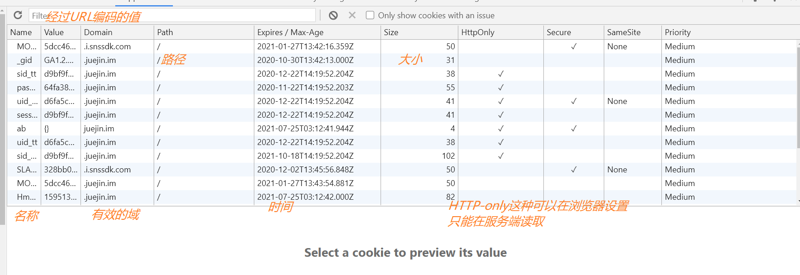

# 前端本地存储

- 浏览器的本地存储主要分为:
    
    1. <font color=FF0000>Cookie</font>
    
    2. 浏览器存储 Api 又称<font color=FF0000>WebStorage</font>
    
    3. <font color=FF0000>IndexedDB</font>

- 其中<font color=FF0000>WebStorage</font>又可以分为<font color=FF0000>localStorage</font>和<font color=FF0000>sessionStorage</font>。

|   | cookie  | sessionStorage  | LocalStorage  | IndexedDB |
| ------------ | ------------ | ------------ | ------------ | -------------- |
|  存储大小	 |  大小不能超过 4kb	 |   |  存储大小限制为 5MB+	 |   |
| 服务器通信	  |  浏览器会使用 Cookie HTTP-header 通过网络发送 cookie	 |  不会随每个请求被发送到服务器	 |   |   |
|  生命周期	 |   |   |  数据不会过期。它在浏览器重启甚至系统重启后仍然存在	 |   |

## 1. cookie(cookie的内容主要包括：名字，值，过期时间，路径和域。)

<font color=FF0000>Cookie</font> 最开始被设计出来其实并不是来做本地存储的，而是为了弥补HTTP在状态管理上的不足。

HTTP 协议是一个无状态协议，客户端向服务器发请求，服务器返回响应，故事就这样结束了，但是下次发请求如何让服务端知道客户端是谁呢？这种背景下，就产生了 Cookie.

Cookie 本质上就是浏览器里面存储的一个很小的文本文件，内部以键值对的方式来存储(在chrome开发者面板的<font color=FF0000>Application</font>这一栏可以看到)。向同一个域名下发送请求，都会携带相同的 Cookie，服务器拿到 Cookie 进行解析，便能拿到客户端的状态。



### 作用：用来做状态存储

cookie是纯文本，没有可执行代码。存储数据，当用户访问了某个网站（网页）的时候，我们就可以通过cookie来向访问者电脑上存储数据，或者某些网站为了辨别用户身份、进行session跟踪而储存在用户本地终端上的数据（通常经过加密）

### 工作原理： 

- 当网页要发http请求时，浏览器会先检查是否有相应的cookie，有则自动添加在request header中的cookie字段中。这些是浏览器自动帮我们做的，而且每一次http请求浏览器都会自动帮我们做。这个特点很重要，因为这关系到“什么样的数据适合存储在cookie中”。

- 存储在cookie中的数据，每次都会被浏览器自动放在http请求中，如果这些数据并不是每个请求都需要发给服务端的数据，浏览器这设置自动处理无疑增加了网络开销；但如果这些数据是每个请求都需要发给服务端的数据（比如身份认证信息），浏览器这设置自动处理就大大免去了重复添加操作。所以对于那种设置“每次请求都要携带的信息（最典型的就是身份认证信息）”就特别适合放在cookie中，其他类型的数据就不适合了。

- 用户每请求一次服务器数据，cookie则会随着这些请求发送到服务器，服务器脚本语言如PHP等能够处理cookie发送的数据，可以说是非常方便的。当然前端也是可以生成Cookie的，用js对cookie的操作相当的繁琐，浏览器只提供document.cookie这样一个对象，对cookie的赋值，获取都比较麻烦。而在PHP中，我们可以通过setcookie()来设置cookie，通过$_COOKIE这个超全局数组来获取cookie

### 特征

1. 不同的浏览器存放的cookie位置不一样，也是不能通用的。（浏览器限制）

2. cookie的存储是以域名形式进行区分的，不同的域下存储的cookie是独立的。（特定域限制）

3. 我们可以设置cookie生效的域（当前设置cookie所在域的子域），也就是说，我们能够操作的cookie是当前域以及当前域下的所有子域

4. 一个域名下存放的cookie的个数是有限制的，不同的浏览器存放的个数不一样,一般为20个。

5. 每个cookie存放的内容大小也是有限制的，不同的浏览器存放大小不一样，一般为4KB。

6. cookie也可以设置过期的时间，默认是会话结束的时候，当时间到期自动销毁

7. 只要有请求涉及cookie，cookie就要在服务器和浏览器之间来回传送（这解释为什么本地文件不能测试cookie）。而且cookie数据始终在同源的http请求中携带（即使不需要），这也是Cookie不能太大的重要原因。正统的cookie分发是通过扩展HTTP协议来实现的，服务器通过在HTTP的响应头中加上一行特殊的指示以提示浏览器按照指示生成相应的cookie。

8. 路径与域一起构成cookie的作用范围。若不设置过期时间，则表示这个cookie的生命期为浏览器会话期间，关闭浏览器窗口，cookie就消失。这种生命期为浏览器会话期的cookie被称为会话cookie。会话cookie一般不存储在硬盘上而是保存在内存里，当然这种行为并不是规范规定的。若设置了过期时间，浏览器就会把cookie保存到硬盘上，关闭后再次打开浏览器，这些cookie仍然有效直到超过设定的过期时间。存储在硬盘上的cookie可以在不同的浏览器进程间共享，比如两个IE窗口。而对于保存在内存里的cookie，不同的浏览器有不同的处理方式。

### cookie值设置

#### 客户端设置
        
```js
document.cookie = '名字=值';
document.cookie = 'username=cfangxu;domain=baike.baidu.com'    并且设置了生效域
```
> 注意：客户端可以设置cookie 的下列选项：expires、domain、path、secure（有条件：只有在https协议的网页中，客户端设置secure类型的 cookie 才能成功），但无法设置HttpOnly选项。

#### 服务器端设置：

不管你是请求一个资源文件（如 html/js/css/图片），还是发送一个ajax请求，服务端都会返回response。而response header中有一项叫set-cookie，是服务端专门用来设置cookie的。

```js
Set-Cookie 消息头是一个字符串，其格式如下（中括号中的部分是可选的）：
Set-Cookie: value[; expires=date][; domain=domain][; path=path][; secure]
```

- 注意： 一个set-Cookie字段只能设置一个cookie，当你要想设置多个 cookie，需要添加同样多的set-Cookie字段。 

- 服务端可以设置cookie 的所有选项：expires、domain、path、secure、HttpOnly 

通过 Set-Cookie 指定的这些可选项只会在浏览器端使用，而不会被发送至服务器端。

#### document.cookie的属性

- expires属性：指定了coolie的生存期，默认情况下coolie是暂时存在的，他们存储的值只在浏览器会话期间存在，当用户推出浏览器后这些值也会丢失，如果想让cookie存在一段时间，就要为expires属性设置为未来的一个过期日期。现在已经被max-age属性所取代，max-age用秒来设置cookie的生存期。

- path属性：它指定与cookie关联在一起的网页。在默认的情况下cookie会与创建它的网页，该网页处于同一目录下的网页以及与这个网页所在目录下的子目录下的网页关联。

- domain属性：domain属性可以使多个web服务器共享cookie。domain属性的默认值是创建cookie的网页所在服务器的主机名。不能将一个cookie的域设置成服务器所在的域之外的域。例如让位于order.damonare.cn的服务器能够读取catalog.damonare.cn设置的cookie值。如果catalog.damonare.cn的页面创建的cookie把自己的path属性设置为“/”，把domain属性设置成“.damonare.cn”，那么所有位于catalog.damonare.cn的网页和所有位于orlders.damonare.cn的网页，以及位于damonare.cn域的其他服务器上的网页都可以访问这个cookie。

- secure属性：它是一个布尔值，指定在网络上如何传输cookie，默认是不安全的，通过一个普通的http连接传输

### cookie实例

```js
function getCookie(c_name){
    if (document.cookie.length>0){
        c_start=document.cookie.indexOf(c_name + "=")
        if (c_start!=-1){
            c_start=c_start + c_name.length+1
            c_end=document.cookie.indexOf(";",c_start)
            if (c_end==-1) c_end=document.cookie.length
            return unescape(document.cookie.substring(c_start,c_end))
        }
    }
    return "";
}

function setCookie(c_name,value,expiredays){
    var exdate=new Date()
    exdate.setDate(exdate.getDate()+expiredays)
    document.cookie=c_name+ "=" +escape(value)+
            ((expiredays==null) ? "" : "; expires="+exdate.toUTCString())
}
function checkCookie(){
    username=getCookie('username')
    if(username!=null && username!=""){alert('Welcome again '+username+'!')}
    else{
        username=prompt('Please enter your name:',"")
        if (username!=null && username!=""){
            setCookie('username',username,355)
        }
    }
}
//这里对Cookie的生存期进行了定义，也就是355天
```

::: tip
注意： chrome87系统之后可以通过cookieStore进行cookie相关操作，并且增加了cookie监控方法
:::

## 2. WebStorage

### 1. localStorage（本地存储/永久存储）

这是一种持久化的存储方式，也就是说如果不手动清除，数据就永远不会过期。它也是采用Key - Value的方式存储数据，底层数据接口是sqlite，按域名将数据分别保存到对应数据库文件里。它能保存更大的数据（IE8上是10MB，Chrome是5MB），同时保存的数据不会再发送给服务器，避免带宽浪费。

#### 特点

- 生命周期：持久化的本地存储，除非主动删除数据，否则数据是永远不会过期的。

- 存储的信息在同一域中是共享的。

- 当本页操作（新增、修改、删除）了localStorage的时候，本页面不会触发storage事件,但是别的页面会触发storage事件。

- 大小：据说是5M（跟浏览器厂商有关系）在非IE下的浏览中可以本地打开。IE浏览器要在服务器中打开。

- localStorage本质上是对字符串的读取，如果存储内容多的话会消耗内存空间，会导致页面变卡localStorage受同源策略的限制

#### localStorage的属性方法

属性方法|说明
---|---
localStorage.length|获得storage中的个数
localStorage.key(n)|获得storage中第n个元素对的键值（第一个元素是0）
localStorage.getItem(key)|获取键值key对应的值
localStorage.key|获取键值key对应的值
localStorage.setItem(key, value)|添加数据，键值为key，值为value
localStorage.removeItem(key)|移除键值为key的数据
localStorage.clear()|清除所有数据

##### 设置
```js
localStorage.setItem('username','cfangxu');
```

##### 获取
```js
localStorage.getItem('username') 
也可以获取键名 
localStorage.key(0) #获取第一个键名
```
##### 删除
```js
localStorage.remove('username') 
也可以一次性清除所有存储 
localStorage.clear()
```
#### localStorage的缺点:

- ① localStorage大小限制在500万字符左右，各个浏览器不一致

- ② localStorage在隐私模式下不可读取

- ③ localStorage本质是在读写文件，数据多的话会比较卡（firefox会一次性将数据导入内存，想想就觉得吓人啊）

- ④ localStorage不能被爬虫爬取，不要用它完全取代URL传参

### 2. sessionStorage(session机制是一种服务器端的机制，服务器使用一种类似于散列表的结构（也可能就是使用散列表）来保存信息。——跨回话存储)

和服务器端使用的session类似，是一种会话级别的缓存，关闭浏览器会数据会被清除。不过有点特别的是它的作用域是窗口级别的，也就是说不同窗口间的sessionStorage数据不能共享的。使用方法（和localStorage完全相同）：

其实跟localStorage差不多，也是本地存储，会话本地存储

#### 特点：

用于本地存储一个会话（session）中的数据，这些数据只有在同一个会话中的页面才能访问并且当会话结束后数据也随之销毁。因此sessionStorage不是一种持久化的本地存储，仅仅是会话级别的存储。也就是说只要这个浏览器窗口没有关闭，即使刷新页面或进入同源另一页面，数据仍然存在。关闭窗口后，sessionStorage即被销毁，或者在新窗口打开同源的另一个页面，sessionStorage也是没有的。

#### 属性方法：

属性方法|说明
---|---
sessionStorage.length|获得storage中的个数
sessionStorage.key(n)|获得storage中第n个元素对的键值（第一个元素是0）
sessionStorage.getItem(key)|获取键值key对应的值
sessionStorage.key|获取键值key对应的值
sessionStorage.setItem(key, value)|添加数据，键值为key，值为value
sessionStorage.removeItem(key)|移除键值为key的数据
sessionStorage.clear()|清除所有数据


### 3. cookie、localStorage、sessionStorage区别

**相同**：在本地（浏览器端）存储数据

**不同**：

#### localStorage、sessionStorage

1. localStorage只要在相同的协议、相同的主机名、相同的端口下，就能读取/修改到同一份localStorage数据。

2. sessionStorage比localStorage更严苛一点，除了协议、主机名、端口外，还要求在同一窗口（也就是浏览器的标签页）下。

3. localStorage是永久存储，除非手动删除。

4. sessionStorage当会话结束（当前页面关闭的时候，自动销毁）

5. sessionStorage用于本地存储一个会话（session）中的数据，这些数据只有在同一个会话中的页面才能访问并且当会话结束后数据也随之销毁。因此sessionStorage不是一种持久化的本地存储，仅仅是会话级别的存储。当用户关闭浏览器窗口后，数据立马会被删除。

6. localStorage用于持久化的本地存储，除非主动删除数据，否则数据是永远不会过期的。第二天、第二周或下一年之后，数据依然可用。

#### Cookie和Session

1. cookie的数据会在每一次发送http请求的时候，同时发送给服务器而localStorage、sessionStorage不会。

2. cookie数据存放在客户的浏览器上，session数据放在服务器上。

3. cookie不是很安全，别人可以分析存放在本地的cookie并进行cookie欺骗，考虑到安全应当使用session。

4. session会在一定时间内保存在服务器上。当访问增多，会比较占用你服务器的性能考虑到减轻服务器性能方面，应当使用cookie。

5. 单个cookie保存的数据不能超过4K，很多浏览器都限制一个站点最多保存20个cookie。

#### 建议：

- 将登陆信息等重要信息存放为SESSION

- 其他信息如果需要保留，可以放在cookie中

## 3. IndexedDB

<font color=FF0000>IndexedDB</font>是运行在浏览器中的<font color=FF0000>非关系型数据库</font>, 本质上是数据库，绝不是和刚才WebStorage的 5M 一个量级，理论上这个容量是没有上限的。

### 重要特性: 

除了拥有数据库本身的特性，比如支持事务，存储二进制数据，还有这样一些特性需要格外注意：

1. 键值对存储。内部采用对象仓库存放数据，在这个对象仓库中数据采用键值对的方式来存储。

2. 异步操作。数据库的读写属于 I/O 操作, 浏览器中对异步 I/O 提供了支持。

3. 受同源策略限制，即无法访问跨域的数据库。

::: tip
总结

1. cookie并不适合存储，而且存在非常多的缺陷。

2. Web Storage包括localStorage和sessionStorage, 默认不会参与和服务器的通信。

3. IndexedDB为运行在浏览器上的非关系型数据库，为大型数据的存储提供了接口。
:::