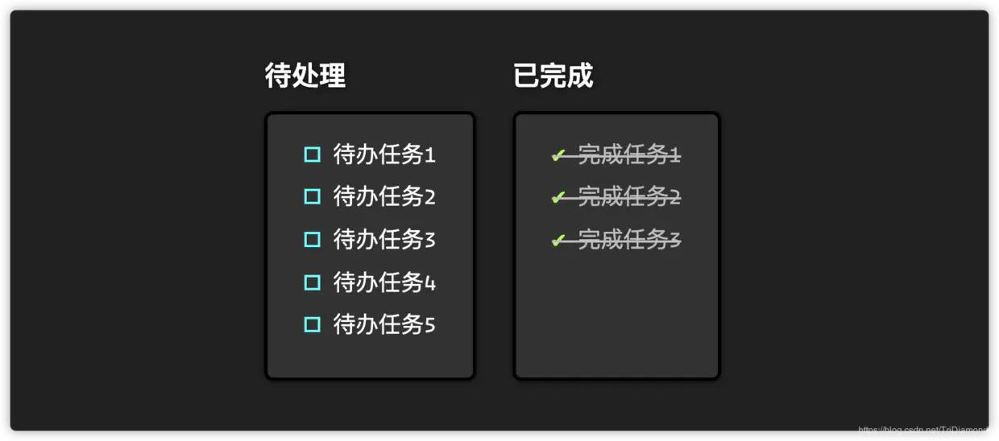
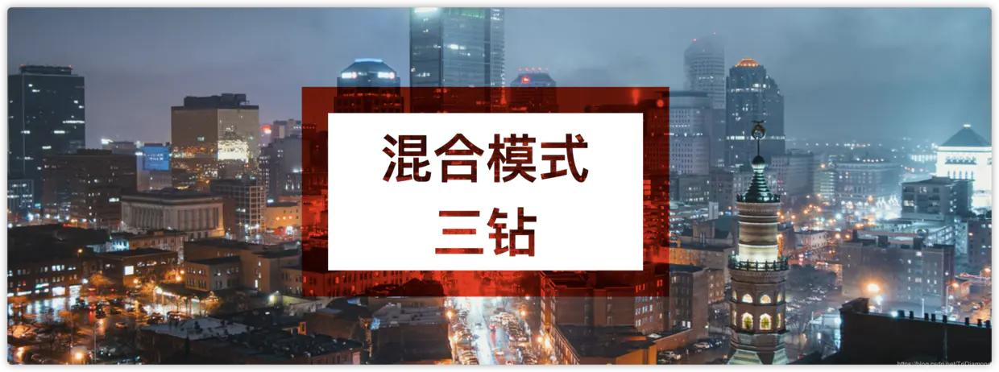
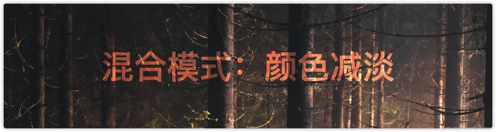
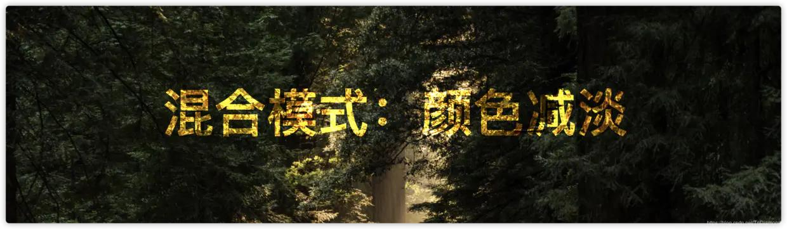

# Css实例合集

## 1. 悬停放大图片


- 悬停放大图片是一个特别吸引眼球的特效，比较常用于可点击的图片。当用户悬停鼠标在图片上，图片会稍微的放大。

- 首先我们需要一个div包裹这img标签，这个包裹层是用来遮挡住图片，当图片放大时不会出现图片超出我们规定的宽高以外。

- 用了transform: scale(1,1)作为悬停时的图片特效，这个transform是用于改变任何元素的属性的，然后scale是用于放大（整数就会放大）或者缩小（负数就会缩小）元素的。

- html
```html
<div class="img-wrapper">
  
</div>
```

- css
```css
.img-wrapper {
  width: 400px;
  height: 400px;
  overflow: hidden;
  box-shadow: 0 1px 4px rgba(0, 0, 0, 0.6);
}

.img-wrapper img {
  height: 400px;
  -webkit-transition: 0.3s linear;
  transition: 0.3s linear;
}

.img-wrapper img:hover {
  transform: scale(1.1);
}

.img-wrapper {
  display: inline-block;
  box-sizing: border-box;
  border: 3px solid #000;
}
```

- 想让图片更加炫酷可以加上图片过滤属性filter，让图片变灰或者变深褐色，然后悬停时候出现更加炫酷的颜色变幻。灰化的属性是filter: grayscale(100%);，然后深褐色化的属性是filter: sepia(100%)。

```html
<!-- 灰度过滤 -->
<div class="img-wrapper">
  
</div>

<!-- 深褐色过滤 -->
<div class="img-wrapper">
  
</div>
```

```css
/* ============== 
* 灰度过滤 
* ==============*/
.grayscale-img {
  -webkit-filter: grayscale(100%);
  filter: grayscale(100%);
}

.grayscale-img:hover {
  -webkit-filter: grayscale(0);
  filter: grayscale(0);
}

/* ============== 
* 深褐色过滤
* ==============*/
.sepia-img {
  -webkit-filter: sepia(100%);
  filter: sepia(100%);
}

.sepia-img:hover {
  -webkit-filter: sepia(0);
  filter: sepia(0);
}
```

::: tip
🌟知识总结

- transform --- 用于改变元素
- scale --- 对元素进行放大和缩小
- filter --- 图片过滤器
- grayscale --- 灰度过滤
- sepia --- 深褐色过滤
:::

## 2. 瞬间黑暗模式


- 我们可以使用invert和hue-rotate两个CSS3过滤器来实现。

- filter: invert() — 是从0到1的刻度，1是从白变黑。

- filter: hue-rotate() — 用于改变你元素的颜色，同时或多或少保持原本相同的色系。这个属性的值可以从0deg到360deg。

- 在我们页面的body标签上添加这两个属性，我们就可以快速尝试把我们的网站变成"黑暗模式"。这里需要注意的是，如果body和html上没有设置background背景颜色，这个过滤就会不起效了哦。

```css
html {
  background: #fff;
}

body {
  background: #fff;
  filter: invert(1) hue-rotate(270deg);
}
```

- 这里我们会发现图片的颜色会受影响，并不是很美观，使用css过滤器是无法完美切换黑暗模式的。不过使用JavaScript辅助就可以完美的切换黑暗模式。最近出了一个JavaScript辅助插件叫Darkmode.js。


### 🌓 Darkmode.js

- 使用Darkmode.js非常简单，只要在脚本里面添加以下代码就可以马上加入一个插件，

```html
<script src="https://cdn.jsdelivr.net/npm/darkmode-js@1.5.5/lib/darkmode-js.min.js"></script>
<script>
  // 这些是这个插件的可配置项：
  var options = {
    bottom: "32px", // 定位底部距离 - 默认: '32px'
    right: "32px", // 定位右边距离 - 默认: '32px'
    left: "unset", // 定位左边距离 - 默认: 'unset'
    time: "0.5s", // 默认动画时间: '0.3s'
    mixColor: "#fff", // 需要改变的颜色 - 默认: '#fff'
    backgroundColor: "#fff", // 背景颜色 - 默认: '#fff'
    buttonColorDark: "#262728", // 黑暗模式下按钮颜色 - 默认: '#100f2c'
    buttonColorLight: "#fff", // 日间模式下按钮颜色 - 默认: '#fff'
    saveInCookies: true, // 是否在cookie保存当前模式 - 默认: true,
    label: "🌓", // 切换模式按钮图标 - 默认: ''
    autoMatchOsTheme: true // 是否自动根据系统适应模式 - 默认: true
  };

  let darkmode = new Darkmode(options);
  darkmode.showWidget();
</script>
```

- 如果你不希望用这个插件的默认按钮，你可以在你的JavaScript代码中自主控制。我们可以通过.toggle()方法来切换模式，同时可以使用.isActivated()来检测是否已经进入黑暗模式。

```js
const darkmode =  new Darkmode();
darkmode.toggle();
console.log(darkmode.isActivated()) // 如果已经进入黑暗模式会返回 true
```

::: tip
🌟知识总结

- filter: invert() — 可以把页面从白变黑，也可以从黑变白。
- filter: hue-rotate() — 用于改变你元素的颜色，同时或多或少保持原本相同的色系。
- Darkmode.js — 瞬间实现黑暗模式。
:::

## 3. 自定义列表符号



- ul，li的无序列表有默认的符号·，但是在很多情况下我们希望可以给这个符号加入自己的样式和颜色，甚至是换成自定义的符号。默认的符号我们是无法做任何的样式处理，而且默认的符号在CSS属性里面只有几个选择可以使用，很多情况下都是无法满足我们的设计。

- 其实自定义无序列表符号不难，我们只需要使用伪元素::before加content属性就可以实现。

### 实现原理

一、首先我们禁用了ul的默认符号样式list-style: none

二、在li的:before伪元素上给予content内容值，待处理任务使用🗹，已完成任务li.completed:before使用✔

三、为了展示效果更加好看我分别给了li和li .completed两个不同的颜色

- HTML
```html
<div>
  <h2>待处理</h2>
  <ul>
    <li>待办任务1</li>
    <li>待办任务2</li>
    <li>待办任务3</li>
    <li>待办任务4</li>
    <li>待办任务5</li>
  </ul>
</div>
<div>
  <h2>已完成</h2>
  <ul>
    <li class="completed">完成任务1</li>
    <li class="completed">完成任务2</li>
    <li class="completed">完成任务3</li>
  </ul>
</div>
```

- CSS

```css
ul {
  list-style: none;
  color: #fff;
  font-size: 20px;
  border: 3px solid #000;
  padding: 1rem 2rem;
  min-height: 200px;
  margin: 15px 2rem 0 0;
  background: #323232;
  box-shadow: 0 1px 4px rgba(0, 0, 0, 0.6);
  border-radius: 8px;
}

li {
  padding: 0.3rem 0;
}

li::before {
  content: "🗹 ";
  color: aqua;
}

li.completed::before {
  content: "✔ ";
  text-decoration: none;
  color: greenyellow;
}

li.completed {
  text-decoration: line-through;
  color: #bdbdbd;
}
```

### 面包屑导航

- 实现逻辑

一、这个导航含有3个a标签，首先给每个a标签加入一个伪元素::after，然后在content属性插入/符号。

二、然后使用a:first-child，这个伪类会选择到第一个a标签，然后使用content属性加入»符号。

三、因为我们第一步在每个a标签的后面插入了/符号, 所以我们需要在最后一个a标签清除掉。这里我们使用:last-child选择到最后一个a标签，然后用content: " "属性把伪类的内容清楚掉。

```html
<div class="breadcrumb">
  <a>三钻</a>
  <a>前端</a>
  <a>教程</a>
</div>
```

```css
.breadcrumb {
  font-size: 1.6rem;
  color: #fff;
}
.breadcrumb a:first-child {
  color: #82fcfd;
}
.breadcrumb a:first-child::before {
  content: " » ";
}
.breadcrumb a::after {
  content: " /";
  color: #ef6eae;
}
.breadcrumb a:last-child::after {
  content: "";
}
```

::: tip
🌟知识总结

- ::before | ::after — 伪元素用于向某些选择器添加特殊的效果。
- content — CSS 属性用于在元素的  ::before 和 ::after 伪元素中插入内容。使用content 属性插入的内容都是匿名的可替换元素。
- :first-child — CSS伪类表示在一组兄弟元素中的第一个元素。
- :last-child — CSS伪类代表父元素的最后一个子元素。
:::


## 4. 图片视差效果


- 普通的网页图片会跟随着网页一起滑动，但是视觉差效果图就会固定在底部，只有图片所在的窗口上的元素会移动。

### 仅使用CSS

- 这个效果只需要用到CSS就能轻易的实现！我们只要使用一个CSS背景图的属性background-attachment: fixed，这个特性会把背景相对于视口固定。即使一个元素拥有滚动机制，背景也不会随着元素的内容滚动。

- 实现理论：

一、在含有图片的元素中加入background: url()和background-size: cover（第二个属性适用于定义图片为封面，可以让图片大小自动适应，在很大的屏幕也会显示完整的图片）

二、然后附加固定背景图的属性background-attachment: fixed

三、最后给这个元素加入一个高度height: 100%或者任意的高度height: 400px
就那么简单哦！不用怀疑，马上上代码，大家都可以自己去试试哦！

```html
<div class="wrapper">
   <div class="parallax-img"></img>
   <p>这里填写一堆文字就可以了，尽量多一点哦</p>
</div>
```

```css
.wrapper {
  height: 100wh;
}
.parallax-img {
  background-attachment: fixed;
  background-position: center;
  background-repeat: no-repeat;
  background-size: cover;
  height: 100%;
  background-image: url("http://ppe.oss-cn-shenzhen.aliyuncs.com/collections/182/7/thumb.jpg");
}
p {
  font-size: 20px;
  padding: 1.5rem 3rem;
  min-height: 1000px; // 当你的文字内容不够，也能撑出足够的高度来看到效果，当然如果你文字足够多，就不需要了
}
```
::: tip
🌟知识总结

- background-attachment: fixed — 把背景相对于视口固定。即使一个元素拥有滚动机制，背景也不会随着元素的内容滚动。
- background-size: cover — 可以让图片大小自动适应，在很大的屏幕也会显示完整的图片。
:::

### 使用CSS + JavaScript


- 上面的例子在滑动的时候图片是固定死的。如果我们加上JavaScript的助力，我们可以让窗口的图片缓慢的跟随这个页面滑动，使得效果更有动力和更有冲击感。

- 实现理论

    1. 首先讲一下排版，因为我们需要在我们滑动页面的时候使用JavaScript偏移图片，所以我们需要给图片一个CSS属性让我们可以让图片可以根据一个速度来往上或者往下移动。这个例子里面我们让所有图片包裹在一个div里面，class名为block。这个div给予相对定位属性position: relative，这个时候我们就可以在里面加入图片，然后让图片绝对定位position: absolute在这个div盒子里面。

    2. 但是图片是可能很大的，我们需要把图片不超出我们定义个盒子，所以我们的div同时也给予了overflow: hidden和一个高度height: 100%。这样图片超出div盒子就会被隐藏。

```html
<div class="block">
  
  <h2>视差速度 -1</h2>
</div>
<div class="block">
  
  <h2>视差速度 1</h2>
</div>
```

```css
html, body{
  margin: 0;
  padding: 0;
  height: 100%;
  width: 100%;
  font-family: 'Amatic SC', cursive;
}
.block{
  width: 100%;
  height: 100%;
  position: relative;
  overflow: hidden;
  font-size: 16px;
}
.block h2{
  position: relative;
  display: block;
  text-align: center;
  margin: 0;
  top: 50%;
  transform: translateY(-50%);
  font-size: 10vw;
  color: white;
  font-weight: 400;
}
.img-parallax {
  width: 100vmax;
  z-index: -1;
  position: absolute;
  top: 0;
  left: 50%;
  transform: translate(-50%,0);
  pointer-events: none
}
```

- 实现这个布局，在你滑动的时候，图片是不会移动的。因为最后一步就是加入JavaScript的辅助，让图片活起来。

```html
<script src="https://cdn.bootcss.com/jquery/3.4.1/jquery.min.js"></script>
<script>
// 循环获取每一个图片元素
$(".img-parallax").each(function () {
  var img = $(this);
  var imgParent = $(this).parent();
  function parallaxImg() {
    var speed = img.data("speed"); // 获取每张图片设置了的偏移速度
    var imgY = imgParent.offset().top; // 获取图片盒子所在的Y位置
    var winY = $(this).scrollTop(); // 获取当前滑动到的位置
    var winH = $(this).height(); // 获取浏览器窗口高度
    var parentH = imgParent.innerHeight(); // 获取图片盒子的内高度

    // 浏览器窗口底部的所在位置
    var winBottom = winY + winH; 

    // 当前图片是否进入浏览器窗口
    if (winBottom > imgY && winY < imgY + parentH) {
      // 运算图片需要开始移动的位置
      var imgBottom = (winBottom - imgY) * speed;
      // 运算出图片需要停止移动的位置
      var imgTop = winH + parentH;
      // 获取从开始移动到结束移动的%（根据开始与结束像素 + 移动速度）
      var imgPercent = (imgBottom / imgTop) * 100 + (50 - speed * 50);
    }
    img.css({
      top: imgPercent + "%",
      transform: "translate(-50%, -" + imgPercent + "%)",
    });
  }
  $(document).on({
    scroll: function () {
      parallaxImg();
    },
    ready: function () {
      parallaxImg();
    },
  });
});
</script>
```

## 5. 裁剪图像的动画


- 现在我们有了两个非常方便简单的CSS3属性可以实现裁剪，那就是object-fit和object-position, 这两个属性可以让我们改变图片的大小，但是不影响图片的长宽比。

- 我们这里使用了 input type="checkbox" 复选框元素，这样我们就可以使用:checked的伪元素来触发启动效果。所以在例子里面我们完全不需要JavaScript的协助。

### 实现原理：

一、首先给予图片一个宽高height: 1080px，width: 1920px。

二、然后用CSS选择器，锁定当input被选中后img标签的样式变化。当被选中时，给图片设定一个新的宽高，这里我们给宽高各自500像素：width: 500px，height: 500px。

三、然后我们加上了过渡效果和时间让图片改变宽高时有动画过渡效果：transition: width 2s, height 4s;。

四、最后加上object-fit: cover和object-position: left-top这两个属性来保持图片的宽高比例，这样就大功告成了！

```html
勾选裁剪图片 <input type="checkbox" />
<br />

```

```css
input {
  transform: scale(1.5); /* 只是用来放大复选框大小 */
  margin: 10px 5px;
  color: #fff;
}

img {
  width: 1920px;
  height: 1080px;
  transition: 0s;
}

/* css选择器锁定复选框被选中时的状态 */
input:checked + br + img {
  width: 500px;
  height: 500px;
  object-fit: cover;
  object-position: left-top;
  transition: width 2s, height 4s;
}
```

::: tip
🌟知识总结

- object-fit — CSS 属性指定可替换元素的内容应该如何适应到其使用的高度和宽度确定的框。
- object-position — 用来切换被替换元素的内容对象在元素框内的对齐方式。
- transition — 过渡可以为一个元素在不同状态之间切换的时候定义不同的过渡效果。
:::

## 6. 混合模式（Blend）



- 往一个元素加入混合模式，我们只需要使用到一个CSS属性mix-blend-mode即可。

### 简单实现原理：

- 首先我们只需要加一个h1标题标签

```html
<h1>混合模式：颜色减淡</h1>
```

- 然后我们给h1标签加入mix-blend-mode中的颜色减弱模式color-dodge，但是要注意的是我们需要给body和html加入背景颜色background: white，要不你会发现这个效果会无效。因为h1我们没有给颜色，会自动往上级继承，并且混合模式是针对背景颜色的过滤，所以body和html需要有背景颜色才行。

```css
h1 {
   mix-blend-mode: color-dodge;
   font-family: yahei;
   font-size: 5rem;
   text-align: center;
   margin: 0; 
   padding: 20vh 200px;
   color: #D1956C;
 }

 html,
 body {
   margin: 0;
   background-color: white;
 }

 body {

   background-image: url(https://images.unsplash.com/photo-1505567745926-ba89000d255a?ixlib=rb-1.2.1&ixid=eyJhcHBfaWQiOjEyMDd9&auto=format&fit=crop&w=3302&q=80);
   background-repeat: no-repeat;
   background-size: cover;
   min-height: 100vh;
   overflow: hidden;
 }
```

- 换换背景图和h1标签的字体颜色就可以弄出各种不同的特效了。




::: tip
🌟知识总结

- mix-blend-mode — CSS 属性描述了元素的内容应该与元素的直系父元素的内容和元素的背景如何混合。
:::

### 鼠标滑过样式

- 纯图片的DIV

```html
<div class="lists">
    <a href="#" class="box">
        
    </a>
    <a href="#" class="box">
        
    </a>
</div>
```

#### 1. 缓动上移

```css
.lists{
    display: flex;
    margin-top: 100px;
    justify-content: center;
}
.box{
    width: 200px;
    height: 200px;
    transition: all 0.3s;
}
.box~.box{
    margin-left: 15px;
}
.box img{width: 100%;height: 100%;}
.box:hover{
    transform: translateY(-6px);
}
```

#### 2. 放大效果

```css
.lists{
    display: flex;
    margin-top: 100px;
    justify-content: center;
}
.box{
    width: 200px;
    height: 200px;
    transition: all 0.3s;
}
.box~.box{
    margin-left: 15px;
}
.box img{width: 100%;height: 100%;}
.box:hover{
    transform: scale(1.03);
}
```

#### 3. 框内放大效果

```css
.lists{
    display: flex;
    margin-top: 100px;
    justify-content: center;
}
.box{
    width: 200px;
    height: 200px;
    overflow:hidden;
}
.box~.box{
    margin-left: 15px;
}
.box img{
    width: 100%;
    height: 100%;
    transition: all 0.5s;
}
.box:hover img{
    transform: scale(1.1);
}
```

#### 4. 蒙层效果

```css
.lists{
    display: flex;
    margin-top: 100px;
    justify-content: center;
}
.box{
    width: 200px;
    height: 200px;
    overflow:hidden;
    background-color: #4f4f4f;
}
.box~.box{
    margin-left: 15px;
}
.box img{
    width: 100%;
    height: 100%;
    transition: all 0.5s;
}
.box:hover img{
    opacity: 0.8
}
```

- 上图下文的DIV

```html
<div class="lists">
    <a href="#" class="item">
        <div class="item_pic">
            
        </div>
        <div class="item_content">
            <div class="title">Kitty的标题标题</div>
            <div class="content">这是内容</div>
        </div>
    </a>
</div>
```

#### 1. 框内放大图片+阴影

```css
.lists{
    display: flex;
    margin-top: 100px;
    justify-content: center;
}
.item{
    width: 200px;
    color: #333;
    text-decoration: none;
    border: 1px solid #eee;
    transition: all 0.5s;
}
.item .item_pic{
    width: 200px;
    height: 200px;
    overflow: hidden;
}
.item .item_pic img{
    width: 100%;
    height: 100%;
    transition: all 0.5s;
}
.item:hover .item_pic img{
    transform: scale(1.1);
}
.item:hover{
    box-shadow: 0 0 15px rgba(0,0,0,0.2);
}
.item_content{
    padding: 20px 10px;
}
```

#### 2. 缓动上滑+阴影

```css
.lists{
    display: flex;
    margin-top: 100px;
    justify-content: center;
}
.item{
    width: 200px;
    color: #333;
    text-decoration: none;
    border: 1px solid #eee;
    transition: all 0.5s;
    margin-right: 20px;
}
.item .item_pic{
    width: 200px;
    height: 200px;
    overflow: hidden;
}
.item .item_pic img{
    width: 100%;
    height: 100%;
    transition: all 0.5s;
}
.item:hover{
    /*-1或者-2最佳*/
    transform: translateY(-1px);  
    box-shadow: 0 0 15px rgba(0,0,0,0.3);
}
.item_content{
    padding: 20px 10px;
}
```

#### 3. 蒙层效果+文字变色+边框

```css
.lists{
    display: flex;
    margin-top: 100px;
    justify-content: center;
}
.item{
    width: 200px;
    color: #333;
    text-decoration: none;
    border: 1px solid #eee;
    margin-right: 20px;
    transition: all 0.5s;
}
.item .item_pic{
    width: 200px;
    height: 200px;
    overflow: hidden;
    background-color: #4f4f4f;
}
.item .item_pic img{
    width: 100%;
    height: 100%;
    transition: all 0.5s;
}
.item:hover{
    border: 1px solid green;
}
.item:hover .item_pic img{
    opacity: 0.8;
}
.item:hover .item_content{
    color: green;
}
.item_content{
    padding: 20px 10px;
    transition: all 0.5s;
}
```

### 文字覆盖图片DIV

```html
<div class="box">
    
    <div class="box2">
        <h3>Kitty的头像</h3>                
        <p>Kitty的名字</p>
    </div>            
</div>
```

```css
.box {
    position:relative;
    z-index:1;
    display:inline-block;
    overflow:hidden;
    background:#3085a3;
    text-align:center;
    cursor:pointer
}
.box img {
    width:200px;
    height:200px;
    opacity:1;
    transition:opacity .35s,transform .35s;
    float:left;
}
.box:hover img {
    opacity:.5;
}
.box h3 {
    margin-top:20%;
    transition:transform .35s;
    transform:translate3d(0,20px,0);
    opacity:0;
    color:#fff;
    font-size:16px;
}
.box p {
    margin:10px 0 0;
    padding:15px;
    border:1px solid #fff;
    opacity:0;
    transition:opacity .35s,transform .35s;
    transform:translate3d(0,20px,0) scale(1.1);
    color:#FFF;
}
.box:hover h3 {
    transform:translate3d(0,0,0);
    opacity:1;
}
.box:hover p {
    opacity:1;
    transform:translate3d(0,0,0) scale(1);
}
.box2 {
    width:200px;
    height:200px;
    padding:15px;
    position:absolute;
    box-sizing: border-box;
}   
```

### 文字滑动进入

```html
<div class="lists">
    <div class="item">
        <div class="text">
          <h1>标题名称</h1>
          
          <h2 class="animate-text">Kitty 的测试案例</h2>
          <p class="animate-text">这里放内容简介，内容简介,这里放内容简介，内容简介,这里放内容简介，内容简介</p>
          <div class="dots"> <span></span> <span></span> <span></span> </div>
        </div>
    </div>
</div>
```

```css
* { margin: 0; padding: 0;}
.lists{
    width: 100%;
    display: flex;
    justify-content: center;
    margin-top: 100px;
}
.item {
    width: 300px;
    height: 300px;
    background-color: #99aeff;
    position: relative;
    cursor: pointer;
    transition: all 0.4s ease-out;
    box-shadow: 0px 35px 77px -17px rgba(0, 0, 0, 0.44);
    overflow: hidden;
    color: #fff;
}
.item img {
    height: 100%;
    width: 100%;
    position: absolute;
    top: 0;
    left: 0;
    z-index: 0;
    transition: all 0.4s ease-out;
}
.item .text {
    width: 100%;
    height: 100%;
    box-sizing: border-box;
    z-index: 99;
    position: absolute;
    padding: 30px;
}
.item h1 {
    text-shadow: 2px 2px 10px rgba(0, 0, 0, 0.3);
}
.item h2 {
    margin-top: 20px;
    font-style: italic;
    transform: translateX(200px);
}
.item p {
    margin-top: 20px;
    line-height: 25px;
    transform: translateX(-200px);
    transition-delay: 0.2s;
}
.animate-text {
    opacity: 0;
    transition: all 0.6s ease-in-out;
}
.item:hover {
    box-shadow: 0px 35px 77px -17px rgba(0, 0, 0, 0.64);
    transform: scale(1.05);
}
.item:hover img {
    opacity: 0.2;
}
.item:hover .animate-text {
    transform: translateX(0);
    opacity: 1;
}
.dots {
    position: absolute;
    bottom: 20px;
    right: 30px;
    margin: 0 auto;
    width: 30px;
    height: 30px;
    display: flex;
    flex-direction: column;
    align-items: center;
    justify-content: space-around;
}
.dots span {
    width: 5px;
    height: 5px;
    background-color: #fff;
    border-radius: 50%;
    display: block;
    opacity: 0;
    transition: transform 0.4s ease-out, opacity 0.5s ease;
    transform: translateY(30px);
}
.item:hover span {
    opacity: 1;
    transform: translateY(0px);
}
.dots span:nth-child(1) {
    transition-delay: 0.05s;
}
.dots span:nth-child(2) {
    transition-delay: 0.1s;
}
.dots span:nth-child(3) {
    transition-delay: 0.15s;
}
```

### 按钮滑动进入

```html
<div class="item">
    
    <div class="btns">
        <div class="follow">关注</div>
        <div class="love">点赞</div>
    </div>
</div>
```

```css
.item{
    width: 300px;
    height: 300px;
    margin: 100px auto;
    cursor: pointer;
    position: relative;
}
.item img{
    width: 100%;
    height: 100%;
    background-color: #4f4f4f;
    position: relative;
    z-index: 2;
}
.item:hover .btns{
    z-index: 3;
}
.item .btns{
    width: 100%;
    height: 100%;
    position: absolute;
    top: 0;
    left: 0;
    z-index: 1;
    background-color: rgba(0,0,0,0.3);
    transition: all 0.6s;
}
.follow,.love{
    width: 100px;
    height: 30px;
    line-height: 30px;
    text-align: center;
    border-radius: 4px;
    transition: all 0.3s;
    font-size: 14px;
    opacity: 0;
    background-color: #fff;
    color: #999;
}
.item:hover .follow{
    transform: translateY(80px);
    opacity: 1;
}
.item:hover .love{
    transform: translateY(-80px);
    opacity: 1;
}
.follow{
    position: absolute;
    left: calc(50% - 50px);
    top: -30px;
}
.love{
    position: absolute;
    bottom: -30px;
    left: calc(50% - 50px);
}
```