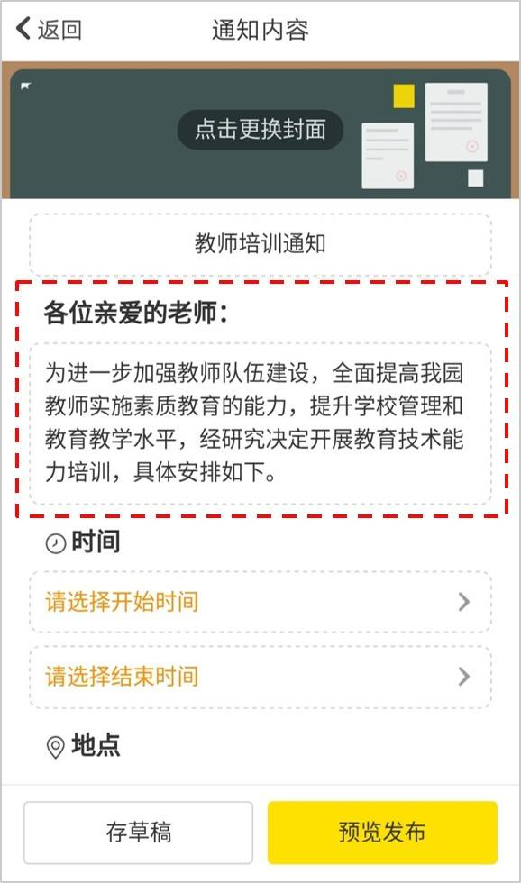
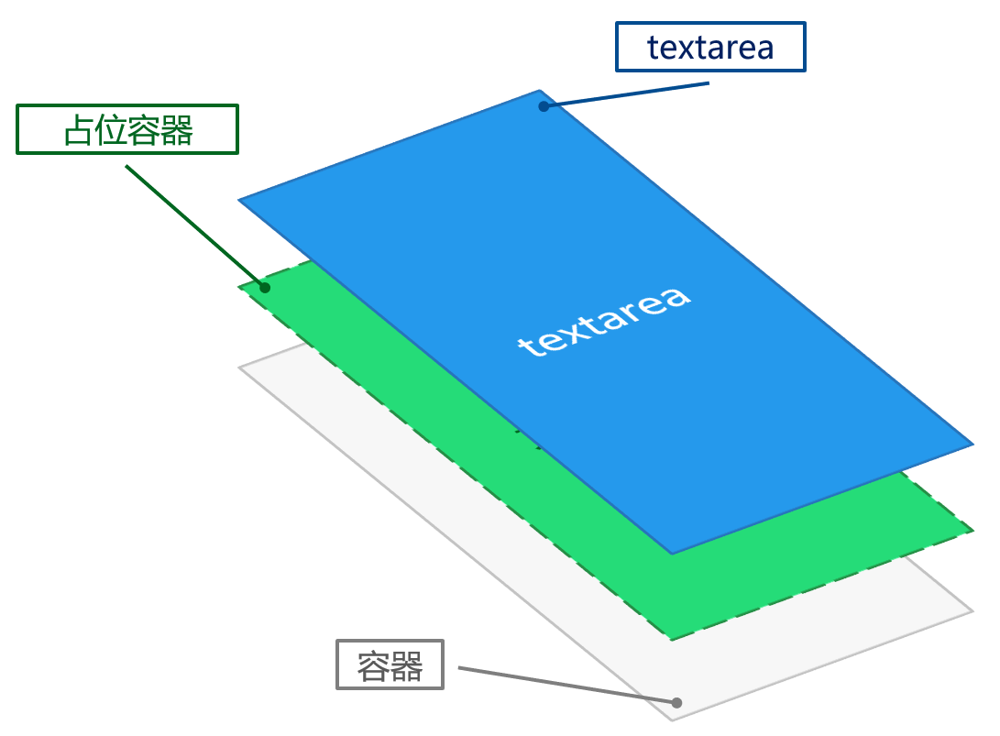
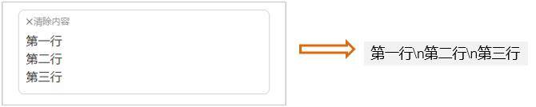
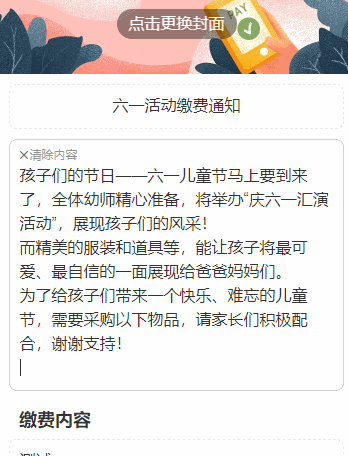
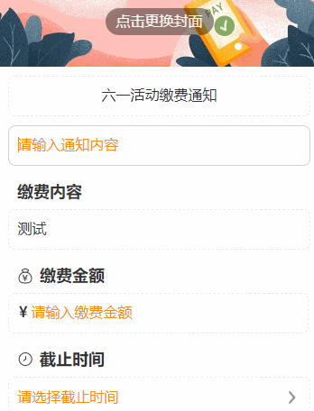
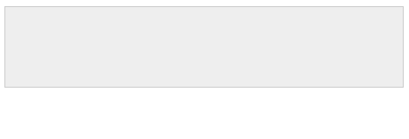
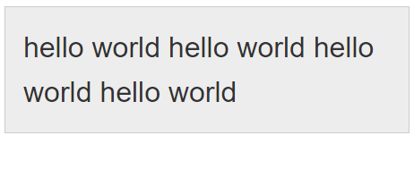
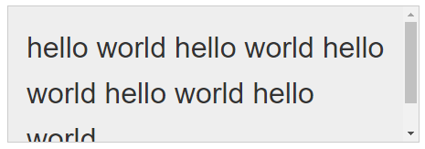

# 自适应高度输入框(ios环境下有缺陷)

前段时间在项目开发中遇到这样一个需求——文本输入框的高度要随着框内文本所占高度而变化。



## 方案一：利用contenteditable属性

首先想到的方法，是使用 HTML 5 中新增的<font color=FF0000>contenteditable</font>属性。它可以把元素变成可编辑状态，同时让其保留原有的特性（如元素高度根据元素内容所占高度而变化）。使用方式如下：

```html
<element contenteditable="value">
```

带有<font color=FF0000>contenteditable</font>属性的元素可以当作富文本编辑器，默认支持粘贴带格式（样式）的HTML代码。如果要限制输入框只能输入纯文本内容，这里可以把<font color=FF0000>user-modify</font>样式设为<font color=FF0000>「read-write-plaintext-only」</font>，或者把<font color=FF0000>contenteditable</font>属性的值设为<font color=FF0000>「plaintext-only」</font>。具体写法如下：

```css
element[contenteditable] {
    user-modify: read-write-plaintext-only
}
/* 或者 */
<element contenteditable="plaintext-only">
```

这种方案的**缺点**在于
    
1. 一个div加上contenteditable属性后也并不能让其支持如placeholder、maxlength等表单控件特性，只能通过额外的JavaScript代码去实现。

2. 我们在实践中发现，这样会导致不少兼容上的问题。

## 方案二：替身占位法

由于方案一存在不少兼容上的问题，所以在近期项目优化中探索出一种基于原生textarea的实现方案：

- 把textarea放置于一个设置了「position: relative」样式的容器中；

- 给textarea设置「position: absolute」，并把宽高设为100%；

- 使textarea与占位容器的文本样式一致；

- textarea内容变化时（监听input事件），把内容同步到占位容器。

这样一来，textarea的内容高度变化时，占位容器的高度也会变化，从而使外层容器的高度也产生变化。textarea与外层容器尺寸一致，所以也会同步变化。



```html
<div class="container">
	<!-- 占位容器 -->
	<span id="text" class="text font-style"></span>
	<!-- 输入框 -->
	<textarea id="textarea" class="textarea font-style"></textarea>
</div>
```

```css
.container {
	position: relative;
	min-height: 90px;
}

.text {
	font-size: 0;
	color: transparent;
}

.textarea {
	position: absolute;
	top: 0;
	left: 0;
	width: 100%;
	height: 100%;
	resize: none;
	border: 0;
	outline: none;
}

/* 统一内容样式 */
.font-style {
	font-family: Helvetica;
	word-wrap: break-word;
	word-break: break-all;
	line-height: 48px;
	font-size: 32px;
}
```

```js
var $text = document.getElementById('text');
var $textarea = document.getElementById('textarea');

$textarea.addEventListener('input', function(e) {
	$text.innerText = e.target.value;
});
```

- 问题1：实现后发现，textarea的换行符是「\n」，与HTML的（br）不一致，导致内容同步到容器中后丢失了换行。



这可以通过设置CSS样式「white-space」来解决：

```css
.text {
	white-space: pre-wrap; 
}
```

- 问题2： 此外，如果换行符刚好在内容的末尾，那么在容器中的换行并不会生效，这时候需要在换行符后面补上一个空格（或者其他非空白字符）。

```js
$textarea.addEventListener('input', function(e) {
	$text.innerText = e.target.value.replace(/\n$/, '\n '); // 解决不换行问题
});
```

> 注意：如果在Vue.js中使用该方案，在内容同步的过程中，不能直接使用v-model实现。

由于Vue.js在数据变化时，并不是同步更新到界面中，而是会把当前操作所发生的数据变化缓存到一个队列中，按顺序异步执行每一个「tick」。

这意味着，在textarea输入内容后，占位容器的内容在短时间内（几毫秒）还维持着上一个状态。当内容换行时，容器的高度不足以让textarea显示完整的内容，会出现跳一下的现象。



因此，内容同步只能通过原生节点操作实现。

```html
<div class="container">
	<!-- 占位容器 -->
	<span class="font-style" ref="text"></span>
	<!-- 输入框 -->
	<textarea class="textarea font-style" v-model="resultValue" @input="inputHandler"></textarea>
</div>
```

```js
{
	methods: {
		 inputHandler() {
			let $text = this.$refs.text;

			if ($text) {
				$text.innerText = this.data.resultValue.replace(/\n$/, '\n ');
 			}
		}
	}
}
```

最终效果：



## 方案三：利用textarea的scrollHeight

有这样一个节点属性<font color=FF0000>「scrollHeight」</font>，对于一个内部可滚动的元素来说，它表示元素中完整内容的高度（注意：<font color=FF0000>「scrollHeight」</font>包括元素的<font color=FF0000>padding</font>，但不包括元素的<font color=FF0000>border</font>和<font color=FF0000>margin</font>。）。

只需要在textarea的内容变化后，把它的高度设为它的「scrollHeight」，就可以完成自适应高度。

```css
textarea {
    width: 100%;
    height: 92px;
    padding: 20px;
    line-height: 50px;
    resize: none;
    outline: none;
    border: 1px solid #ccc;
    background: #eee;
    font-size: 32px;
    box-sizing: border-box;
}
```

```js
var $textarea = document.getElementById('textarea');

$textarea.addEventListener('input', function() {
    // 总高度 = scrollHeight + 上下边框的宽度（1px * 2）
    $textarea.style.height = $textarea.scrollHeight + 2 + 'px';
});
```

> 问题： 当内容高度缩减时，输入框的高度并没有跟随缩减。



根据scrollHeight设置的元素高度的存在，即使内容高度缩减，此时scrollHeight也不会低于元素高度。所以，在做自适应高度缩减时就无法直接通过同步scrollHeight来实现，而是要先清掉高度样式：

```js
$textarea.addEventListener('input', function() {
    // 清除原来高度
    $textarea.style.height = '';

    $textarea.style.height = $textarea.scrollHeight + 2 + 'px';
});
```

> 输入到临近换行处，内容高度提前增高了。



调试后发现，清掉高度样式后，textarea恢复到原来的高度，此时内容超过textarea高度，因此会出现滚动条。滚动条会占据一定的空间，导致一行能容纳的字符减少，于是就提前换行了（如下图所示）。而因为在清理高度样式后，又立刻把高度设为新的scrollHeight，所以在界面上没有体现出现。



要解决这个问题，只需要把滚动条隐藏掉。

```css
textarea {
    overflow: hidden;
}
```

> 优化：如何检查内容高度是否发生了变化：

- 内容增加时，scrollHeight有可能会发生变化，所以可以记录上一次的scrollHeight，并与当前的scrollHeight对比，有变化时才设置高度样式。

- 内容减少时，没有有效的方式可以知道内容高度是否有变更（scrollHeight不会减少），所以这种情况目前无法优化。

```js
var $textarea = document.getElementById('textarea');
var lastLength = 0;
var lastHeight = 0;

$textarea.addEventListener('input', function() {
    var currentLength = $textarea.value.length;

    // 判断字数如果比之前少了，说明内容正在减少，需要清除高度样式，重新获取
    if (currentLength < lastLength) {
        $textarea.style.height = '';
    }

    var currentHeight = $textarea.scrollHeight;

    // 如果内容高度发生了变化，再去设置高度值
    if (lastHeight !== currentHeight || !$textarea.style.height) {
        $textarea.style.height = currentHeight + 2 + 'px';
    }

    lastLength = currentLength;
    lastHeight = currentHeight;
});
```
