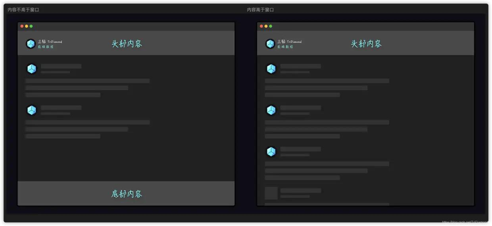
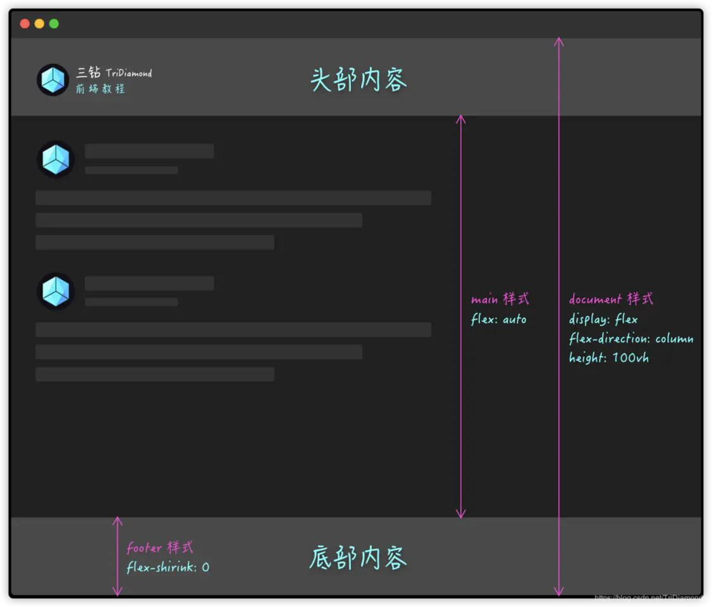

# 页面布局实例

## 1. 固定底部内容



- 这种布局方式在后台管理系统中比较常见，当我们内容不足浏览器窗口高度时，底部内容需要固定在底部。当内容超出了浏览器窗口高度，就会随着内容往后推。

- 随着CSS3的来临，最完美的实现方式是使用Flexbox。实现的关键就是使用不太被关注的flex-grow属性，可以在我们的内容标签元素（比如div）中使用。在我们下面的例子里使用了main标签。

- 实现原理：



为了避免底部内容受内容部分扩充空间的影响，我们给footer底部元素flex-shrink: 0属性。flex-shrink的作用与flex-grow是恰恰相反，用来控制flex元素收缩的空间，这里我们给了flex-shrink: 0就是为了底部footer的大小不受影响。

- html
```html
<div id="document">
	<nav>
		<h1>头部内容</h1>
	</nav>
	<main>
		<p onclick="addMore()">可以添加更多内容看看底部的变化哦！</p>
	</main>
	<footer>
		<h1>底部内容</h1>
	</footer>
</div>
```

- css
```css
#document {
    height: 100vh;
    display: flex;
    flex-direction: column;
    background: #202020;
    font-family: microsoft yahei,wenquanyi micro hei,sans-serif !important;
}

nav, footer {
    background: #494949;
    display: flex;
    justify-content: center;
}

main {
    color: #bdbdbd;
    flex: auto;
}

footer {
    flex-shrink: 0;
}

* {
    margin: 0;
}

h1,
p {
    padding: 15px;
}

nav > h1 {
    color: #82FCFD;
    text-shadow: 1px 1px 4px #00000080;
}

footer > h1 {
    color: #82FCFD;
    text-shadow: 1px 1px 4px #00000080;
}
```

::: tip
flex-grow --- 是用来控制一个flex元素相对它同等级flex元素的自身可扩充的空间
flex-shrink --- 作用与flex-grow是恰恰相反，用来控制flex元素收缩的空间
:::

## 2. 瀑布流布局


- CSS Grid和Flexbox让我们可以更简便，更容易和更快的实现各式各样的响应布局，并且让我们快捷方便的在布局中实现横向剧中和竖向剧中。但是回想一下以前是颇为困难的。

- 瀑布流一般来说都是宽度一致，但是高度是根据图片自适应的。并且图片的位置也是根据在上方图片的位置而定的。

- 最好实现瀑布流布局的办法就是用CSS的列属性套件，这套属性大多数都是用于排版杂志中的文本列。但是用于布局瀑布流也是特别实用哦。因为以前需要实现瀑布流，就必须有JavaScript的辅助来计算图片高度然后决定每张图片的定位和位置，所以现在有了列属性就可以使用纯CSS实现了。

### 实现原理：

- 实现这个布局，首选我们需要把所有的内容先包裹在一个div元素里面，然后给这个元素column-width和column-gap属性。

- 然后，为了防止任何元素被分割到两个列之间，将column-break-inside: avoid添加到各个元素中。

```html
<div class="columns">
  <figure>
    
  </figure>
  <figure>
    
  </figure>
  <figure>
    
  </figure>
  <figure>
    
  </figure>
  <figure>
    
  </figure>
  <figure>
    
  </figure>
  <figure>
    
  </figure>
  <figure>
    
  </figure>
  <figure>
    
  </figure>
  <figure>
    
  </figure>
</div>
```

```css
.columns {
  column-width: 320px;
  column-gap: 15px;
  width: 90%;
  max-width: 1100px;
  margin: 50px auto;
}
.columns figure {
  display: inline-block;
  box-shadow: 0 1px 2px rgba(34, 25, 25, 0.4);
  column-break-inside: avoid;
  border-radius: 8px;
}
.columns figure img {
  width: 100%;
  height: auto;
  margin-bottom: 15px;
  border-radius: 8px;
}
```

::: tip
🌟知识总结

- column-width — CSS属性建议一个最佳列宽。 列宽是在添加另一列之前列将成为最大宽度。
- column-width — 该 CSS 属性用来设置元素列之间的间隔 (gutter) 大小。
- column-break-inside — 设置或检索对象内部是否断。
:::