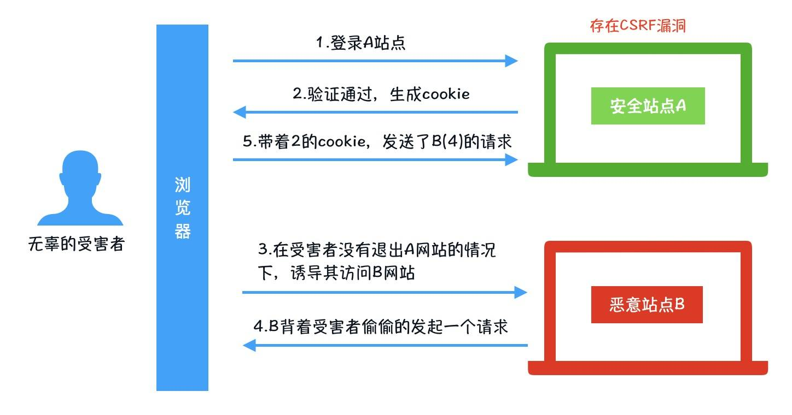

# 前端安全

[项目地址](https://github.com/YvetteLau/Blog/tree/master/Security)

## 一、XSS攻击与防御

XSS(Cross-Site Scripting，跨站脚本攻击)是一种代码注入攻击。攻击者在目标网站上注入恶意代码，当被攻击者登陆网站时就会执行这些恶意代码，这些脚本可以读取 cookie，session tokens，或者其它敏感的网站信息，对用户进行钓鱼欺诈，甚至发起蠕虫攻击等。

XSS 的本质是：恶意代码未经过滤，与网站正常的代码混在一起；浏览器无法分辨哪些脚本是可信的，导致恶意脚本被执行。由于直接在用户的终端执行，恶意代码能够直接获取用户的信息，利用这些信息冒充用户向网站发起攻击者定义的请求。

> XSS分类

根据攻击的来源，XSS攻击可以分为：

1. 存储型(持久性)

2. 反射型(非持久型)

3. DOM型。

### 1. 反射型XSS

当用户点击一个恶意链接，或者提交一个表单，或者进入一个恶意网站时，注入脚本进入被攻击者的网站。Web服务器将注入脚本，比如一个错误信息，搜索结果等，未进行过滤直接返回到用户的浏览器上。

> 反射型 XSS 的攻击步骤：

1. 攻击者构造出特殊的 URL，其中包含恶意代码。

2. 用户打开带有恶意代码的 URL 时，网站服务端将恶意代码从 URL 中取出，拼接在 HTML 中返回给浏览器。

3. 用户浏览器接收到响应后解析执行，混在其中的恶意代码也被执行。

4. 恶意代码窃取用户数据并发送到攻击者的网站，或者冒充用户的行为，调用目标网站接口执行攻击者指定的操作。

- 发请求时，XSS代码出现在URL中，提交给服务端。服务端返回的内容，也带上了这段XSS代码。最后浏览器执行XSS代码。

- 通常情况是攻击者找到有XSS漏洞的网站，然后构造一个连接，就像这种带有攻击效果的链接

```
http://www.hasxss.com?x=<script>alert(document.cookie)</script>
```

- 然后诱导你点击，通常他们会把链接短链一下迷惑你，就好比

```
http://dwz.cn/woshiduanwangzhi
```

> 如何防范反射型XSS攻击

对字符串进行编码。

对url的查询参数进行转义后再输出到页面。

```js
app.get('/welcome', function(req, res) {
    //对查询参数进行编码，避免反射型 XSS攻击
    res.send(`${encodeURIComponent(req.query.type)}`); 
});
```

### 2. **存储型XSS**

恶意脚本永久存储在目标服务器上。当浏览器请求数据时，脚本从服务器传回并执行，影响范围比反射型和DOM型XSS更大。存储型XSS攻击的原因仍然是没有做好数据过滤：前端提交数据至服务端时，没有做好过滤；服务端在接受到数据时，在存储之前，没有做过滤；前端从服务端请求到数据，没有过滤输出。

> 存储型 XSS 的攻击步骤：

1. 攻击者将恶意代码提交到目标网站的数据库中。

2. 用户打开目标网站时，网站服务端将恶意代码从数据库取出，拼接在 HTML 中返回给浏览器。

3. 用户浏览器接收到响应后解析执行，混在其中的恶意代码也被执行。

4. 恶意代码窃取用户数据并发送到攻击者的网站，或者冒充用户的行为，调用目标网站接口执行攻击者指定的操作。

这种攻击常见于带有用户保存数据的网站功能，如论坛发帖、商品评论、用户私信等。

> 如何防范存储型XSS攻击：

1. 前端数据传递给服务器之前，先转义/过滤(防范不了抓包修改数据的情况)

2. 服务器接收到数据，在存储到数据库之前，进行转义/过滤

3. 前端接收到服务器传递过来的数据，在展示到页面前，先进行转义/过滤


存储型和反射型的区别就是，提交的XSS代码会存储在服务器端。这种XSS也是最危险的。

- 举个例子，我们的网站允许用户设置一段个性签名，会显示在个人主页。

- 然后用户签名设置为数据库存储这段代码，然后页面显示出来。
```js
<script>alert(document.cookie)<script>。
```

- 如果这个过程中没有经过任何转义，那么这段html就直接执行了。这样，所有访问你个人主页的用户，就都中招了。

### 3. **DOM XSS**

DOM 型 XSS 攻击，实际上就是前端 <font color=FF0000>JavaScript</font> 代码不够严谨，把不可信的内容插入到了页面。在使用 <font color=FF0000>.innerHTML</font>、<font color=FF0000>.outerHTML</font>、<font color=FF0000>.appendChild</font>、<font color=FF0000>document.write()</font>等API时要特别小心，不要把不可信的数据作为 HTML 插到页面上，尽量使用 <font color=FF0000>.innerText</font>、<font color=FF0000>.textContent</font>、<font color=FF0000>.setAttribute()</font> 等。

> DOM 型 XSS 的攻击步骤：

1. 攻击者构造出特殊数据，其中包含恶意代码。

2. 用户浏览器执行了恶意代码。

3. 恶意代码窃取用户数据并发送到攻击者的网站，或者冒充用户的行为，调用目标网站接口执行攻击者指定的操作。

> 如何防范 DOM 型 XSS 攻击

防范 DOM 型 XSS 攻击的核心就是对输入内容进行转义(DOM 中的内联事件监听器和链接跳转都能把字符串作为代码运行，需要对其内容进行检查)。

1. 对于url链接(例如图片的src属性)，那么直接使用 encodeURIComponent 来转义。

2. 非url，我们可以这样进行编码：

```js
function encodeHtml(str) {
    return str.replace(/"/g, '&quot;')
            .replace(/'/g, '&apos;')
            .replace(/</g, '&lt;')
            .replace(/>/g, '&gt;');
}
```

DOM 型 XSS 攻击中，取出和执行恶意代码由浏览器端完成，属于前端 JavaScript 自身的安全漏洞。

- 这种和上面说的两种的区别就在于，DOM XSS不需要服务端参与，可以认为是前端代码漏洞导致。

- 举个例子，有这样一段代码
```js
<script>

    eval(location.hash.substr(1));

</script>

// 而这个时候，如果用户在网址后面加上恶意代码

http://www.xss.com#alert(document.cookie)
```
这样就完成了攻击了。

- 这也是我们常说eval不安全的原因，传入eval的字符串，天知道会是什么东西，但无论是什么，它都会去执行。

### 4. **防御手段**

#### 1. 过滤转义输入输出

- 用户输入的情况，通常来讲也是HTTP请求。GET请求的url参数。POST请求的body数据。

- 比如我们接收的数据是用户年龄，那么在后端，需要判断一下数据是否是Number，这样才能让恶意攻击者没有可乘之机。

- 对于一些特殊符号，我们需要对其进行转义
```js
& --> &amp;

< --> &lt;

> --> &gt;

" --> &quot;

' --> &#x27;

/ --> &#x2F;
```

- 这个一方面是后端接收这些代码时候的转义存储，一方面是前端在显示的时候，需要把它们转成html实体。
    
#### 2. 避免使用eval，new Function等执行字符串的方法，除非确定字符串和用户输入无关。

#### 3. 使用innerHTML，document.write的时候，如果数据是用户输入的，那么需要对关键字符都进行过滤与转义。

#### 4. 对于非客户端cookie，比如保存用户凭证的session，务必标识为http only，这样js就获取不到这个cookie值了，安全性得到提高。

#### 5. 还有一种方式是主动防御。也就是当发现页面有XSS攻击时候，主动上报。至于如何检测到，目前的方式大多是对事件和脚本拦截。判断是否有恶意代码。

#### 6. Content Security Policy

在服务端使用 HTTP的[Content-Security-Policy](https://developer.mozilla.org/zh-CN/docs/Web/HTTP/Headers/Content-Security-Policy) 头部来指定策略，或者在前端设置 meta 标签。

例如下面的配置只允许加载同域下的资源：

```js
Content-Security-Policy: default-src 'self'
```

```html
<meta http-equiv="Content-Security-Policy" content="form-action 'self';">
```

前端和服务端设置 CSP 的效果相同，但是meta无法使用report

严格的 CSP 在 XSS 的防范中可以起到以下的作用：

- 禁止加载外域代码，防止复杂的攻击逻辑。

- 禁止外域提交，网站被攻击后，用户的数据不会泄露到外域。

- 禁止内联脚本执行（规则较严格，目前发现 GitHub 使用）。

- 禁止未授权的脚本执行（新特性，Google Map 移动版在使用）。

- 合理使用上报可以及时发现 XSS，利于尽快修复问题。

### 5. XSS 检测

作为开发者本身，该如何去检测XSS呢？

1. 使用通用 XSS 攻击字串手动检测 XSS 漏洞

如: jaVasCript:/*-/*`/*\`/*'/*"/**/(/* */oNcliCk=alert() )//%0D%0A%0d%0a//</stYle/</titLe/</teXtarEa/</scRipt/--!>\x3csVg/<sVg/oNloAd=alert()//>\x3e

能够检测到存在于 HTML 属性、HTML 文字内容、HTML 注释、跳转链接、内联 JavaScript 字符串、内联 CSS 样式表等多种上下文中的 XSS 漏洞，也能检测 eval()、setTimeout()、setInterval()、Function()、innerHTML、document.write() 等 DOM 型 XSS 漏洞，并且能绕过一些 XSS 过滤器。

2. 使用第三方工具进行扫描
    - 1. Arachni
        
        Arachni是基于Ruby的开源，功能全面，高性能的漏洞扫描框架，Arachni提供简单快捷的扫描方式，只需要输入目标网站的网址即可开始扫描。它可以通过分析在扫描过程中获得的信息，来评估漏洞识别的准确性和避免误判。
        
        Arachni默认集成大量的检测工具，可以实施 代码注入、CSRF、文件包含检测、SQL注入、命令行注入、路径遍历等各种攻击。
        
        同时，它还提供了各种插件，可以实现表单爆破、HTTP爆破、防火墙探测等功能。
        
        针对大型网站，该工具支持会话保持、浏览器集群、快照等功能，帮助用户更好实施渗透测试。

    - 2. Mozilla HTTP Observatory
        
        Mozilla HTTP Observatory，是Mozilla最近发布的一款名为Observatory的网站安全分析工具，意在鼓励开发者和系统管理员增强自己网站的安全配置。用法非常简单：输入网站URL，即可访问并分析网站HTTP标头，随后可针对网站安全性提供数字形式的分数和字母代表的安全级别。

        检查的主要范围包括：

            Cookie
            跨源资源共享（CORS）
            内容安全策略（CSP）
            HTTP公钥固定（Public Key Pinning）
            HTTP严格安全传输（HSTS）状态
            是否存在HTTP到HTTPs的自动重定向
            子资源完整性（Subresource Integrity）
            X-Frame-Options
            X-XSS-Protection
    - 3. w3af
        W3af是一个基于Python的Web应用安全扫描器。可帮助开发人员，有助于开发人员和测试人员识别Web应用程序中的漏洞。

        扫描器能够识别200多个漏洞，包括跨站点脚本、SQL注入和操作系统命令

作者：刘小夕
链接：https://juejin.im/post/5cd6ad7a51882568d3670a8e
来源：掘金
著作权归作者所有。商业转载请联系作者获得授权，非商业转载请注明出处。


## 二、CSRF攻击

CSRF（Cross-site request forgery）跨站请求伪造：攻击者诱导受害者进入第三方网站，在第三方网站中，向被攻击网站发送跨站请求。利用受害者在被攻击网站已经获取的注册凭证，绕过后台的用户验证，达到冒充用户对被攻击的网站执行某项操作的目的。

> 典型的CSRF攻击流程：

1. 受害者登录A站点，并保留了登录凭证（Cookie）。

2. 攻击者诱导受害者访问了站点B。

3. 站点B向站点A发送了一个请求，浏览器会默认携带站点A的Cookie信息。

4. 站点A接收到请求后，对请求进行验证，并确认是受害者的凭证，误以为是无辜的受害者发送的请求。

5. 站点A以受害者的名义执行了站点B的请求。

6. 攻击完成，攻击者在受害者不知情的情况下，冒充受害者完成了攻击。



> CSRF的特点

1. 攻击通常在第三方网站发起，如图上的站点B，站点A无法防止攻击发生。

2. 攻击利用受害者在被攻击网站的登录凭证，冒充受害者提交操作；并不会去获取cookie信息(cookie有同源策略)

3. 跨站请求可以用各种方式：图片URL、超链接、CORS、Form提交等等(来源不明的链接，不要点击)


- CSRF全称是跨站请求伪造。

- 假设 新浪微博关注某个人的请求是GET www.weibo.com/attention?userid=123 。
所以，当用户处于登录状态下，并且访问如上链接，便会关注userid为123的用户。那么我们可以做出如下攻击。

- 编写一个恶意页面 www.csrf.com。然后在页面上加上一句

```html

```

- 这时，用户只要访问了这个页面，便发起了关注的请求。并且该请求还是带上了登录cookie的，因为cookie是跟随着请求域名一起的。

- 上面这个例子是一个太理想的情况，又例如实际关注的请求，是一个POST请求，那应该怎么办呢？

- 其实这也很简单，虽然发送post请求会有跨域限制，但是我们可以使用js动态生成一个form表单。然后把地址指向上述url,最后再加上自动提交即可。

```js
function createForm() {

  var form = document.createElement('form');

  document.body.appendChild(form);

  form.method = 'post';

  return form;

}

function createInput() {

  // 省略一些代码，创建一些input，让form使用appendChild放进去

}

var f = createForm();

// 插入一些数据

f.action = 'http://www.csrf.com';

f.submit();
```

### CSRF的防御方式

1. 判断请求的来源：检测Referer(并不安全，Referer可以被更改)。检测http referer是否是同域名，通常来讲，用户提交的请求，referer应该是来来自站内地址，所以如果发现referer中地址异常，那么很可能是遭到了CSRF攻击。`Referer` 可以作为一种辅助手段，来判断请求的来源是否是安全的，但是鉴于 `Referer` 本身是可以被修改的，因为不能仅依赖于  `Referer`

2. 避免登录的session长时间存储在客户端中。

3. 使用Token(主流)：

CSRF攻击之所以能够成功，是因为服务器误把攻击者发送的请求当成了用户自己的请求。那么我们可以要求所有的用户请求都携带一个CSRF攻击者无法获取到的Token。服务器通过校验请求是否携带正确的Token，来把正常的请求和攻击的请求区分开。跟验证码类似，只是用户无感知。

- 服务端给用户生成一个token，加密后传递给用户
- 用户在提交请求时，需要携带这个token
- 服务端验证token是否正确

关键请求使用验证码或者token机制。在一些十分关键的操作，比如交易付款环节。这种请求中，加入验证码，可以防止被恶意用户攻击。token机制也有一定的防御作用。具体来说就是服务器每次返回客户端页面的时候，在页面中埋上一个token字段，例如 
```js
<input type=“hidden” name=“csrftoken” value=“abcd">
```
之后，客户端请求的时候带上这个token，使用这个机制后，攻击者也就很难发起CSRF攻击了。

4. 添加验证码(体验不好)

验证码能够防御CSRF攻击，但是我们不可能每一次交互都需要验证码，否则用户的体验会非常差，但是我们可以在转账，交易等操作时，增加验证码，确保我们的账户安全。

5. Samesite Cookie属性

为了从源头上解决这个问题，Google起草了一份草案来改进HTTP协议，为Set-Cookie响应头新增Samesite属性，它用来标明这个 Cookie是个“同站 Cookie”，同站Cookie只能作为第一方Cookie，不能作为第三方Cookie，Samesite 有两个属性值，分别是 Strict 和 Lax。

部署简单，并能有效防御CSRF攻击，但是存在兼容性问题。

**Samesite=Strict**

Samesite=Strict 被称为是严格模式,表明这个 Cookie 在任何情况都不可能作为第三方的 Cookie，有能力阻止所有CSRF攻击。此时，我们在B站点下发起对A站点的任何请求，A站点的 Cookie 都不会包含在cookie请求头中。

```
**Samesite=Lax**

`Samesite=Lax` 被称为是宽松模式，与 Strict 相比，放宽了限制，允许发送安全 HTTP 方法带上 Cookie，如 `Get` / `OPTIONS` 、`HEAD` 请求.

但是不安全 HTTP 方法，如： `POST`, `PUT`, `DELETE` 请求时，不能作为第三方链接的 Cookie
```

## 三、HTTP劫持与对策

### 点击劫持

点击劫持是指在一个Web页面中隐藏了一个透明的iframe，用外层假页面诱导用户点击，实际上是在隐藏的frame上触发了点击事件进行一些用户不知情的操作。

> 典型点击劫持攻击流程

1. 攻击者构建了一个非常有吸引力的网页【不知道哪些内容对你们来说有吸引力，我就不写页面了，偷个懒】

2. 将被攻击的页面放置在当前页面的 iframe 中

3. 使用样式将 iframe 叠加到非常有吸引力内容的上方

4. 将iframe设置为100%透明

5. 你被诱导点击了网页内容，你以为你点击的是***，而实际上，你成功被攻击了。


- HTTP劫持严格上来说不能完全算前端安全的范畴。因为导致这种情况的主要是运营商。

- 先简单解释下HTTP劫持吧，当我们访问页面的时候，运营商在页面的HTML代码中，插入弹窗、广告等HTML代码，来获取相应的利益。

- 针对这种情况，最好的解决方式也就是使用HTTPS，加密过后，他们就没法插入广告代码了。

- 那么对于还没有升级的情况，我们可以努力让影响降到最低。
    1. 情况一：页面被iframe嵌套了
        - 这种情况还是比较简单的。对于跨域iframe，我们是可以改变父页面地址的。
        - 
        - 所以，我们在代码中加上
        ```
        if (self != top) {
    
         top.location = location.href;
    
        }
        ```
    2. 情况二：页面多出了广告的html代码或者插入广告的脚本
    
        - 这种情况下，我们能做的有限。
        
        - 一方面我们可以检测是否有新增的html。监控检测判断，发现是广告就移除掉。
        
        - 另一方面，对于使用document.write方法写入的广告，我们可以通过重写document.write方法来达到删除广告的目的

## 四、界面操作劫持

- 界面操作劫持是一种基于视觉欺骗的劫持攻击。通过在页面上覆盖一个iframe + opacity:0的页面，让用户误点击。

- 这么解释很苍白，我们来看一下具体案例：假设我开发的页面是百度


- 我希望诱导别人关注我的新浪微博。


- 这时，我可以选择在我的页面中使用iframe嵌入微博页面


- 这里我没有把opacity设置为0。如果设置为0的话。那么就完成了一次界面操作劫持了。你以为点击了百度一下，实际点击的是关注。 

## 五、防御手段
- 上面列举的例子都不具备实际攻击作用，因为浏览器厂商，W3C等已经做了很多安全工作，让我们的页面可以安稳的运行起来。但是道高一尺魔高一丈，我们要合理运用防护手段，才能让页面不被攻击。

1. HTTP响应头，在响应可以通过这些字段来提高安全性

    - X-Frame-Options 禁止页面被加载进iframe中
    
    - X-XSS-Protection 对于反射型XSS进行一些防御
    
    - X-Content-Security-Policy 这个就比较复杂了，可选项很多，用来设置允许的的资源来源以及对脚本执行环境的控制等。

2. 使用HTTPS、使用HTTP ONLY的cookie。cookie的secure字段设置为true

3. GET请求与POST请求，要严格遵守规范，不要混用，不要将一些危险的提交使用JSONP完成。
