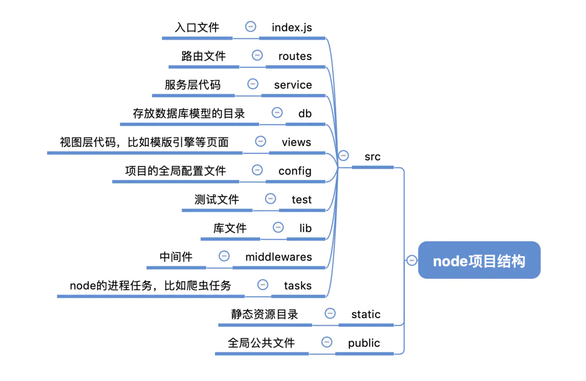
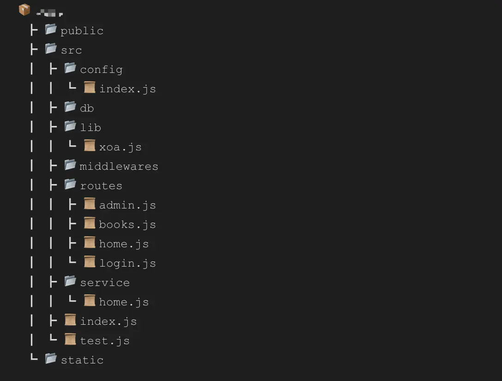
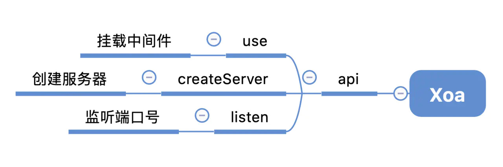

# 搭建nodejs开发环境及目录设计

## 如何配置eslint来管理项目代码规范

- 用过eslint的朋友都知道，eslint主要是针对javascript代码检测用的插件化工具。它可以约束代码的书写格式，语法规范，比如保持代码一致的缩进，代码末尾有无分号，使用单引号还是双引号等，我们通过一系列的配置，将会打造完全一致的代码写作风格，这样对后期的代码管理和维护有着非常重要的意义。说了这么多，我们看看看怎么使用在我们的nodejs项目中吧。

[eslint官网](http://eslint.cn/docs/user-guide/getting-started)

```js
npm install eslint --global
```

- 然后我们就可以在项目中生成eslint的配置文件了，具体可选择的配置文件类型有专属的.eslintrc的静态json文件， 或者可动态配置的eslintrc.js文件，这里笔者建议采用后者, 在当前项目下生成配置文件的命令如下：

```js
eslint --init
```

- 这样通过命令行的方法我们就可以生成我们想要的eslint配置文件了。首先笔者先上一份简单的eslint配置文件：

```js
module.exports = {
    "env": {
        "browser": true,
        "node": true,  // 启用node环境
        "es6": true    // 启用es6语法
    },
    "extends": "eslint:recommended",
    "globals": {
        "Atomics": "readonly",
        "SharedArrayBuffer": "readonly"
    },
    "parserOptions": {
        "ecmaVersion": 2018,
        "sourceType": "module"
    },
    "rules": {
        "semi": [2, "never"],  // 结尾不能有分号
        "eqeqeq": "warn",  // 要求使用 === 和 !==
        "no-irregular-whitespace": "warn",  // 禁止不规则的空白
        "no-empty-pattern": "warn",  // 禁止使用空解构模式
        "no-redeclare": "warn", // 禁止多次声明同一变量
        "quotes": ["error", "single"],  // 代码中使用单引号包裹字符串
        "indent": ["warn", 2],  // 代码缩进为2个空格
        "no-class-assign": "error",  // 禁止修改类声明的变量
        "no-const-assign": "error",  // 禁止修改 const 声明的变量
    }
};
```

- 其中rules中键的值分别表示：

    - "off" or 0 - 关闭规则

    - "warn" or 1 - 将规则视为一个警告（不会影响退出码）

    - "error" or 2 - 将规则视为一个错误 (退出码为1)

- 当我们的配置规则配置完毕后，我们只需要在npm的scripts脚本文件中添加执行代码，eslint就会自动帮我们校验代码：

```js
"scripts": {
    "start": "eslint src && export NODE_ENV=development && nodemon -w src"
  },
```


## 如何使用babel7来配置nodejs支持最新的es语法

我们都知道，nodejs对es的支持还不够完善，虽然在10.0+已经支持大部分的es语法了，但是最重要的模块化语法（import，export），类（class）和修饰器（Decorator）还不支持，作为一名有追求的前端工程师，为了让代码更优雅更简洁，我们有理由去用最新的特性去编写更加强大的代码，所以完善的es的环境支持是搭建nodejs项目的第二步。

我们这里统一采用babel7来给大家介绍如何配置es环境，如果你还在使用babel6或者更低的版本，可以查看对应文档的版本进行配置。babel7将很多功能都内置到了自己的模块中，我们首先要配置环境，即preset-env，我们可以使用@babel/preset-env，对于class和Decorator的支持，我们需要安装@babel/plugin-proposal-class-properties和@babel/plugin-proposal-decorators这两个模块。所以我们一共需要安装如下几个模块：

- @babel/cli

- @babel/core

- @babel/node

- @babel/plugin-proposal-class-properties

- @babel/plugin-proposal-decorators

- @babel/preset-env

关于babel的配置机制，官网上也写的很详细，大家感兴趣的可以看一下，核心就是环境（presets）和插件（plugin）机制

即@babel/preset-env是一个智能的允许我们使用最新javascript语法的代码自动转化工具。同时官网也列出了不同配置属性对应的不同功能，为了节约篇幅，我们直接上配置的代码：
```js
module.exports = function (api) {
  api.cache(true)
  const presets = [
    [
      '@babel/preset-env',
      {
        'targets': {
          'node': 'current'
        }
      }
    ]
  ]

  const plugins = [
    ['@babel/plugin-proposal-decorators', { 'legacy': true }],
    ['@babel/plugin-proposal-class-properties', { 'loose' : true }]
  ]

  return {
    presets,
    plugins
  }
}
```

以上两个plugin的作用不言而知，一个是用来编译转换修饰器属性的，一个是用来编译转换class语法的。最后一步就是在package.json中的脚本文件中使用我们的babel工具：

```json
"scripts": {
    "start": "eslint src && nodemon -w src --exec \"babel-node src\"",
    "build": "babel src --out-dir dist"
  }
```

babel-node src指定了需要编译的node目录为src目录，其他文件和目录无需编译。
通过这样的配置，我们就能开心的用最新的javascript语法开发nodejs项目了,在代码编写完成之后，我们执行npm run build即可将src的代码打包编译到dist目录下。

```js
"use strict";

var _glob = _interopRequireDefault(require("glob"));

var _path = require("path");

var _xoa = _interopRequireDefault(require("./lib/xoa.js"));

var _config = _interopRequireDefault(require("./config"));

function _interopRequireDefault(obj) { return obj && obj.__esModule ? obj : { default: obj }; }

const app = new _xoa.default();
app.use((req, res) => {
  console.log(req.url, req.method);
}); // 全局注册业务接口
// function autoRegister(path, )

_glob.default.sync((0, _path.resolve)(__dirname, './routes/*.js')).forEach(item => {
  app.use(require(item).default);
});
// ...
```

## 如何使用nodemon来自动化实现node程序自动重启

nodemon的使用非常简单，我们只需要按照官网文档的配置来安装和使用即可：

```js
npm install --save-dev nodemon
```

然后在package.json的脚本文件中如下配置：

```json
"scripts": {
    "start": "eslint src && export NODE_ENV=development && nodemon -w src --exec \"babel-node src\"",
    "build": "babel src --out-dir dist",
    "buildR": "node dist",
    "test": "echo \"Error: no test specified\" && exit 1"
  }
```

nodemon -w src 表示监听src目录下的文件变化，一旦文件变化将立刻重新启动node程序。我们还可以专门写一个nodemon的配置文件，实现不监听某一个具体的文件变动，或者其他自定义的配置，如果服务上线，我们还可以用forever和nodemon结合来是实现持久化，当然主流的方式还是pm2.


## 如何划分node目录结构实现一个node通用服务类Xoa来实现经典的MVC架构


具体目录如下：


## 原生javascript实现一个简单的node服务层的封装

我们都知道nodejs有http模块方便我们快速创建一个node服务器，代码可能长这个样子：

```js
import { createServer } from 'http'
createServer((req, res) => {
    res.end('hello world!')
}).listen(3000)
```

中间件机制，当我们要注册一个路由时，我们只需要这样写：

```js
app.use(routerA)
```

一个自己的小型服务框架：



代码如下：

```js
import { createServer } from 'http'

class Xoa {
  constructor() {
    // 初始化中间键数组
    this.middleware = []
  }
  // 维持中间键数组
  use(func) {
    this.middleware.push(func)
  }
  // 创建服务器实例,并执行相应任务
  createServer() {
    const server = createServer((req, res) => {
      // 应用中间件
      this.middleware.forEach((fn) => fn(req, res))
    })
    return server
  }
  // 服务器监听
  listen(port = 3000, cb) {
    this.createServer().listen(port, cb)
  }
}

export default Xoa
```

使用：

```js
import Xoa from './lib/xoa.js'

const app = new Xoa()

app.use((req, res) => {
  console.log(req.url, req.method)
  res.end('A')
})

app.use((req, res) => {
  res.end('B')
})

app.listen(3000)
```

另外一种场景，如果我们的路由很多，有负责页面渲染的路由，也有负责输出api数据的路由，那么我们要每个都使用use来use一遍，这样感觉太傻了，作为一个有追求的程序员是不允许这种事情发生的，我们希望这一切都是自动完成的，自动注册中间件，这该怎么实现呢？
好在node社区提供了一个强大的第三方模块glob，我们可以通过glob来遍历目录实现自动化注册路由，关于glob的用法这里就不带大家细说了，用法非常简单。
比如我们的路由文件有如下几个：


我们要保证路由目录下面的路由文件都有导出，然后在 入口文件中我们可以这么实现：
```js
import glob from 'glob'
import { resolve } from 'path'
import Xoa from './lib/xoa.js'
import config from './config'

const app = new Xoa()

// 全局注册业务接口
glob.sync(resolve(__dirname, './routes/*.js')).forEach(item => {
  app.use(require(item).default)
})

app.listen(config.serverPort, () => {
  console.log(`服务器地址:${config.protocol}//${config.host}:${config.serverPort}`)
})
```

通过glob的sync方法我们可以遍历routes目录并通过require加载路由文件，然后直接注册到app上，这样就不用我们手动一个个引入了，是不是非常简单呢？（虽然这只是个极简版的服务端封装，对于实际项目需要做进一步的升级和扩展

