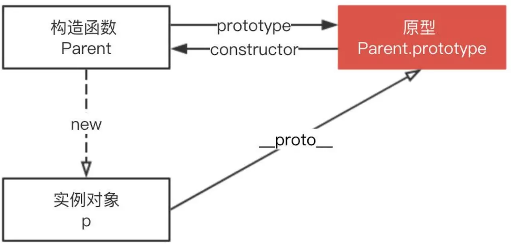
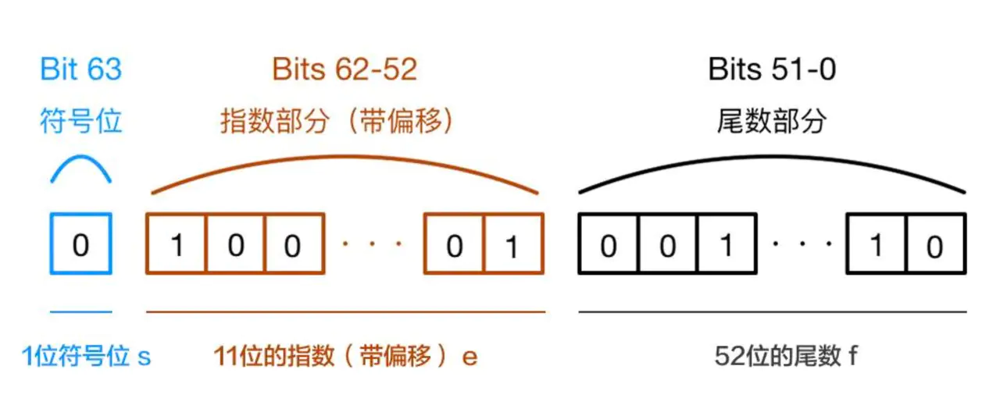
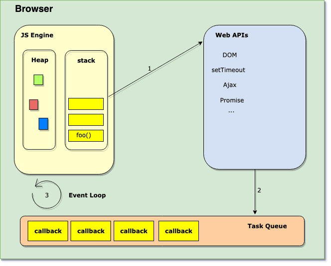
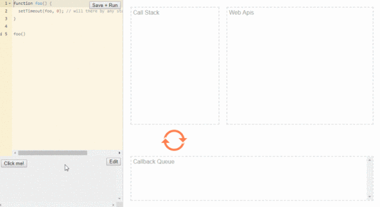

# JavaScript

## 1. 基本数据类型有哪几种？null 是对象吗？基本数据类型和复杂数据类型(引用类型)存储有什么区别？

- 基本类型有6种，分别是undefined,null,bool,string,number,symbol(ES6新增)。

- 虽然 typeof null 返回的值是 object,但是null不是对象，而是基本数据类型的一种。

- 基本数据类型存储在栈内存，存储的是值。五种基本类型: Undefined、Null、Boolean、Number和String。

- 复杂数据类型的值存储在堆内存，地址（指向堆中的值）存储在栈内存。当我们把对象赋值给另外一个变量的时候，复制的是地址，指向同一块内存空间，当其中一个对象改变时，另一个对象也会变化。引用类型: Object、Array和Function。

## 2. typeof 是否正确判断类型? instanceof呢？ instanceof 的实现原理是什么？

首先 typeof 能够正确的判断基本数据类型，但是除了 null, typeof null输出的是对象。

但是对象来说，typeof 不能正确的判断其类型， typeof 一个函数可以输出 'function',而除此之外，输出的全是 object,这种情况下，我们无法准确的知道对象的类型。

instanceof可以准确的判断复杂数据类型，但是不能正确判断基本数据类型。

instanceof 是通过原型链判断的，A instanceof B, 在A的原型链中层层查找，是否有原型等于B.prototype，如果一直找到A的原型链的顶端(null;即Object.proptotype.__proto__),仍然不等于B.prototype，那么返回false，否则返回true.

instanceof的实现代码:

```js
// L instanceof R
function instance_of(L, R) {//L 表示左表达式，R 表示右表达式
    var O = R.prototype;// 取 R 的显式原型
    L = L.__proto__;    // 取 L 的隐式原型
    while (true) { 
        if (L === null) //已经找到顶层
            return false;  
        if (O === L)   //当 O 严格等于 L 时，返回 true
            return true; 
        L = L.__proto__;  //继续向上一层原型链查找
    } 
}
```

## 3. for of , for in 和 forEach,map 的区别。

- for...of循环：具有 iterator 接口，就可以用for...of循环遍历它的成员(属性值)。for...of循环可以使用的范围包括数组、Set 和 Map 结构、某些类似数组的对象、Generator 对象，以及字符串。for...of循环调用遍历器接口，数组的遍历器接口只返回具有数字索引的属性。对于普通的对象，for...of结构不能直接使用，会报错，必须部署了 Iterator 接口后才能使用。可以中断循环。

- for...in循环：遍历对象自身的和继承的可枚举的属性, 不能直接获取属性值。可以中断循环。

- forEach: 只能遍历数组，不能中断，没有返回值(或认为返回值是undefined)。

- map: 只能遍历数组，不能中断，返回值是修改后的数组。

```js
let arry = [1, 2, 3, 4];

arry.forEach((item) => {
    item *= 10;
});
console.log(arry); //[1, 2, 3, 4]

arry.forEach((item) => {
    arry[1] = 10; //直接操作数组
});
console.log(arry); //[ 1, 10, 3, 4 ]

let arry2 = [
    { name: "Yve" },
    { age: 20 }
];
arry2.forEach((item) => {
    item.name = 10;
});
console.log(arry2);//[ { name: 10 }, { age: 20, name: 10 } ]
```

## 4. 如何判断一个变量是不是数组？

- 使用 Array.isArray 判断，如果返回 true, 说明是数组

- 使用 instanceof Array 判断，如果返回true, 说明是数组

- 使用 Object.prototype.toString.call 判断，如果值是 [object Array], 说明是数组

- 通过 constructor 来判断，如果是数组，那么 arr.constructor === Array. (不准确，因为我们可以指定 obj.constructor = Array)

```js
function fn() {
    console.log(Array.isArray(arguments));   //false; 因为arguments是类数组，但不是数组
    console.log(Array.isArray([1,2,3,4]));   //true
    console.log(arguments instanceof Array); //fasle
    console.log([1,2,3,4] instanceof Array); //true
    console.log(Object.prototype.toString.call(arguments)); //[object Arguments]
    console.log(Object.prototype.toString.call([1,2,3,4])); //[object Array]
    console.log(arguments.constructor === Array); //false
    arguments.constructor = Array;
    console.log(arguments.constructor === Array); //true
    console.log(Array.isArray(arguments));        //false
}
fn(1,2,3,4);
```

## 5. 类数组和数组的区别是什么？

**类数组**

1）拥有length属性，其它属性（索引）为非负整数（对象中的索引会被当做字符串来处理）;

2）不具有数组所具有的方法；

类数组是一个普通对象，而真实的数组是Array类型。

常见的类数组有: 函数的参数 arguments, DOM 对象列表(比如通过 document.querySelectorAll 得到的列表), jQuery 对象 (比如 $("div")).

类数组可以转换为数组:

```js
//第一种方法
Array.prototype.slice.call(arrayLike, start);
//第二种方法
[...arrayLike];
//第三种方法:
Array.from(arrayLike);
```

> PS: 任何定义了遍历器（Iterator）接口的对象，都可以用扩展运算符转为真正的数组。

Array.from方法用于将两类对象转为真正的数组：类似数组的对象（array-like object）和可遍历（iterable）的对象。

## 6. == 和 === 有什么区别？

=== 不需要进行类型转换，只有类型相同并且值相等时，才返回 true.
== 如果两者类型不同，首先需要进行类型转换。具体流程如下:

1. 首先判断两者类型是否相同，如果相等，判断值是否相等.

2. 如果类型不同，进行类型转换

3. 判断比较的是否是 null 或者是 undefined, 如果是, 返回 true .

4. 判断两者类型是否为 string 和 number, 如果是, 将字符串转换成 number

5. 判断其中一方是否为 boolean, 如果是, 将 boolean 转为 number 再进行判断

6. 判断其中一方是否为 object 且另一方为 string、number 或者 symbol , 如果是, 将 object 转为原始类型再进行判断

```js
let person1 = {
    age: 25
}
let person2 = person1;
person2.gae = 20;
console.log(person1 === person2); //true,注意复杂数据类型，比较的是引用地址
```

> 思考: [] == ![]

- 首先，我们需要知道 ! 优先级是高于 == (更多运算符优先级可查看: 运算符优先级)

- ![] 引用类型转换成布尔值都是true,因此![]的是false

- 根据上面的比较步骤中的第五条，其中一方是 boolean，将 boolean 转为 number 再进行判断，false转换成 number，对应的值是 0.

- 根据上面比较步骤中的第六条，有一方是 number，那么将object也转换成Number,空数组转换成数字，对应的值是0.(空数组转换成数字，对应的值是0，如果数组中只有一个数字，那么转成number就是这个数字，其它情况，均为NaN)

- 0 == 0; 为true

## 7. ES6中的class和ES5的类有什么区别？

1. ES6 class 内部所有定义的方法都是不可枚举的;

2. ES6 class 必须使用 new 调用;

3. ES6 class 不存在变量提升;

4. ES6 class 默认即是严格模式;

5. ES6 class 子类必须在构造函数中调用super()，这样才有this对象;ES5中类继承的关系是相反的，先有子类的this，然后用父类的方法应用在this上。

## 8. 数组的哪些API会改变原数组？

> 修改原数组的API有: 

splice/reverse/fill/copyWithin/sort/push/pop/unshift/shift

> 不修改原数组的API有:

slice/map/forEach/every/filter/reduce/entries/find

## 9. let、const 以及 var 的区别是什么？

- let 和 const 定义的变量不会出现变量提升，而 var 定义的变量会提升。

- let 和 const 是JS中的块级作用域

- let 和 const 不允许重复声明(会抛出错误)

- let 和 const 定义的变量在定义语句之前，如果使用会抛出错误(形成了暂时性死区)，而 var 不会。

- const 声明一个只读的常量。一旦声明，常量的值就不能改变(如果声明是一个对象，那么不能改变的是对象的引用地址)

## 10. 在JS中什么是变量提升？什么是暂时性死区？

变量提升就是变量在声明之前就可以使用，值为undefined。

在代码块内，使用 let/const 命令声明变量之前，该变量都是不可用的(会抛出错误)。这在语法上，称为“暂时性死区”。暂时性死区也意味着 typeof 不再是一个百分百安全的操作。

```js
typeof x; // ReferenceError(暂时性死区，抛错)
let x;

typeof y; // 值是undefined,不会报错
```

暂时性死区的本质就是，只要一进入当前作用域，所要使用的变量就已经存在了，但是不可获取，只有等到声明变量的那一行代码出现，才可以获取和使用该变量。

## 11. 词法作用域和this的区别。

- 词法作用域是由你在写代码时将变量和块作用域写在哪里来决定的

- this 是在调用时被绑定的，this 指向什么，完全取决于函数的调用位置(关于this的指向问题，本文已经有说明)

## 12. 谈谈你对JS执行上下文栈和作用域链的理解.

执行上下文就是当前 JavaScript 代码被解析和执行时所在环境, JS执行上下文栈可以认为是一个存储函数调用的栈结构，遵循先进后出的原则。


- JavaScript执行在单线程上，所有的代码都是排队执行。

- 一开始浏览器执行全局的代码时，首先创建全局的执行上下文，压入执行栈的顶部。

- 每当进入一个函数的执行就会创建函数的执行上下文，并且把它压入执行栈的顶部。当前函数执行-完成后，当前函数的执行上下文出栈，并等待垃圾回收。

- 浏览器的JS执行引擎总是访问栈顶的执行上下文。

- 全局上下文只有唯一的一个，它在浏览器关闭时出栈。

作用域链: 无论是 LHS 还是 RHS 查询，都会在当前的作用域开始查找，如果没有找到，就会向上级作用域继续查找目标标识符，每次上升一个作用域，一直到全局作用域为止。

## 13. 什么是闭包？闭包的作用是什么？闭包有哪些使用场景？

闭包是指有权访问另一个函数作用域中的变量的函数，创建闭包最常用的方式就是在一个函数内部创建另一个函数。

闭包的作用有:

1. 封装私有变量

2. 模仿块级作用域(ES5中没有块级作用域)

3. 实现JS的模块

## 14. call、apply有什么区别？call,aplly和bind的内部是如何实现的？

call 和 apply 的功能相同，区别在于传参的方式不一样:

- fn.call(obj, arg1, arg2, ...),调用一个函数, 具有一个指定的this值和分别地提供的参数(参数的列表)。

- fn.apply(obj, [argsArray]),调用一个函数，具有一个指定的this值，以及作为一个数组（或类数组对象）提供的参数。

> call核心:

- 将函数设为传入参数的属性

- 指定this到函数并传入给定参数执行函数

- 如果不传入参数或者参数为null，默认指向为 window / global

- 删除参数上的函数

```js
Function.prototype.call = function (context) {
    /** 如果第一个参数传入的是 null 或者是 undefined, 那么指向this指向 window/global */
    /** 如果第一个参数传入的不是null或者是undefined, 那么必须是一个对象 */
    if (!context) {
        //context为null或者是undefined
        context = typeof window === 'undefined' ? global : window;
    }
    context.fn = this; //this指向的是当前的函数(Function的实例)
    let rest = [...arguments].slice(1);//获取除了this指向对象以外的参数, 空数组slice后返回的仍然是空数组
    let result = context.fn(...rest); //隐式绑定,当前函数的this指向了context.
    delete context.fn;
    return result;
}

//测试代码
var foo = {
    name: 'Selina'
}
var name = 'Chirs';
function bar(job, age) {
    console.log(this.name);
    console.log(job, age);
}
bar.call(foo, 'programmer', 20);
// Selina programmer 20
bar.call(null, 'teacher', 25);
// 浏览器环境: Chirs teacher 25; node 环境: undefined teacher 25
```

> apply:

apply的实现和call很类似，但是需要注意他们的参数是不一样的，apply的第二个参数是数组或类数组.

```js
Function.prototype.apply = function (context, rest) {
    if (!context) {
        //context为null或者是undefined时,设置默认值
        context = typeof window === 'undefined' ? global : window;
    }
    context.fn = this;
    let result;
    if(rest === undefined || rest === null) {
        //undefined 或者 是 null 不是 Iterator 对象，不能被 ...
        result = context.fn(rest);
    }else if(typeof rest === 'object') {
        result = context.fn(...rest);
    }
    delete context.fn;
    return result;
}
var foo = {
    name: 'Selina'
}
var name = 'Chirs';
function bar(job, age) {
    console.log(this.name);
    console.log(job, age);
}
bar.apply(foo, ['programmer', 20]);
// Selina programmer 20
bar.apply(null, ['teacher', 25]);
// 浏览器环境: Chirs programmer 20; node 环境: undefined teacher 25
```

> bind

bind 和 call/apply 有一个很重要的区别，一个函数被 call/apply 的时候，会直接调用，但是 bind 会创建一个新函数。当这个新函数被调用时，bind() 的第一个参数将作为它运行时的 this，之后的一序列参数将会在传递的实参前传入作为它的参数。

```js
Function.prototype.bind = function(context) {
    if(typeof this !== "function"){
       throw new TypeError("not a function");
    }
    let self = this;
    let args = [...arguments].slice(1);
    function Fn() {};
    Fn.prototype = this.prototype;
    let bound = function() {
        let res = [...args, ...arguments]; //bind传递的参数和函数调用时传递的参数拼接
        context = this instanceof Fn ? this : context || this;
        return self.apply(context, res);
    }
    //原型链
    bound.prototype = new Fn();
    return bound;
}

var name = 'Jack';
function person(age, job, gender){
    console.log(this.name , age, job, gender);
}
var Yve = {name : 'Yvette'};
let result = person.bind(Yve, 22, 'enginner')('female');	
```


## 15. new的原理是什么？通过new的方式创建对象和通过字面量创建有什么区别？

new:

1. 创建一个新对象。

2. 这个新对象会被执行**原型**连接。

3. 属性和方法被加入到 this 引用的对象中。并执行了构造函数中的方法.

4. 如果函数没有返回其他对象，那么this指向这个新对象，否则this指向构造函数中返回的对象。

```js
function new(func) {
    let target = {};
    target.__proto__ = func.prototype;
    let res = func.call(target);
    if (res && typeof(res) == "object" || typeof(res) == "function") {
    	return res;
    }
    return target;
}
```

字面量创建对象，不会调用 Object构造函数, 简洁且性能更好;

new Object() 方式创建对象本质上是方法调用，涉及到在proto链中遍历该方法，当找到该方法后，又会生产方法调用必须的 堆栈信息，方法调用结束后，还要释放该堆栈，性能不如字面量的方式。

通过对象字面量定义对象时，不会调用Object构造函数。

## 16. 谈谈你对原型的理解？

在 JavaScript 中，每当定义一个对象（函数也是对象）时候，对象中都会包含一些预定义的属性。其中每个函数对象都有一个prototype 属性，这个属性指向函数的原型对象。使用原型对象的好处是所有对象实例共享它所包含的属性和方法。

## 17. 什么是原型链？【原型链解决的是什么问题？】

原型链解决的主要是继承问题。

每个对象拥有一个原型对象，通过 __proto__ (读音: dunder proto) 指针指向其原型对象，并从中继承方法和属性，同时原型对象也可能拥有原型，这样一层一层，最终指向 null(Object.prototype.__proto__ 指向的是null)。这种关系被称为原型链 (prototype chain)，通过原型链一个对象可以拥有定义在其他对象中的属性和方法。

构造函数 Parent、Parent.prototype 和 实例 p 的关系如下:(p.__proto__ === Parent.prototype)



## 18. prototype 和 __proto__ 区别是什么？

prototype是构造函数的属性。

__proto__ 是每个实例都有的属性，可以访问 **prototype** 属性。

实例的__proto__ 与其构造函数的prototype指向的是同一个对象。

```js
function Student(name) {
    this.name = name;
}
Student.prototype.setAge = function(){
    this.age=20;
}
let Jack = new Student('jack');
console.log(Jack.__proto__);
//console.log(Object.getPrototypeOf(Jack));;
console.log(Student.prototype);
console.log(Jack.__proto__ === Student.prototype);//true
```

## 19. 使用ES5实现一个继承？

> 组合继承(最常用的继承方式)

```js
function SuperType(name) {
    this.name = name;
    this.colors = ['red', 'blue', 'green'];
}
SuperType.prototype.sayName = function() {
    console.log(this.name);
}

function SubType(name, age) {
    SuperType.call(this, name);
    this.age = age;
}
SubType.prototype = new SuperType();
SubType.prototype.constructor = SubType;

SubType.prototype.sayAge = function() {
    console.log(this.age);
}
```

## 20. 什么是深拷贝？深拷贝和浅拷贝有什么区别？

浅拷贝是指只复制第一层对象，但是当对象的属性是引用类型时，实质复制的是其引用，当引用指向的值改变时也会跟着变化。

深拷贝复制变量值，对于非基本类型的变量，则递归至基本类型变量后，再复制。深拷贝后的对象与原来的对象是完全隔离的，互不影响，对一个对象的修改并不会影响另一个对象。

实现一个深拷贝:

```js
function deepClone(obj) { //递归拷贝
    if(obj === null) return null; //null 的情况
    if(obj instanceof RegExp) return new RegExp(obj);
    if(obj instanceof Date) return new Date(obj);
    if(typeof obj !== 'object') {
        //如果不是复杂数据类型，直接返回
        return obj;
    }
    /**
     * 如果obj是数组，那么 obj.constructor 是 [Function: Array]
     * 如果obj是对象，那么 obj.constructor 是 [Function: Object]
     */
    let t = new obj.constructor();
    for(let key in obj) {
        //如果 obj[key] 是复杂数据类型，递归
        t[key] = deepClone(obj[key]);
    }
    return t;
}
```

## 22. 防抖和节流的区别是什么？防抖和节流的实现。

防抖和节流的作用都是防止函数多次调用。区别在于，假设一个用户一直触发这个函数，且每次触发函数的间隔小于设置的时间，防抖的情况下只会调用一次，而节流的情况会每隔一定时间调用一次函数。

> 防抖(debounce): n秒内函数只会执行一次，如果n秒内高频事件再次被触发，则重新计算时间

```js
function debounce(func, wait, immediate = true) {
    let timer;
    // 延迟执行函数
    const later = (context, args) => setTimeout(() => {
        timer = null;// 倒计时结束
        if (!immediate) {
            func.apply(context, args);
            //执行回调
            context = args = null;
        }
    }, wait);
    let debounced = function (...params) {
        let context = this;
        let args = params;
        if (!timer) {
            timer = later(context, args);
            if (immediate) {
                //立即执行
                func.apply(context, args);
            }
        } else {
            clearTimeout(timer);
            //函数在每个等待时延的结束被调用
            timer = later(context, args);
        }
    }
    debounced.cancel = function () {
        clearTimeout(timer);
        timer = null;
    };
    return debounced;
};
```

防抖的应用场景:

- 每次 resize/scroll 触发统计事件

- 文本输入的验证（连续输入文字后发送 AJAX 请求进行验证，验证一次就好）

> 节流(throttle): 高频事件在规定时间内只会执行一次，执行一次后，只有大于设定的执行周期后才会执行第二次。

```js
//underscore.js
function throttle(func, wait, options) {
    var timeout, context, args, result;
    var previous = 0;
    if (!options) options = {};

    var later = function () {
        previous = options.leading === false ? 0 : Date.now() || new Date().getTime();
        timeout = null;
        result = func.apply(context, args);
        if (!timeout) context = args = null;
    };

    var throttled = function () {
        var now = Date.now() || new Date().getTime();
        if (!previous && options.leading === false) previous = now;
        var remaining = wait - (now - previous);
        context = this;
        args = arguments;
        if (remaining <= 0 || remaining > wait) {
            if (timeout) {
                clearTimeout(timeout);
                timeout = null;
            }
            previous = now;
            result = func.apply(context, args);
            if (!timeout) context = args = null;
        } else if (!timeout && options.trailing !== false) {
            // 判断是否设置了定时器和 trailing
            timeout = setTimeout(later, remaining);
        }
        return result;
    };

    throttled.cancel = function () {
        clearTimeout(timeout);
        previous = 0;
        timeout = context = args = null;
    };

    return throttled;
};

```

函数节流的应用场景有:

- DOM 元素的拖拽功能实现（mousemove）

- 射击游戏的 mousedown/keydown 事件（单位时间只能发射一颗子弹）

- 计算鼠标移动的距离（mousemove）

- Canvas 模拟画板功能（mousemove）

- 搜索联想（keyup）

- 监听滚动事件判断是否到页面底部自动加载更多：给 scroll 加了 debounce 后，只有用户停止滚动后，才会判断是否到了页面底部；如果是 throttle 的话，只要页面滚动就会间隔一段时间判断一次

## 22. 取数组的最大值（ES5、ES6）

```js
// ES5 的写法
Math.max.apply(null, [14, 3, 77, 30]);

// ES6 的写法
Math.max(...[14, 3, 77, 30]);

// reduce
[14,3,77,30].reduce((accumulator, currentValue)=>{
    return accumulator = accumulator > currentValue ? accumulator : currentValue
});
```

## 23.  ES6新的特性有哪些？

1. 新增了块级作用域(let,const)

2. 提供了定义类的语法糖(class)

3. 新增了一种基本数据类型(Symbol)

4. 新增了变量的解构赋值

5. 函数参数允许设置默认值，引入了rest参数，新增了箭头函数

6. 数组新增了一些API，如 isArray / from / of 方法;数组实例新增了 entries()，keys() 和 values() 等方法

7. 对象和数组新增了扩展运算符

8. ES6 新增了模块化(import/export)

9. ES6 新增了 Set 和 Map 数据结构

10. ES6 原生提供 Proxy 构造函数，用来生成 Proxy 实例

11. ES6 新增了生成器(Generator)和遍历器(Iterator)

## 24. setTimeout倒计时为什么会出现误差？

setTimeout() 只是将事件插入了“任务队列”，必须等当前代码（执行栈）执行完，主线程才会去执行它指定的回调函数。要是当前代码消耗时间很长，也有可能要等很久，所以并没办法保证回调函数一定会在 setTimeout() 指定的时间执行。所以， setTimeout() 的第二个参数表示的是最少时间，并非是确切时间。

HTML5标准规定了 setTimeout() 的第二个参数的最小值不得小于4毫秒，如果低于这个值，则默认是4毫秒。在此之前。老版本的浏览器都将最短时间设为10毫秒。另外，对于那些DOM的变动（尤其是涉及页面重新渲染的部分），通常是间隔16毫秒执行。这时使用 requestAnimationFrame() 的效果要好于 setTimeout();

## 25. 为什么 0.1 + 0.2 != 0.3 ?

0.1 + 0.2 != 0.3 是因为在进制转换和进阶运算的过程中出现精度损失。

详细解释：
JavaScript使用 Number 类型表示数字(整数和浮点数)，使用64位表示一个数字。



图片说明:

- 第0位：符号位，0表示正数，1表示负数(s)

- 第1位到第11位：储存指数部分（e）

- 第12位到第63位：储存小数部分（即有效数字）f

计算机无法直接对十进制的数字进行运算, 需要先对照 IEEE 754 规范转换成二进制，然后对阶运算。

> 1.进制转换

0.1和0.2转换成二进制后会无限循环

```js
0.1 -> 0.0001100110011001...(无限循环)
0.2 -> 0.0011001100110011...(无限循环)
```

但是由于IEEE 754尾数位数限制，需要将后面多余的位截掉，这样在进制之间的转换中精度已经损失。

> 2.对阶运算

由于指数位数不相同，运算时需要对阶运算 这部分也可能产生精度损失。

按照上面两步运算（包括两步的精度损失），最后的结果是

0.0100110011001100110011001100110011001100110011001100

结果转换成十进制之后就是 0.30000000000000004。

## 27. promise 有几种状态, Promise 有什么优缺点 ?

promise有三种状态: fulfilled, rejected, pending.

> Promise 的优点:

1. 一旦状态改变，就不会再变，任何时候都可以得到这个结果

2. 可以将异步操作以同步操作的流程表达出来，避免了层层嵌套的回调函数

> Promise 的缺点:

1. 无法取消 Promise

2. 当处于pending状态时，无法得知目前进展到哪一个阶段

## 27. Promise构造函数是同步还是异步执行，then中的方法呢 ?promise如何实现then处理 ?

Promise的构造函数是同步执行的。then 中的方法是异步执行的。

promise的then实现，详见:[Promise源码实现](https://juejin.im/post/5c88e427f265da2d8d6a1c84)

## 28. Promise和setTimeout的区别 ?

Promise 是微任务，setTimeout 是宏任务，同一个事件循环中，promise.then总是先于 setTimeout 执行。

## 1. 如何用原生js给一个按钮绑定两个onclick事件？

**addEventListener**

```js
//事件监听 绑定多个事件
var btn = document.getElementById("btn");
btn.addEventListener("click",hello1);
btn.addEventListener("click",hello2);
function hello1(){
 alert("hello 1");
}
function hello2(){
 alert("hello 2");
}
```

## 2. 拖拽会用到哪些事件？

- dragstart:拖拽开始时在被拖拽元素上触发此事件,监听器需要设置拖拽所需数据,从操作系统拖拽文件到浏览器时不触发此事件.

- dragenter:拖拽鼠标进入元素时在该元素上触发,用于给拖放元素设置视觉反馈,如高亮

- dragover:拖拽时鼠标在目标元素上移动时触发.监听器通过阻止浏览器默认行为设置元素为可拖放元素.

- dragleave:拖拽时鼠标移出目标元素时在目标元素上触发.此时监听器可以取消掉前面设置的视觉效果.

- drag:拖拽期间在被拖拽元素上连续触发

- drop:鼠标在拖放目标上释放时,在拖放目标上触发.此时监听器需要收集数据并且执行所需操。如果是从操作系统拖放文件到浏览器,需要取消浏览器默认行为.

- dragend:鼠标在拖放目标上释放时,在拖拽元素上触发.将元素从浏览器拖放到操作系统时不会触发此事件.

## 3. document.write和innerHTML的区别？

- document.write是直接写入到页面的内容流，如果在写之前没有调用document.open, 浏览器会自动调用open。每次写完关闭之后重新调用该函数，会导致页面被重写。

- innerHTML则是DOM页面元素的一个属性，代表该元素的html内容。你可以精确到某一个具体的元素来进行更改。如果想修改document的内容，则需要修改document.documentElement.innerElement。

- innerHTML将内容写入某个DOM节点，不会导致页面全部重绘

- innerHTML很多情况下都优于document.write，其原因在于其允许更精确的控制要刷新页面的那一个部分。

## 4. 什么是ajax? ajax的步骤？

- ajax(异步javascript xml) 能够刷新局部网页数据而不是重新加载整个网页。

- 如何使用ajax?

- 第一步，创建xmlhttprequest对象，var xmlhttp =new XMLHttpRequest（);XMLHttpRequest对象用来和服务器交换数据。

```js
var xhttp;
if (window.XMLHttpRequest) {
//现代主流浏览器
xhttp = new XMLHttpRequest();
} else {
// 针对浏览器，比如IE5或IE6
xhttp = new ActiveXObject("Microsoft.XMLHTTP");
}
```

- 第二步，使用xmlhttprequest对象的open（）和send（）方法发送资源请求给服务器。

- 第三步，使用xmlhttprequest对象的responseText或responseXML属性获得服务器的响应。

- 第四步，onreadystatechange函数，当发送请求到服务器，我们想要服务器响应执行一些功能就需要使用onreadystatechange函数，每次xmlhttprequest对象的readyState发生改变都会触发onreadystatechange函数。

## 5. xml和json的区别？

-  JSON相对于XML来讲，数据的体积小，传递的速度更快些

-  JSON与JavaScript的交互更加方便，更容易解析处理，更好的数据交互

-  XML对数据描述性比较好；

-  JSON的速度要远远快于XML；

## 7. undefined和null的区别？

- null： Null类型，代表“空值”，代表一个空对象指针，使用typeof运算得到 “object”，所以你可以认为它是一个特殊的对象值。

- undefined： Undefined类型，当一个声明了一个变量未初始化时，得到的就是undefined。

- null是javascript的关键字，可以认为是对象类型，它是一个空对象指针，和其它语言一样都是代表“空值”，不过 undefined 却是javascript才有的。

- undefined是在ECMAScript第三版引入的，为了区分空指针对象和未初始化的变量，它是一个预定义的全局变量。没有返回值的函数返回为undefined，

- 没有实参的形参也是undefined。

- javaScript权威指南：
    1. null 和 undefined 都表示“值的空缺”，你可以认为undefined是表示系统级的、
    2. 出乎意料的或类似错误的值的空缺，而null是表示程序级的、正常的或在意料之中的值的空缺
## 8. JS哪些操作会造成内存泄露？

（1）意外的全局变量引起的内存泄露。
```js
function leak(){  
  leak="xxx";//leak成为一个全局变量，不会被回收  
}
```

（2）闭包引起的内存泄露。

（3）没有清理的DOM元素引用。

（4）被遗忘的定时器或者回调 

（5）子元素存在引起的内存泄露。
## 9. 怎样添加、移除、移动、复制、创建和查找节点？

（1）创建新节点
- createDocumentFragment() //创建一个DOM片段
- createElement() //创建一个具体的元素
- createTextNode() //创建一个文本节点

（2）添加、移除、替换、插入
- appendChild() //添加
- removeChild() //移除
- replaceChild() //替换
- insertBefore() //插入

（3）查找
- getElementsByTagName() //通过标签名称
- getElementsByName() //通过元素的Name属性的值
- getElementById() //通过元素Id，唯一性
## 10. $(document).ready()方法和window.onload有什么区别？

(1)、window.onload方法是在网页中所有的元素(包括元素的所有关联文件)完全加载到浏览器后才执行的。

(2)、$(document).ready() 方法可以在DOM载入就绪时就对其进行操纵，并调用执行绑定的函数。

## 11. 类型及其转换
- JavaScript 内置了7种类型：==null==, ==undefined== , ==boolean==, ==number==, ==string==, ==object以及== ==symbol== (ES6).
    1. 原始类型（基本类型）：按值访问，可以操作保存在变量中实际的值。原始类型汇总中null和undefined比较特殊。
    2. 引用类型：引用类型的值是保存在内存中的对象。
    3. 与其他语言不同的是，JavaScript不允许直接访问内存中的位置，也就是说不能直接操作对象的内存空间。在操作对象时，实际上是在操作对象的引用而不是实际的对象。所以引用类型的值是按引用访问的。

- 除了 object 以外，这几种类型都可以归类为原始类型。

- Undefined 表示尚未定义。它被用作表示未初始化变量，未提供的函数参数，对象缺少的属性的默认值。当函数没有返回值时也会默认返回 undefined .

- Null 则表示空值。它可以被赋值给一个变量来表示的“没有值”。

- 隐式类型转换:
    - Falsy 类型的值是指在强制类型转换时会被转换为布尔 false 的值。包括："", 0, null, undefined, NaN, false.
    - 除了 Falsy 类型值以外的都被称为 truthy 类型值，它们会被转换为 true.空的数组，对象和函数布尔值也会被转换为 true ！

- String & Number 运算
    - 你需要注意的第一件事是 + 操作符。这是一个棘手的操作符，因为它同时适用于数值运算和字符串连接。

    - 但是，*，/和-操作符都是数字运算专用的。当这些运算符与字符串一起使用时，会强制转换字符串为数字类型的值。
    
- == 与 ===
    - 事实上，== 是比较强制类型转换之后的结果，而 === 则是直接比较。

- 基本类型中的number,string和boolean都有对应的包装类型。

```js
var str = "string";//string
var strObj = new String("string");//String {0:"s",1:'t'···}

```
把一个基本类型尝试用对象的方式使用它的时候，比如访问length属性，或者增加一些属性的操作时，javascript会把这些基本类型转化为对应的包装类型对象。完成这样一个访问比如a.length返回以后或者a.t设置了以后，这个临时对象会被销毁掉。所以a.t赋值3了以后，再去输出a.t值是undefined。

str，number和true都有包装类型，所以可以把数字用括号括起来调用toString()方法

```js
(123).toString();==='123'

```
---

## 12. 函数问题

```js
function Foo () {
 getName = function () { alert(1) }
 return this
 }
 Foo.getName = function () { alert(2) }
 
 Foo.prototype.getName = function () { alert(3) }
 var getName = function () { alert(4) }
 function getName () { alert(5) }
 Foo.getName();
 getName();
 Foo().getName();
 getName();
 new Foo.getName();
 new Foo().getName();
 new new Foo().getName();

// 答案
 Foo.getName(); //2
 getName(); //4
 Foo().getName(); //1
 getName();//1
 new Foo.getName(); //2
 new Foo().getName(); //3
 new new Foo().getName(); //3
```
- 此题涉及的知识点众多，包括变量定义提升、this指针指向、运算符优先级、原型、继承、全局变量污染、对象属性及原型属性优先级等等

### 1. 第一问

- 解析
    1. 首先定义了一个叫Foo的函数
    
    2. 之后为Foo创建了一个叫getName的静态属性存储了一个匿名函数
    
    3. 之后为Foo的原型对象新创建了一个叫getName的匿名函数。
    
    4. 之后又通过函数变量表达式创建了一个getName的函数
    
    5. 最后再声明一个叫getName函数。

- 第一问的 Foo.getName 自然是访问Foo函数上存储的静态属性，自然是2

### 2. 第二问

- 直接调用 getName 函数。既然是直接调用那么就是访问当前上文作用域内的叫getName的函数，所以跟1 2 3都没什么关系。此处有两个坑，一是变量声明提升，二是函数表达式。

- 变量声明提升：即所有声明变量或声明函数都会被提升到当前函数的顶部。
    注意：
    1. 初始化不会提升。
    2. 函数提升优先级高于变量提升，且不会被变量声明覆盖，但是会被变量赋值之后覆盖
    
- 例如下代码：

```js
console.log(x);//输出：function x(){}
var x=1;
function x(){}
```
- 实际执行的代码为，先将 var x=1 拆分为 var x; 和 x = 1; 两行，再将 var x;(变量声明提升) 和 function x(){}（函数提升优先级高于变量提升） 两行提升至最上方变成：

```js
function x(){}
var x;//仅仅是声明不会覆盖！所以后面还是fun
console.log(x);//输出
x=1
```
- 所以最终函数声明的x覆盖了变量声明的x，log输出为x函数。

```js
function Foo() {
 getName = function () { alert (1); };
 return this;
}
function getName() { alert (5);}//提升函数声明，覆盖var的声明
var getName;//只提升变量声明
Foo.getName = function () { alert (2);};
Foo.prototype.getName = function () { alert (3);};
getName = function () { alert (4);};//最终的赋值再次覆盖function getName声明
getName();//最终输出4
```

### 3. 第三问

- 第三问的 Foo().getName(); 先执行了Foo函数，然后调用Foo函数的返回值对象的getName属性函数。

- Foo函数的第一句 getName = function () { alert (1); }; 是一句函数赋值语句，注意它没有var声明，所以先向当前Foo函数作用域内寻找getName变量，没有。再向当前函数作用域上层，即外层作用域内寻找是否含有getName变量，找到了，也就是第二问中的alert(4)函数，将此变量的值赋值为 function(){alert(1)}。

- 此处实际上是将外层作用域内的getName函数修改了。

- **注意：此处若依然没有找到会一直向上查找到window对象，若window对象中也没有getName属性，就在window对象中创建一个getName变量。**

- 遂Foo函数返回的是this(window对象)，相当于执行 window.getName() ，而window中的getName已经被修改为alert(1)，所以最终会输出1

### 4. 第四问

- 直接调用getName函数，相当于 window.getName() ，因为这个变量已经被Foo函数执行时修改了，遂结果与第三问相同，为1

### 5. 第五问

- 第五问 new Foo.getName(); ,此处考察的是js的运算符优先级问题。
 
- 通过查文档可以得知点（.）的优先级高于new（无参数列表）操作，遂相当于是: **new (Foo.getName)();**

- 所以实际上将getName函数作为了构造函数来执行，遂弹出2。

### 6. 第六问

- 第六问 new Foo().getName() ，比较的是 new(有参数)、成员访问、执行函数()的优先级，这几个是同级的，从左到右依次执行，就是((new Foo()).getName)()，遂先执行Foo函数，而Foo此时作为构造函数却有返回值，所以这里需要说明下什么是**new(有参数列表)和js中的构造函数返回值问题。**

- new(有参数列表)
    1. new(有参数列表)，例如：new abc()或者new abc(...arg)
    2. new(无参数列表)，例如：new abc

- 构造函数的返回值：在传统语言中，构造函数不应该有返回值，实际执行的返回值就是此构造函数的实例化对象。而在js中构造函数可以有返回值也可以没有。
    - 1、没有返回值则按照其他语言一样返回实例化对象。
    ```js
    function F() {} // undefined
    new F() // F {}
    ```
    - 2、若有返回值则检查其返回值是否为引用类型。如果是非引用类型，如基本类型（string,number,boolean,null,undefined）则与无返回值相同，实际返回其实例化对象。
    ```js
    function F() {return true;} // undefined
    new F() // F {}
    ```
    
    - 3、若返回值是引用类型，则实际返回值为这个引用类型。
    ```js
    function F() {return {a: 1}} // undefined
    new F() // Object{a: 1}
    ```
- 原题中，返回的是this，而this在构造函数中本来就代表当前实例化对象，遂最终Foo函数返回实例化对象。

- 之后调用实例化对象的getName函数，因为在Foo构造函数中没有为实例化对象添加任何属性，遂到当前对象的原型对象（prototype）中寻找getName，找到了。

### 7. 第七问

- 第七问, new new Foo().getName(); 同样是运算符优先级问题。最终实际执行为：new ((new Foo()).getName)();

- 先初始化Foo的实例化对象，然后将其原型上的getName函数作为构造函数再次new。

## 13. "newArray"中有哪些元素？

```js
var array = [];
for(var i = 0; i <3; i++) {
 array.push(() => i);
}
var newArray = array.map(el => el());
console.log(newArray); // ??   
```

- 在for循环的头部声明带有var关键字的变量会为该变量创建单个绑定（存储空间）。阅读更多关于闭包的信息。让我们再看一次for循环。

```js
// 误解作用域:认为存在块级作用域
var array = [];
for (var i = 0; i < 3; i++) {
  // 三个箭头函数体中的每个`'i'`都指向相同的绑定，
  // 这就是为什么它们在循环结束时返回相同的值'3'。
  array.push(() => i);
}
var newArray = array.map(el => el());
console.log(newArray); // [3, 3, 3]
```

- 如果使用 let 声明一个具有块级作用域的变量，则为每个循环迭代创建一个新的绑定。

```js
// 使用ES6块级作用域
var array = [];
for (let i = 0; i < 3; i++) {
  // 这一次，每个'i'指的是一个新的的绑定，并保留当前的值。
 // 因此，每个箭头函数返回一个不同的值。
  array.push(() => i);
}
var newArray = array.map(el => el());
console.log(newArray); // [0, 1, 2]
```

- 另一种方法是使用闭包。

```js
let array = [];
for (var i = 0; i < 3; i++) {

  array[i] = (function(x) {
    return function() {
      return x;
    };
  })(i);
}
const newArray = array.map(el => el());
console.log(newArray); // [0, 1, 2] 
```

## 14. 如果我们在浏览器控制台中运行'foo'函数，是否会导致堆栈溢出错误？

```js
function foo() {
  setTimeout(foo, 0); // 是否存在堆栈溢出错误?
};  
```
- 解答：不会溢出

- JavaScript并发模型基于“事件循环”。当我们说“浏览器是 JS 的家”时我真正的意思是浏览器提供运行时环境来执行我们的JS代码。

- 浏览器的主要组件包括调用堆栈，事件循环，任务队列和Web API。像setTimeout，setInterval和Promise这样的全局函数不是JavaScript的一部分，而是 Web API 的一部分。JavaScript 环境的可视化形式如下所示：



- JS调用栈是后进先出(LIFO)的。引擎每次从堆栈中取出一个函数，然后从上到下依次运行代码。每当它遇到一些异步代码，如setTimeout，它就把它交给Web API(箭头1)。因此，每当事件被触发时，callback 都会被发送到任务队列（箭头2）。

- 事件循环(Event loop)不断地监视任务队列(Task Queue)，并按它们排队的顺序一次处理一个回调。每当调用堆栈(call stack)为空时，Event loop获取回调并将其放入堆栈(stack )(箭头3)中进行处理。请记住，如果调用堆栈不是空的，则事件循环不会将任何回调推入堆栈。

- **步骤**
    
    1. 调用 foo()会将foo函数放入调用堆栈(call stack)。
    
    2. 在处理内部代码时，JS引擎遇到setTimeout。
    
    3. 然后将foo回调函数传递给WebAPIs(箭头1)并从函数返回，调用堆栈再次为空
    
    4. 计时器被设置为0，因此foo将被发送到任务队列`<Task Queue>`(箭头2)。
    
    5. 由于调用堆栈是空的，事件循环将选择foo回调并将其推入调用堆栈进行处理。
    
    6.进程再次重复，堆栈不会溢出。

 


## 15. 运行以下代码片段时，控制台上会打印什么？

```js
var obj = { a: 1, b: 2 };
Object.setPrototypeOf(obj, {c: 3});
Object.defineProperty(obj, 'd', { value: 4, enumerable: false });

// what properties will be printed when we run the for-in loop?
for(let prop in obj) {
    console.log(prop);
} 
```

- 解答： a, b, c

- 解析：for-in循环遍历对象本身的可枚举属性以及对象从其原型继承的属性。可枚举属性是可以在for-in循环期间包含和访问的属性。

```js
var obj = { a: 1, b: 2 };
var descriptor = Object.getOwnPropertyDescriptor(obj, "a");
console.log(descriptor.enumerable); // true
console.log(descriptor);
// { value: 1, writable: true, enumerable: true, configurable: true }
```
- 现在你已经掌握了这些知识，应该很容易理解为什么我们的代码要打印这些特定的属性
```js
var obj = { a: 1, b: 2 }; //a，b 都是 enumerables 属性

// 将{c：3}设置为'obj'的原型，并且我们知道
// for-in 循环也迭代 obj 继承的属性
// 从它的原型，'c'也可以被访问。
Object.setPrototypeOf(obj, { c: 3 });

// 我们在'obj'中定义了另外一个属性'd'，但是 
// 将'enumerable'设置为false。 这意味着'd'将被忽略。
Object.defineProperty(obj, "d", { value: 4, enumerable: false });

for (let prop in obj) {
  console.log(prop);
}
// 打印
// a
// b
// c
```

