# 前端项目中常见的 CSS 问题

## 1. 重设 button、input 元素的背景

在添加一个按钮时，记得重设它的背景，不然在不同浏览器下它将呈现不同的效果。下面这个例子是同一个按钮在 Chrome 和 Safari 中所展示出的样子。后者多了一个默认的灰色背景。

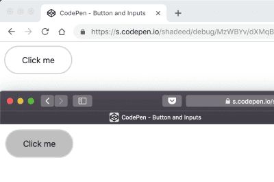

- 重设它的背景可以解决这个问题：

```css
button {
  appearance: none;
  background: transparent;
  /* Other styles */
}
```

## 2. Overflow: scroll vs. auto

要固定一个元素的高度，并允许用户进行滚动查看，可添加<font color=FF0000>overflow: scroll-y</font>。这在 macOS 版的 Chrome 下是没有问题的。然而，如果是在 Windows 下的话，滚动栏就会一直存在（即便元素的内容很短）。这是因为 <font color=FF0000>scroll-y</font> 不管元素的内容如何都会显示出滚动栏，如果使用 <font color=FF0000>overflow: auto </font>的话就只会在必要的时候才展示出滚动栏。

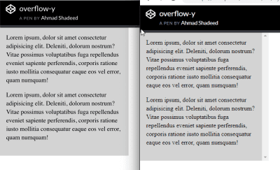

```css
.element {
    height: 300px;
    overflow-y: auto;
}
```

## 3. flex布局

### 1. 添加 flex-wrap

要使一个元素变成 flex 容器，只需添加 display: flex 即可；但如果只是这样，而没有添加 flex-wrap 的话，当屏幕尺寸缩小时，浏览器就会展示出一个水平滚动栏。

```html
<div class="wrapper">
  <div class="item"></div>
  <div class="item"></div>
  <div class="item"></div>
  <div class="item"></div>
  <div class="item"></div>
  <div class="item"></div>
</div>
```

```css
.wrapper {
  display: flex;
}

.item {
  flex: 0 0 120px;
  height: 100px;
}
```

上面这个例子在大屏幕下效果会不错；但在移动端的话，浏览器就会展示出一个水平滚动栏。

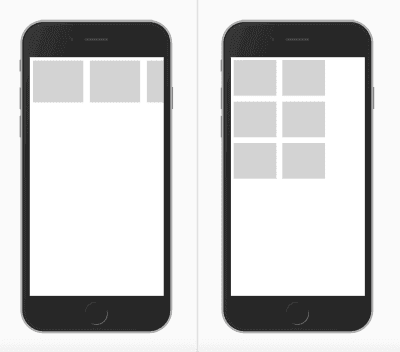

- 解决方法非常简单：让 wrapper 知道当空间不够用时，应该对元素进行换行排列。

```css
.wrapper {
    display: flex;
    flex-wrap: wrap;
}
```

### 2. 如果元素的数量是动态的话，不要使用 justify-content: space-between

如果把 <font color=FF0000>justify-content: space-between</font> 应用在一个 flex 容器上，它将会把它的元素按照等距的间隔来排列。在我们的例子中有 8 张卡片元素，看上去效果不错。但如果因为某些原因，他们的数量变成了 7 会怎样？——第二行的元素显示效果就会与第一行不一样。

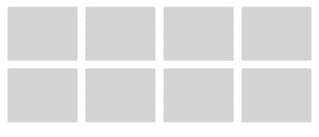

- 其实在这种场景下，使用 grid 布局会更加合适。

## 4. 长词和长链

在移动设备屏幕上查看一篇文章时，长词或长链可能会导致水平滚动栏的出现；使用 word-break 可以防止这个问题发生。

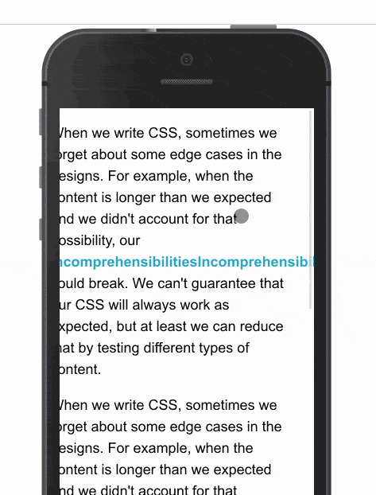

## 5. 渐变中的透明色

当添加用 transparent 作为渐变的开始或结束点的渐变时，在 Safari 中会显示成乌黑的效果。这是因为 Safari 并不能识别 transparent 关键字。把它替换成 <font color=FF0000>rgba(0, 0, 0, 0)</font> 就好了。仔细看下面的截图：

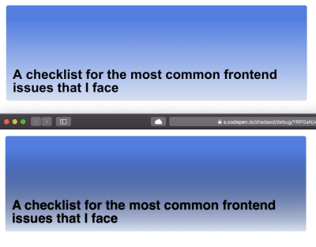

```js
.section-hero {
  background: linear-gradient(transparent, #d7e0ef), #527ee0;
  /*Other styles*/
}
```

- 应该这样写：

```js
.section-hero {
  background: linear-gradient(rgba(0, 0, 0,0), #d7e0ef), #527ee0;
  /*Other styles*/
}
```

## 6. Grid布局

### 1. 关于Grid布局中 auto-fit 和 auto-fill 之间的区别的误解

在 CSS 的 Grid 布局中，repeat 函数可以用来创建响应式的分栏布局，而不需要借助媒体查询来实现。要实现这种效果，可以使用 <font color=FF0000>auto-fill</font> 和 <font color=FF0000>auto-fit</font>。

```css
.wrapper {
    grid-template-columns: repeat(auto-fill, minmax(100px, 1fr));
}
```
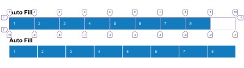

- auto-fill 在排列每一栏时不会扩展他们的宽度，而 auto-fit 则会把他们收缩成 0 宽度——如果那一栏是空元素的话。

### 2. 使用 CSS Grid 布局来定义 main、aside 元素

CSS Grid 布局可以用来定义一个布局中的 <font color=FF0000>main</font> 和 <font color=FF0000>aside </font>区域，这非常适用于 grid。不过这样的结果是，aside 区域的高度会和 <font color=FF0000>main</font> 元素保持一致，即便 <font color=FF0000>aside</font> 是空元素。

要解决这个问题，将 aside 元素保持与其父元素的开始位置对齐即可，这样他的高度就不会自动扩展了。

```css
.wrapper {
  display: grid;
  grid-template-columns: repeat(12, minmax(0, 1fr));
  grid-gap: 20px;
}

// align-self will tell the aside element to align itself with the start of its parent.
// align-self 可以告诉 aside 元素保持与其父元素对对齐。
aside {
  grid-column: 1 / 4;
  grid-row: 1;
  align-self: start;
}

main {
  grid-column: 4 / 13;
}
```

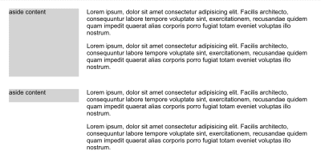


## 7. 在浏览器视窗高度不够时将元素固定在顶部

如果你把一个元素固定在屏幕顶部，当视窗的高度不足时会发生什么？很简单：它会占用屏幕空间，而且会造成用户浏览你网站的可用垂直方向的空间变小，造成用户不适，这样就会导致体验退化。

```css
@media (min-height: 500px) {
    .site-header {
        position: sticky;
        top: 0;
        /*other styles*/
    }
}
```
> 在你使用 <font color=FF0000>position: sticky</font> 的时候，如果不指定 top 属性是不会有效果的。

- 上面这段代码中，我们告诉浏览器只在视窗的高度大于等于 500 个像素时才将头部固定显示。

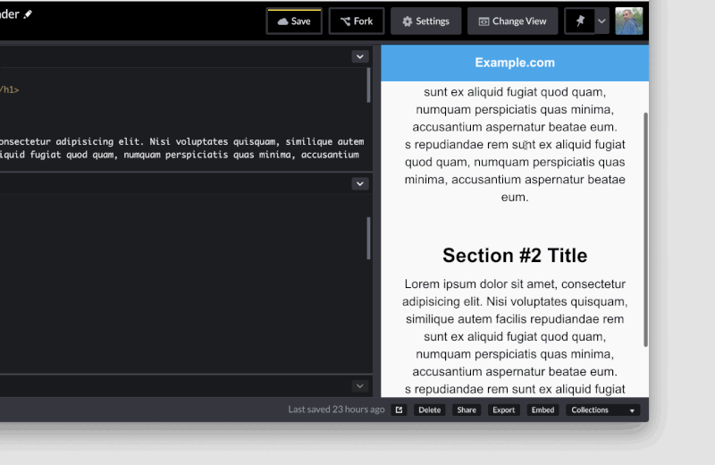

## 8. 设置图片的 max-width

在添加图片时，将其 max-width 设置为 100%，这样在屏幕较小时，图片的尺寸就会收缩，否则就会出现一个水平滚动栏。

```css
img {
    max-width: 100%;
}
```

## 9. 为 SVG 添加 fill

在使用 SVG 时，如果 <font color=FF0000>fill</font> 属性是内联在其上的的话，有个时候会得不到想要的效果。要解决这个问题，要么将 fill 属性从 SVG 上移出，要么用 <font color=FF0000>fill: <颜色值></font> 来覆盖。

```css
.some-icon {
    fill: #137cbf;
}
```

- 如果这个 SVG 上有内联的 fill 的话，这样是没用的，应该这样写：

```css
.some-icon path {
    fill: #137cbf;
}
```

## 10. 使用伪元素

尽可能地使用伪元素。他们可以用来创建虚假元素——大多数时候作为装饰效果用，且不用添加东西到 HTML 中。

在使用他们的时候，编写者可能经常会忘记做下面这些事：

- 添加 <font color=FF0000>content: ""</font> 属性。

- 设置了 <font color=FF0000>width</font> 和 <font color=FF0000>height</font> ，却没有定义其 <font color=FF0000>display</font> 属性。

例如：有一个标题，它前面的标记就是一个伪元素。需要添加 content: "" 才会有作用；另外，如要要让他的 width 和 height 生效，还需要设置 display: inline-block。

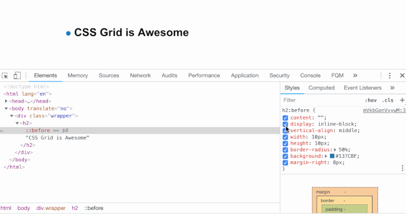


## 11. 当使用 display: inline-block 时，元素间隔的怪异现象

将两个或多个元素设置为 <font color=FF0000>display: inline-block</font> 或 <font color=FF0000>display: inline</font> 时，会在他们之间制造出一个小的空间。这个空间的出现，是因为浏览器把这些元素解释成了单词，所以会在他们之间添加一个字符的间距。

下面这个例子中，每个元素的右边都拥有 8px 的空间，但如果使用的是 display: inline-block 的话，这个小空间就会变成 12px ，这并不是所期望的结果。

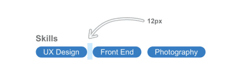

- 要修复这个问题，一个简单的方法就是将它父元素的 fotn-size 设置为 0 。

```css
ul {
    font-size: 0;
}

li {
    font-size: 16px; /*The font size should be reassigned here because it will inherit `font-size: 0` from its parent.*/
    /* 这里之所以重新设置了字体大小，是它会集成父元素的字体大小 */
}
```

## 12. 为 Label 元素添加 for="ID" 属性

在使用表单元素时，确保所有的 label 元素都设置了指向目标表单元素 ID 的 for 属性。这可以使得表单元素更具可访问性，在点击这些 label 的时候，对应的表单元素就可以获得聚焦。

```css
<label for="emailAddress">Email address:</label>
<input type="email" id="emailAddress">
```

## 13. 字体属性不会影响到交互式元素

如果把字体设置到整个文档上，input、button、select 及 textarea 元素并不会受影响，他们默认不会继承字体，因为浏览器对他们应用了默认的系统字体。

- 要解决这个问题，需要手动地为他们设置字体属性：

```css
input, button, select, textarea {
  font-family: your-awesome-font-name;
}
```

## 14. 水平滚动栏

某些元素会由于自身的宽度问题导致水平滚动栏的出现。

要找出这这个问题原因，最简单的方法就是使用 CSS 的 outline 属性。Addy OSmani 分享了一段脚本，它可以直接放到浏览器的 console 中执行，以此 outline 出页面的每个元素。

```css
[].forEach.call($$("*"), function(a) {
  a.style.outline =
    "1px solid #" + (~~(Math.random() * (1 << 24))).toString(16);
});
```
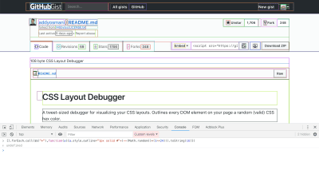

## 15. 图片的挤压和拉伸

在使用 CSS 来重定义图片的尺寸时，如果其长宽比与设定的不一致，就会导致其出现挤压或拉伸的效果。

- 解决方法非常简单：使用 CSS 的 <font color=FF0000>object-fit</font> 就可以了。它的作用类似于针对背景图片的 <font color=FF0000>background-size: cover</font>。

```css
img {
    object-fit: cover;
}
```

- 使用 object-fit 并不是在所有情况下都合适。有些地方可能要求图片不经裁切或缩减尺寸，另外有些平台也会强制用户上传符合规定尺寸的图片。

## 16. 为 input 元素添加正确的 type 属性

为 input 元素添加正确的 type 属性可以增强移动端的用户体验，让用户获得更多的可访问性。

```html
<form action="">
  <p>
    <label for="name">Full name</label>
    <input type="text" id="name">
  </p>
  <p>
    <label for="email">Email</label>
    <input type="email" id="email">
  </p>
  <p>
    <label for="phone">Phone</label>
    <input type="tel" id="phone">
  </p>
</form>
```

## 17.  RTL 布局中的电话号码

当在右到左布局中添加像+ 972-123555777这样的手机号码时，加号会被置于号码的末尾。要解决这个问题，需要重新设置号码的 direction 属性。

```css
p {
    direction: ltr; // left-to-right，左到右 ——译注
}
```
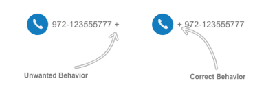

