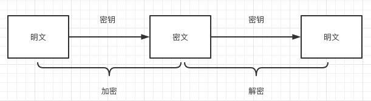
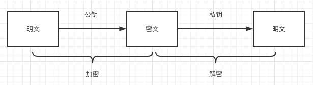
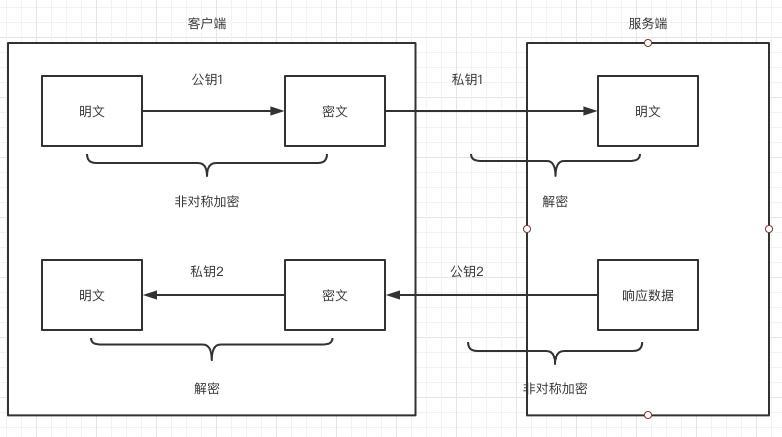
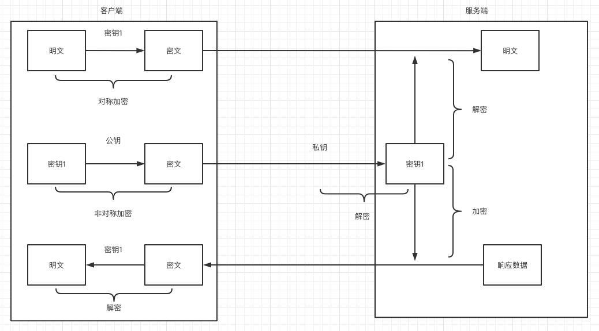

## 敏感数据加密方案及实现

### 前言

现在是大数据时代，需要收集大量的个人信息用于统计。一方面它给我们带来了便利，另一方面一些个人信息数据在无意间被泄露，被非法分子用于推销和黑色产业。

2018 年 5 月 25 日，欧盟已经强制执行《通用数据保护条例》（General Data Protection Regulation，缩写作 GDPR）。该条例是欧盟法律中对所有欧盟个人关于数据保护和隐私的规范。这意味着个人数据必须使用假名化或匿名化进行存储，并且默认使用尽可能最高的隐私设置，以避免数据泄露。

相信大家也都不想让自己在外面“裸奔”。所以，作为前端开发人员也应该尽量避免用户个人数据的明文传输，尽可能的降低信息泄露的风险。

看到这里可能有人会说现在都用 HTTPS 了，数据在传输过程中是加密的，前端就不需要加密了。其实不然，我可以在你发送 HTTPS 请求之前，通过谷歌插件来捕获 HTTPS 请求中的个人信息，下面我会为此演示。所以前端数据加密还是很有必要的。

### 数据泄露方式

- 中间人攻击

中间人攻击是常见的攻击方式。大概的过程是中间人通过 DNS 欺骗等手段劫持了客户端与服务端的会话。

客户端、服务端之间的信息都会经过中间人，中间人可以获取和转发两者的信息。在 HTTP 下，前端数据加密还是避免不了数据泄露，因为中间人可以伪造密钥。为了避免中间人攻击，我们一般采用 HTTPS 的形式传输。

- 谷歌插件

HTTPS 虽然可以防止数据在网络传输过程中被劫持，但是在发送 HTTPS 之前，数据还是可以从谷歌插件中泄露出去。

因为谷歌插件可以捕获 Network 中的所有请求，所以如果某些插件中有恶意的代码还是可以获取到用户信息的，下面为大家演示。

所以光采用 HTTPS，一些敏感信息如果还是以明文的形式传输的话，也是不安全的。如果在 HTTPS 的基础上再进行数据的加密，那相对来说就更好了。

### 加密算法介绍

#### 1. 对称加密

对称加密算法，又称为共享密钥加密算法。在对称加密算法中，使用的密钥只有一个，发送和接收双方都使用这个密钥对数据进行加密和解密。

这就要求加密和解密方事先都必须知道加密的密钥。其优点是算法公开、计算量小、加密速度快、加密效率高；缺点是密钥泄露之后，数据就会被破解。一般不推荐单独使用。根据实现机制的不同，常见的算法主要有**AES、ChaCha20、3DES**等。



#### 2. 非对称加密

非对称加密算法，又称为公开密钥加密算法。它需要两个密钥，一个称为公开密钥 (public key)，即公钥；另一个称为私有密钥 (private key)，即私钥。

他俩是配对生成的，就像钥匙和锁的关系。因为加密和解密使用的是两个不同的密钥，所以这种算法称为非对称加密算法。其优点是算法强度复杂、安全性高；缺点是加解密速度没有对称加密算法快。常见的算法主要有**RSA、Elgamal**等。



#### 3. 散列算法

散列算法又称散列函数、哈希函数，是把消息或数据压缩成摘要，使得数据量变小，将数据的格式固定成特定长度的值。一般用于校验数据的完整性，平时我们下载文件就可以校验 MD5 来判断下载的数据是否完整。常见的算法主要有 **MD4、MD5、SHA**等。

### 实现方案

- 方案一：如果用对称加密，那么服务端和客户端都必须知道密钥才行。那服务端势必要把密钥发送给客户端，这个过程中是不安全的，所以单单用对称加密行不通。


- 方案二：如果用非对称加密，客户端的数据通过公钥加密，服务端通过私钥解密，客户端发送数据实现加密没问题。客户端接受数据，需要服务端用公钥加密，然后客户端用私钥解密。所以这个方案需要两套公钥和私钥，需要在客户端和服务端各自生成自己的密钥。



- 方案三：如果把对称加密和非对称加密相结合。客户端需要生成一个对称加密的密钥 1，传输内容与该密钥 1进行对称加密传给服务端，并且把密钥 1 和公钥进行非对称加密，然后也传给服务端。服务端通过私钥把对称加密的密钥 1 解密出来，然后通过该密钥 1 解密出内容。以上是客户端到服务端的过程。如果是服务端要发数据到客户端，就需要把响应数据跟对称加密的密钥 1 进行加密，然后客户端接收到密文，通过客户端的密钥 1进行解密，从而完成加密传输。



> 总结：以上只是列举了常见的加密方案。总的来看，方案二比较简单，但是需要维护两套公钥和私钥，当公钥变化的时候，必须通知对方，灵活性比较差。方案三相对方案二来说，密钥 1 随时可以变化，并且不需要通知服务端，相对来说灵活性、安全性好点并且方案三对内容是对称加密，当数据量大时，对称加密的速度会比非对称加密快。所以本文采用方案三给予代码实现。

### 代码实现

- 下面是具体的代码实现（以登录接口为例），主要的目的就是要把明文的个人信息转成密文传输。其中对称加密库使用的是 AES，非对称加密库使用的是RSA。

- 客户端：

    - AES 库(aes-js)：https://github.com/ricmoo/aes-js

    - RSA库(jsencrypt)：https://github.com/travist/jsencrypt

    - 具体代码实现登录接口: 
    
        - 客户端需要随机生成一个 aesKey，在页面加载完的时候需要从服务端请求 publicKey

        ```js
        let aesKey = [1, 2, 3, 4, 5, 6, 7, 8, 9, 10, 11, 12, 13, 14, 15, 16]; // 随机产生
        let publicKey = ""; // 公钥会从服务端获取
            
        // 页面加载完之后，就去获取公钥
        window.onload = () => {
        axios({
            method: "GET",
            headers: { "content-type": "application/x-www-form-urlencoded" },
            url: "http://localhost:3000/getPub",
        })
            .then(function (result) {
            publicKey = result.data.data; // 获取公钥
            })
            .catch(function (error) {
            console.log(error);
            });
        };
        ```

        - aes加密和解密方法

        ```js
        /**
         * aes加密方法
        * @param {string} text 待加密的字符串
        * @param {array} key 加密key
        */
        function aesEncrypt(text, key) {
        const textBytes = aesjs.utils.utf8.toBytes(text); // 把字符串转换成二进制数据
            
        // 这边使用CTR-Counter加密模式，还有其他模式可以选择，具体可以参考aes加密库
        const aesCtr = new aesjs.ModeOfOperation.ctr(key, new aesjs.Counter(5));
            
        const encryptedBytes = aesCtr.encrypt(textBytes); // 进行加密
        const encryptedHex = aesjs.utils.hex.fromBytes(encryptedBytes); // 把二进制数据转成十六进制
            
        return encryptedHex;
        }
            
        /**
        * aes解密方法
        * @param {string} encryptedHex 加密的字符串
        * @param {array} key 加密key
        */
        function aesDecrypt(encryptedHex, key) {
        const encryptedBytes = aesjs.utils.hex.toBytes(encryptedHex); // 把十六进制数据转成二进制
        const aesCtr = new aesjs.ModeOfOperation.ctr(key, new aesjs.Counter(5));
            
        const decryptedBytes = aesCtr.decrypt(encryptedBytes); // 进行解密
        const decryptedText = aesjs.utils.utf8.fromBytes(decryptedBytes); // 把二进制数据转成utf-8字符串
            
        return decryptedText;
        }
        ```

        - 请求登录

        ```js
        /**
         * 登陆接口
        */
        function submitFn() {
        const userName = document.querySelector("#userName").value;
        const password = document.querySelector("#password").value;
        const data = {
            userName,
            password,
        };
            
        const text = JSON.stringify(data);
        const sendData = aesEncrypt(text, aesKey); // 把要发送的数据转成字符串进行加密
        console.log("发送数据", text);
            
        const encrypt = new JSEncrypt();
        encrypt.setPublicKey(publicKey);
        const encrypted = encrypt.encrypt(aesKey.toString()); // 把aesKey进行非对称加密
            
        const url = "http://localhost:3000/login";
        const params = { id: 0, data: { param1: sendData, param2: encrypted } };
            
        axios({
            method: "POST",
            headers: { "content-type": "application/x-www-form-urlencoded" },
            url: url,
            data: JSON.stringify(params),
        })
            .then(function (result) {
            const reciveData = aesDecrypt(result.data.data, aesKey); // 用aesKey进行解密
            console.log("接收数据", reciveData);
            })
            .catch(function (error) {
            console.log("error", error);
            });
        }

        ```

- 服务端（Node）：

    - AES库(aes-js)：https://github.com/ricmoo/aes-js

    - RSA 库(node-rsa)：https://github.com/rzcoder/node-rsa

    - 具体代码实现登录接口

        - 引用加密库: 
        
        ```js
        const http = require("http");
        const aesjs = require("aes-js");
        const NodeRSA = require("node-rsa");
        const rsaKey = new NodeRSA({ b: 1024 }); // key的size为1024位
        let aesKey = null; // 用于保存客户端的aesKey
        let privateKey = ""; // 用于保存服务端的公钥
            
        rsaKey.setOptions({ encryptionScheme: "pkcs1" }); // 设置加密模式
        ```

        - 实现login接口

        ```js
        http
        .createServer((request, response) => {
            response.setHeader("Access-Control-Allow-Origin", "*");
            response.setHeader("Access-Control-Allow-Headers", "Content-Type");
            response.setHeader("Content-Type", "application/json");
            switch (request.method) {
            case "GET":
                if (request.url === "/getPub") {
                const publicKey = rsaKey.exportKey("public");
                privateKey = rsaKey.exportKey("private");
                response.writeHead(200);
                response.end(JSON.stringify({ result: true, data: publicKey })); // 把公钥发送给客户端
                return;
                }
                break;
            case "POST":
                if (request.url === "/login") {
                let str = "";
                request.on("data", function (chunk) {
                    str += chunk;
                });
                request.on("end", function () {
                    const params = JSON.parse(str);
                    const reciveData = decrypt(params.data);
                    console.log("reciveData", reciveData);
                    // 一系列处理之后
            
                    response.writeHead(200);
                    response.end(
                    JSON.stringify({
                        result: true,
                        data: aesEncrypt(
                        JSON.stringify({ userId: 123, address: "杭州" }), // 这个数据会被加密
                        aesKey
                        ),
                    })
                    );
                });
                return;
                }
                break;
            default:
                break;
            }
            response.writeHead(404);
            response.end();
        })
        .listen(3000);

        ```

        - 加密和解密方法

        ```js
        function decrypt({ param1, param2 }) {
        const decrypted = rsaKey.decrypt(param2, "utf8"); // 解密得到aesKey
        aesKey = decrypted.split(",").map((item) => {
            return +item;
        });
            
        return aesDecrypt(param1, aesKey);
        }
            
        /**
        * aes解密方法
        * @param {string} encryptedHex 加密的字符串
        * @param {array} key 加密key
        */
        function aesDecrypt(encryptedHex, key) {
        const encryptedBytes = aesjs.utils.hex.toBytes(encryptedHex); // 把十六进制转成二进制数据
        const aesCtr = new aesjs.ModeOfOperation.ctr(key, new aesjs.Counter(5)); // 这边使用CTR-Counter加密模式，还有其他模式可以选择，具体可以参考aes加密库
            
        const decryptedBytes = aesCtr.decrypt(encryptedBytes); // 进行解密
        const decryptedText = aesjs.utils.utf8.fromBytes(decryptedBytes); // 把二进制数据转成字符串
            
        return decryptedText;
        }
            
        /**
        * aes加密方法
        * @param {string} text 待加密的字符串
        * @param {array} key 加密key
        */
        function aesEncrypt(text, key) {
        const textBytes = aesjs.utils.utf8.toBytes(text); // 把字符串转成二进制数据
        const aesCtr = new aesjs.ModeOfOperation.ctr(key, new aesjs.Counter(5));
            
        const encryptedBytes = aesCtr.encrypt(textBytes); // 加密
        const encryptedHex = aesjs.utils.hex.fromBytes(encryptedBytes); // 把二进制数据转成十六进制
            
        return encryptedHex;
        }
        ```


