# 手机调试&使用Proxy劫持（3类真机调试技巧）

## 1、safari + ios

- 在Mac端safari中调试vue网页

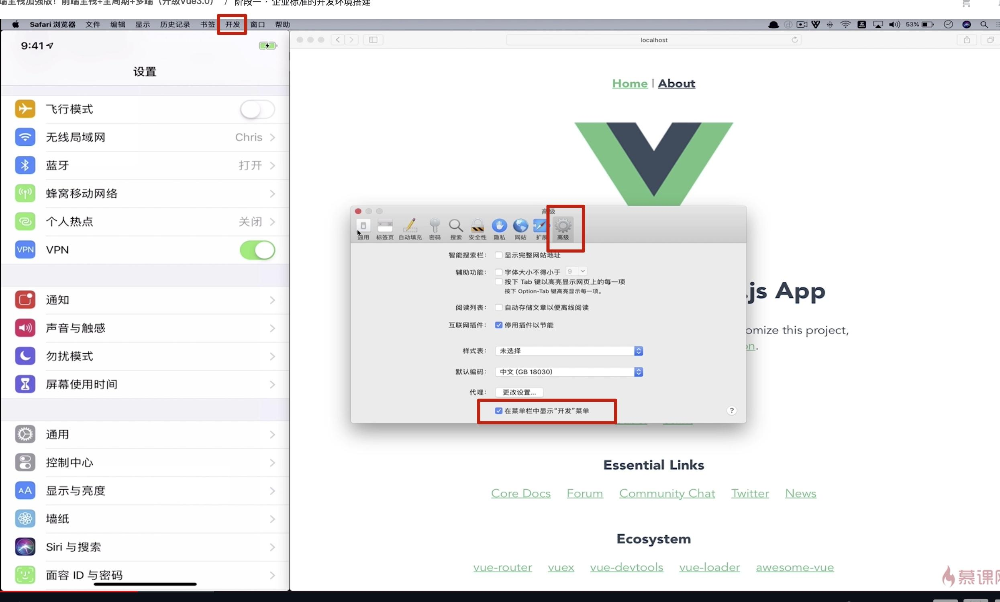

- 在iphone手机中，设置 - 高级 - 打开 web检查器

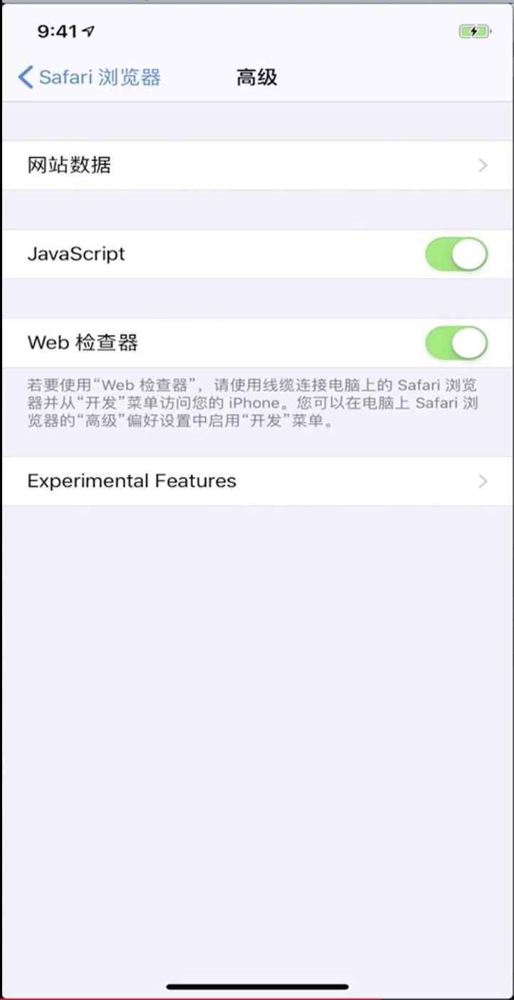

- 通过ifconfig（ipconfig）查看本机的IP

- 用safari 访问这个ip：端口之后，就可以在电脑上打开调试器了。

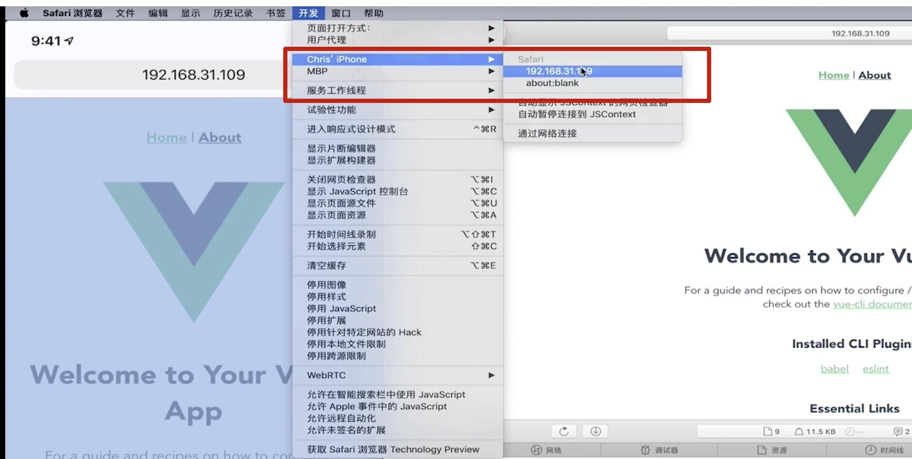

## 2、Chrome + Android

- chrome浏览器进入这个地址：chrome的地址chrome://inspect/#device

- 手机端开启开发者模式：多次点击版本号
    
    - 打开开发者模式
    
    - 打开USB调试
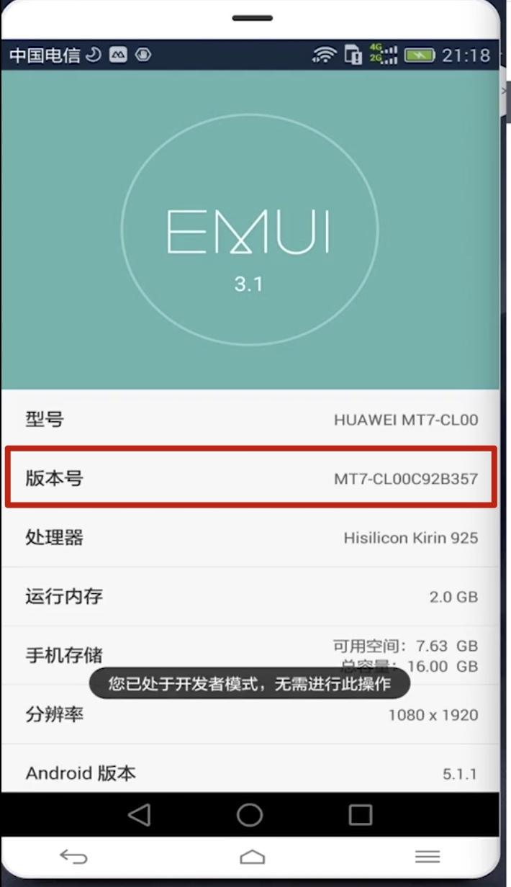

- 手机端访问需要调试的地址：
    
    - 保持在同一个网段
    
    - 用数据线连接电脑
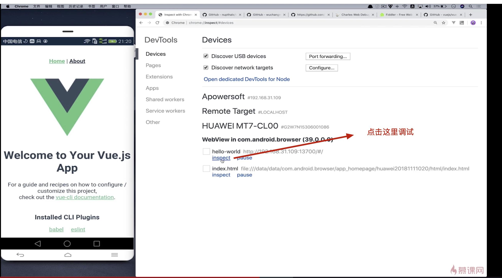

> [Tip]如果出现白屏，请检查浏览器的版本。

## 3、Fiddler OR Charles

当我们的服务已经发布到线上了，而这个页面是嵌套在App中的，需要访问接口，页面上一直在加载中。

这个时候就需要使用劫持工具了。

### Charles

- charles的设置如下：

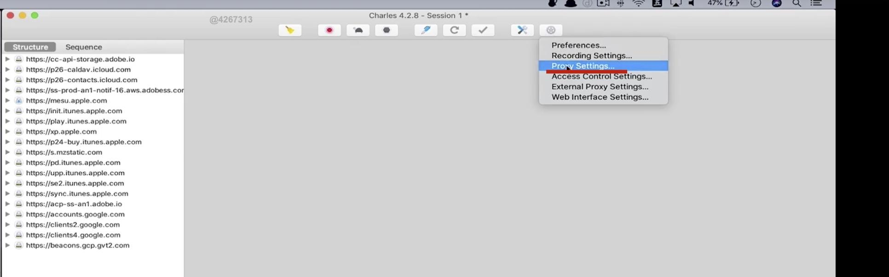

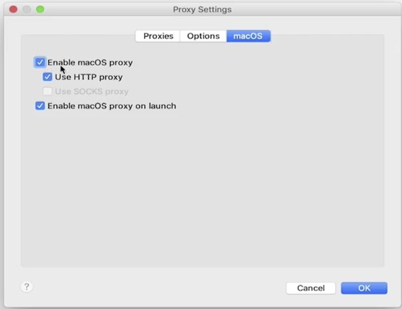

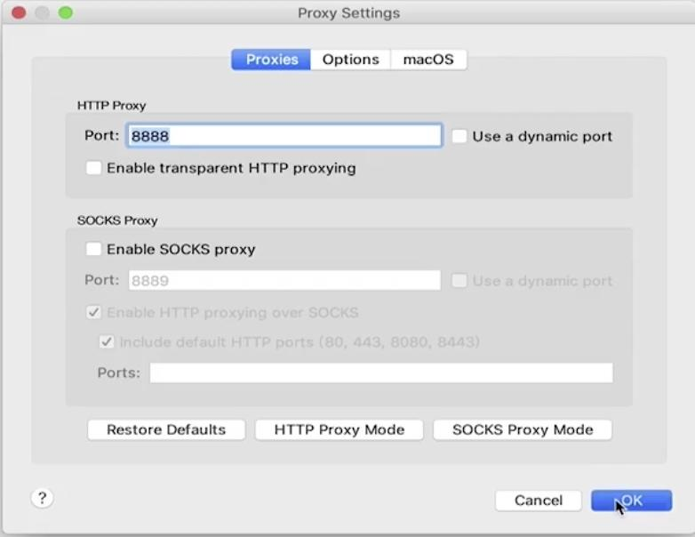

- 手机端设置如下：

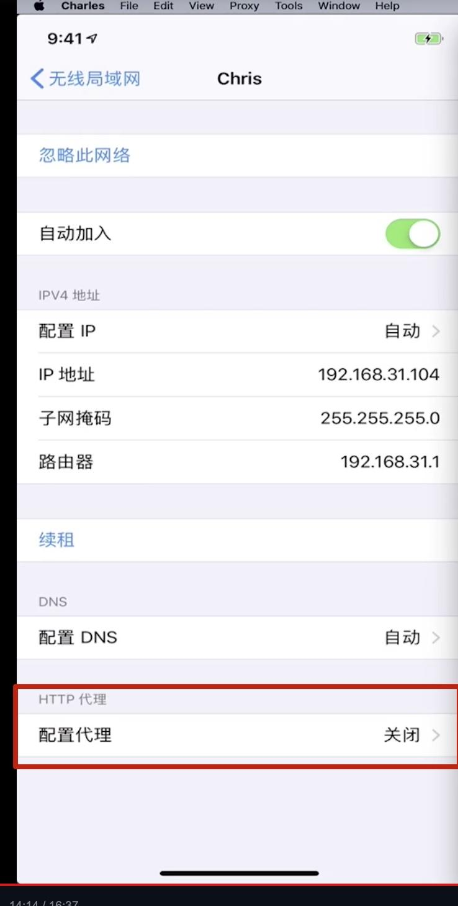

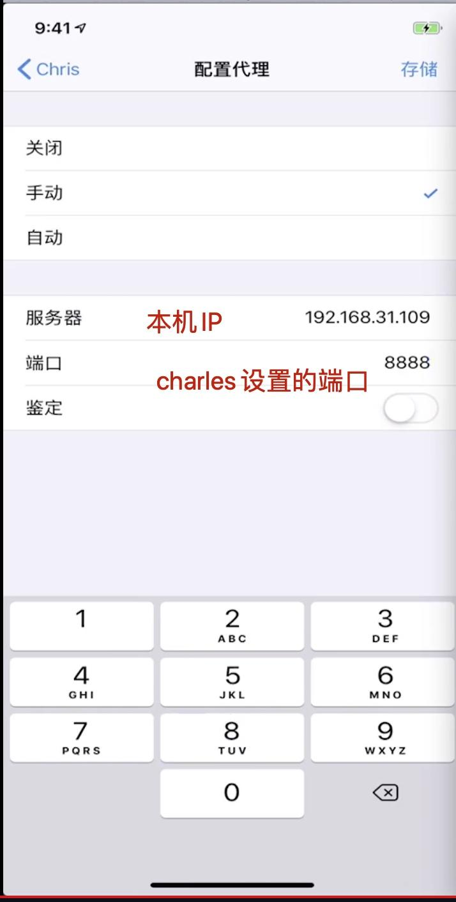

手机访问任何地址的时候，都会弹出这个界面，点击allow

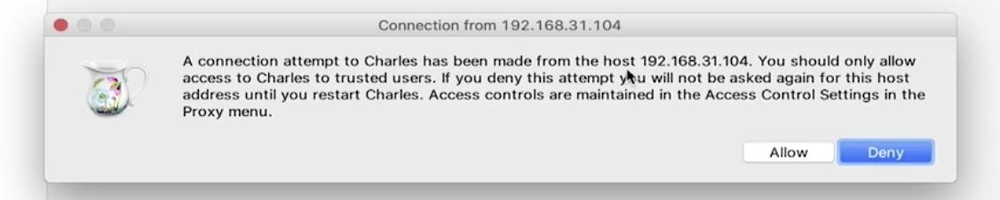

