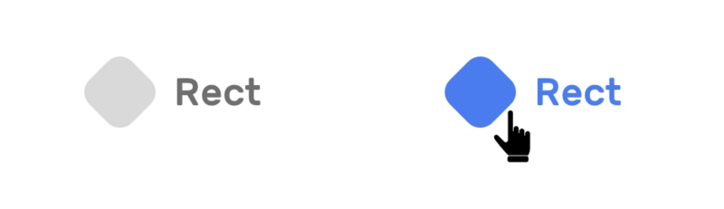
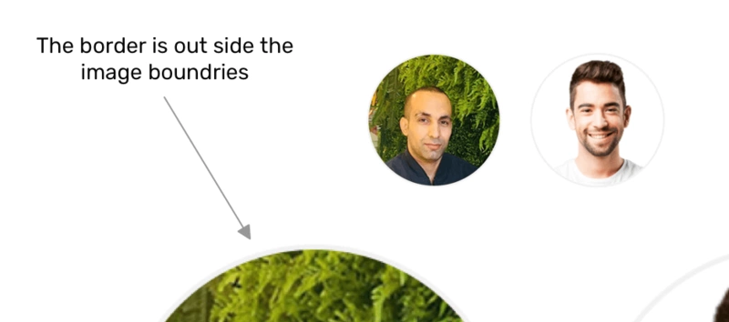

# 网站 Logo

网站 <font color=FF0000>Logo</font>是很重要的，因为它可以将网站与其他网站区分开。 要嵌入徽标，我们有一些选择：

- img -> png,jpg, orsvg

- 内联SVG

- 背景图

## 带有很多细节的 Logo

当徽标具有许多细节或形状时，将其用作嵌入式SVG可能没有好处。 我建议使用 <font color=FF0000>img</font>，图像类型可以是<font color=FF0000>png，jpg或svg</font>。


## 需要动画的简单 Logo



我们有一个简单的logo ，其中包含形状和文字。 悬停时，形状和文本需要更改颜色。 怎么做？ 对我来说最好的解决方案是使用嵌入式SVG。

- HTML

```html
<a href="#">
    <svg class="logo" width="115" height="47" xmlns="http://www.w3.org/2000/svg">
      <g transform="translate(-5 -5)" fill="none" fill-rule="evenodd">
        <rect fill="#D8D8D8" transform="rotate(45 28.5 28.5)" x="9" y="9" width="39" height="39" rx="11" />
        <text font-family="Rubik-Medium, Rubik" font-size="25" font-weight="400" fill="#6F6F6F">
          <tspan x="63.923" y="36.923">Rect</tspan>
        </text>
      </g>
    </svg>
</a>
```

- CSS

```css
.logo rect,
.logo text {
  transition: 0.3s ease-out;
}

.logo:hover rect,
.logo:hover text {
  fill: #4a7def;
}
```

## 响应 Logo


完美的解决方案是使用 <font color=FF0000>picture</font>元素，可以在其中添 加logo 的两个版本。 如下所示：

```html
<a class="logo" href="/">
    <picture>
      <source media="(min-width: 1350px)" srcset="sm-logo--full.svg"></picture>
  </a>
```

在CSS中，我们需要将视口的宽度更改为等于或大于1350px。

```css
.logo {
  display: inline-block;
  width: 45px;
}

@media (min-width: 1350px) {
  .logo {
    width: 180px;
  }
}
```

## 带有渐变的Logo

使用SVG，我们可以轻松地为logo添加渐变。 我添加了 <font color=FF0000>
linearGradient </font>并将其用作文本填充。


```html
<svg class="logo" width="115" height="47" xmlns="http://www.w3.org/2000/svg">
    <defs>
      <linearGradient id="gradient" x1="0%" y1="100%" x2="0%" y2="0%">
        <stop offset="0%" stop-color="#4a7def"></stop>
        <stop offset="50%" stop-color="#ab4787"></stop>
      </linearGradient>
    </defs>
      <g transform="translate(-5 -5)" fill="none" fill-rule="evenodd">
        <rect fill="#AB4787" transform="rotate(45 28.5 28.5)" x="9" y="9" width="39" height="39" rx="11" />
        <text font-family="Rubik-Medium, Rubik" font-size="30" font-weight="400" fill="url(#gradient)">
          <tspan x="63.923" y="36.923">Rect</tspan>
        </text>
      </g>
</svg>
```

## 用户头像

- img 元素

- img 和 div 元素

- div 与CSS背景

- SVG image

### 使用 HTML img

- 添加一个边框

```css
.avatar {
    border: 2px solid #f2f2f2;
}
```


### 使用 img 和 div 元素

现在的问题是，要添加内部边框，我们不能使用box-shadow，因为它无法在图像上使用。 解决方案用 div 包裹 头像中，并添加专用于内部边框的元素。

```html
<div class="avatar-wrapper">
     
     <div class="avatar-border"></div>
</div>
```

```css
.avatar-wrapper {
  position: relative;
  width: 150px;
  height: 150px;
}

.avatar-border {
  position: absolute;
  left: 0;
  top: 0;
  width: 100%;
  height: 100%;
  border-radius: 50%;
  border: 2px solid rgba(0, 0, 0, 0.1);
}
```

通过在 div 上使用透明度10%黑色的边框，我们可以确保边框与深色图像融合，并且只有在图像较亮的情况下才可见。 参见下面的模型：


### 使用 div 与CSS背景

如果我要使用 div来显示头像，则可能表示该图像具有装饰性。 我记得一个用例，它是分散在页面中的随机头像。


```html
<div class="avatar" style="--img-url: url(shadeed2.jpg)"></div>
```

```css
.avatar {
  background: var(--img-url) center/cover;
  width: 150px;
  height: 150px;
  border-radius: 50%;
  box-shadow: inset 0 0 0 2px rgba(#000, 0.1);
}
```

### 使用 SVG  image

```js
<svg role="none" style="height: 36px; width: 36px;">
  <mask id="avatar">
    <circle cx="18" cy="18" fill="white" r="18"></circle>
  </mask>
  <g mask="url(#avatar)">
    <image x="0" y="0" height="100%" preserveAspectRatio="xMidYMid slice" width="100%" xlink:href="avatar.jpg" style="height: 36px; width: 36px;"></image>
    <circle cx="18" cy="18" r="18"></circle>
  </g>
</svg>
```

- 用于将图像剪切为圆形(circle )的蒙版(mask )

- 对其应用了蒙版的组

- image本身带有preserveAspectRatio =“ xMidYMid”

- 用于内边界的圆

```css
circle {
  stroke-width: 2;
  stroke: rgba(0, 0, 0, 0.1);
  fill: none;
}
```